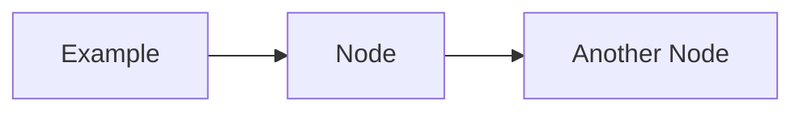

# Contributing to the Cybersecurity Reference Guide

This project is authored and maintained by [Shodzery](https://github.com/shodzery) and [ShodTeam](https://github.com/ShodTeam). Thank you for your interest in contributing. This project succeeds because practitioners and researchers share knowledge with rigor and precision. The following guidelines ensure that contributions maintain the technical quality and organizational consistency expected of a professional reference.

---

## Table of Contents

- [Code of Conduct](#code-of-conduct)
- [What We Welcome](#what-we-welcome)
- [What We Do Not Accept](#what-we-do-not-accept)
- [Before You Contribute](#before-you-contribute)
- [How to Contribute](#how-to-contribute)
- [Documentation Standards](#documentation-standards)
- [Pull Request Process](#pull-request-process)
- [Review Process](#review-process)
- [Attribution](#attribution)

---

## Code of Conduct

All contributors must adhere to the [Code of Conduct](CODE_OF_CONDUCT.md). Participation in this project implies acceptance of these standards.

---

## What We Welcome

- New documentation covering topics not yet addressed
- Technical corrections to existing content
- Additional lab exercises with complete, verified instructions
- Improved or additional Mermaid diagrams
- Updated tool documentation and version-accurate usage examples
- Framework mapping additions or corrections
- Translations of core documentation (with maintainer coordination)
- Template improvements based on real operational use

---

## What We Do Not Accept

- Content that facilitates attacks against systems without authorization
- Plagiarized content from other sources without proper attribution
- Marketing language, product endorsements, or vendor-specific advocacy
- Documentation without technical substance (placeholder content, vague descriptions)
- Content that violates applicable laws or ethical standards
- Contributions that lack proper structure or deviate significantly from established style

---

## Before You Contribute

1. **Check existing issues**: Review open issues to determine whether your contribution is already planned or in progress.
2. **Open an issue first for large contributions**: If you plan to add a new domain section or make significant structural changes, open an issue for discussion before investing writing time.
3. **Verify technical accuracy**: All technical claims must be verifiable. Cite sources where appropriate.
4. **Test all commands and configurations**: Any commands, scripts, or configurations included in labs or documentation must be tested and confirmed to work in the stated environment.

---

## How to Contribute

### Setting Up Your Environment

```bash
# Fork the repository and clone your fork
git clone https://github.com/ShodTeam/cybersecurity-guide.git
cd cybersecurity-guide

# Create a branch for your contribution
git checkout -b doc/topic-name
# or
git checkout -b fix/correction-description
# or
git checkout -b lab/lab-name
```

### Branch Naming Conventions

| Prefix | Use |
|--------|-----|
| `doc/` | New or significantly expanded documentation |
| `fix/` | Corrections to existing content |
| `lab/` | New lab exercises |
| `template/` | Template additions or improvements |
| `diagram/` | New or updated diagrams |
| `resource/` | Resource list updates |

---

## Documentation Standards

### Markdown

- Use ATX-style headings (`#`, `##`, `###`)
- Maximum heading depth of four levels (`####`)
- Use fenced code blocks with language identifiers
- Use tables for comparative information
- Use ordered lists for sequential steps, unordered lists for non-sequential items
- One blank line between sections and before/after code blocks

### Technical Writing

- Write in active voice where possible
- Use precise technical terminology consistent with the domain
- Define acronyms on first use: "Transport Layer Security (TLS)"
- Avoid promotional language, vague superlatives, and qualifiers without substance
- Do not use phrases characteristic of automated text generation
- No emojis anywhere in documentation

### Code Blocks

Always specify the language for syntax highlighting:

````markdown
```bash
nmap -sV -p 1-65535 target.example.com
```
````

```python
import hashlib
sha256 = hashlib.sha256(b"example").hexdigest()
```

### File Naming

- Use lowercase kebab-case: `incident-response-lifecycle.md`
- Be descriptive and specific: `tls-handshake-analysis.md` not `tls.md`
- Avoid generic names: `overview.md` is acceptable only as a section index

### Diagrams

All diagrams should be written in Mermaid format and embedded inline in Markdown files. Standalone diagram files in the `diagrams/` directory should also use Mermaid.



---

## Pull Request Process

1. Ensure your branch is up to date with `main`:
   ```bash
   git fetch upstream
   git rebase upstream/main
   ```

2. Write a clear PR title and description using the PR template.

3. Link the PR to any relevant issues using GitHub keywords: `Closes #123`, `Fixes #456`.

4. Ensure all content follows the documentation standards described above.

5. Self-review your diff before requesting review. Check for:
   - Typos and grammatical errors
   - Broken links
   - Untested commands or configurations
   - Missing headings or malformed Markdown

6. Request review from at least one maintainer.

---

## Review Process

Pull requests undergo the following review:

- **Technical accuracy review**: Content is verified against authoritative sources.
- **Style review**: Consistency with existing documentation style and standards.
- **Completeness review**: Contributions should be complete, not partial.

Reviews are conducted within 7 business days for most contributions. Complex or large contributions may take longer.

Maintainers may request changes. Requested changes must be addressed before a PR is merged. If a PR becomes inactive (no response to review comments within 30 days), it may be closed.

---

## Attribution

This repository is authored and maintained by [Shodzery](https://github.com/shodzery) and [ShodTeam](https://github.com/ShodTeam). Contributors who make substantive contributions will be credited in CHANGELOG.md. If you contribute content derived from your own previously published work, note this in the PR description. All contributions must be submitted under the project's Apache 2.0 license. See the [AUTHORS](../AUTHORS) file for the full list of authors and maintainers.
