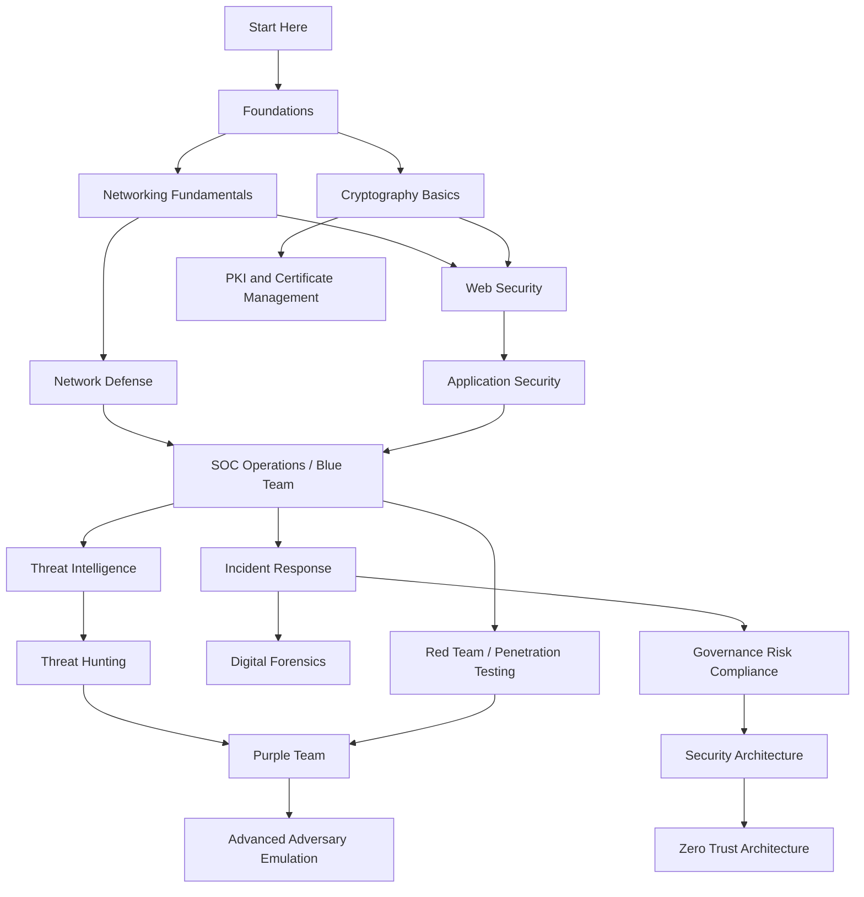

# Cybersecurity Reference Guide

A comprehensive, practitioner-oriented reference covering the full spectrum of cybersecurity disciplines — from foundational theory to advanced offensive and defensive techniques. This repository is maintained as a living document aligned with current threats, industry frameworks, and real-world operational practice.

Intended audiences: students preparing for professional roles, system administrators hardening infrastructure, SOC analysts building detection capability, penetration testers, incident responders, forensic examiners, and security architects designing resilient systems.

---

## Table of Contents

- [Project Objectives](#project-objectives)
- [Repository Architecture](#repository-architecture)
- [Quick Start](#quick-start)
- [Learning Roadmap](#learning-roadmap)
- [Core Domains](#core-domains)
  - [Foundations](#foundations)
  - [Networking Security](#networking-security)
  - [Cryptography](#cryptography)
  - [Web Security](#web-security)
  - [Cloud Security](#cloud-security)
  - [Malware Analysis](#malware-analysis)
  - [Blue Team Operations](#blue-team-operations)
  - [Red Team Operations](#red-team-operations)
  - [Digital Forensics](#digital-forensics)
  - [Incident Response](#incident-response)
  - [Governance, Risk, and Compliance](#governance-risk-and-compliance)
- [Practical Labs](#practical-labs)
- [Diagrams](#diagrams)
- [Resources](#resources)
- [Frameworks and Standards](#frameworks-and-standards)
- [Contributing](#contributing)
- [License](#license)

---

## Project Objectives

This repository aims to:

1. Provide technically accurate, depth-first documentation across all major cybersecurity domains.
2. Bridge the gap between theoretical security knowledge and operational practice.
3. Serve as a structured curriculum for self-directed learners and team onboarding programs.
4. Maintain alignment with internationally recognized standards: NIST, ISO 27001, MITRE ATT&CK, OWASP, and CIS Controls.
5. Support both defensive (Blue Team) and offensive (Red Team) practitioners within a clearly defined ethical and legal framework.
6. Offer reusable templates, lab guides, and reference diagrams usable in real operational environments.

---

## Repository Architecture

```
cybersecurity-guide/
├── README.md                        # This file
├── LICENSE                          # Apache 2.0
├── CONTRIBUTING.md                  # Contribution guidelines
├── CODE_OF_CONDUCT.md               # Community standards
├── CHANGELOG.md                     # Version history
│
├── docs/                            # Technical documentation by domain
│   ├── introduction/                # CIA triad, threat modeling, defense in depth
│   ├── networking/                  # TCP/IP, DNS, firewalls, IDS/IPS, VPN
│   ├── cryptography/                # Hashing, AES, RSA, ECC, PKI, TLS
│   ├── web-security/                # OWASP Top 10, XSS, SQLi, CSRF, SSRF
│   ├── cloud-security/              # AWS, Azure, GCP, IAM, misconfigurations
│   ├── malware/                     # Virus, ransomware, rootkits, botnets
│   ├── threat-intelligence/         # CTI lifecycle, IOCs, TTPs, sharing platforms
│   ├── incident-response/           # NIST lifecycle, containment, recovery
│   ├── digital-forensics/           # Evidence acquisition, disk/memory analysis
│   ├── mobile-security/             # Android, iOS, OWASP MASVS
│   ├── application-security/        # SDLC, SAST, DAST, threat modeling
│   ├── os-security/                 # Linux, Windows hardening
│   ├── identity-and-access-management/ # IAM, MFA, RBAC, PAM, SSO
│   ├── zero-trust/                  # Principles, architecture, implementation
│   ├── soc-operations/              # SIEM, alerting, triage, playbooks
│   ├── red-team/                    # Recon, exploitation, post-exploitation
│   ├── blue-team/                   # Detection engineering, threat hunting
│   ├── purple-team/                 # Adversary emulation, feedback loops
│   ├── governance-risk-compliance/  # GRC frameworks, risk management
│   ├── security-frameworks/         # NIST CSF, ISO 27001, CIS, MITRE
│   └── career-roadmap/              # Learning paths by role
│
├── labs/                            # Hands-on exercises
│   ├── beginner/                    # Foundational labs
│   ├── intermediate/                # Intermediate-level exercises
│   └── advanced/                    # Advanced attack/defense scenarios
│
├── diagrams/                        # Mermaid and architectural diagrams
│
├── resources/                       # Curated external references
│   ├── books.md
│   ├── certifications.md
│   ├── blogs.md
│   ├── tools.md
│   └── learning-paths.md
│
├── templates/                       # Operational document templates
│   ├── incident-report-template.md
│   ├── risk-assessment-template.md
│   ├── threat-model-template.md
│   └── security-audit-template.md
│
└── .github/                         # GitHub meta-files
    ├── ISSUE_TEMPLATE/
    ├── PULL_REQUEST_TEMPLATE.md
    └── workflows/
```

---

## Quick Start

### For students and self-learners

1. Begin with [docs/introduction/](docs/introduction/) to build foundational understanding.
2. Follow the [career-roadmap](docs/career-roadmap/) that matches your target role.
3. Complete [beginner labs](labs/beginner/) to apply concepts hands-on.
4. Progressively move through intermediate and advanced material.

### For security professionals

- Navigate directly to the domain relevant to your current work.
- Use [templates/](templates/) for operational documentation.
- Reference [resources/tools.md](resources/tools.md) for tooling recommendations by category.
- Consult [security-frameworks/](docs/security-frameworks/) for compliance mapping.

### For teams and organizations

- Use the [GRC documentation](docs/governance-risk-compliance/) to structure your risk management program.
- Adopt [templates/](templates/) as a baseline for your internal documentation.
- Build detection use cases from the [SOC operations](docs/soc-operations/) and [Blue Team](docs/blue-team/) sections.

---

## Learning Roadmap

The following roadmap describes a structured path from foundational knowledge to advanced operational capability.



### Role-Based Paths

| Role | Recommended Sequence |
|------|---------------------|
| Security Analyst (SOC) | Foundations → Networking → SOC Operations → Threat Intelligence → Incident Response |
| Penetration Tester | Foundations → Networking → Web Security → Red Team → Advanced Labs |
| Security Engineer | Foundations → Application Security → Cloud Security → IAM → Zero Trust |
| Incident Responder | Foundations → Incident Response → Digital Forensics → Threat Intelligence |
| GRC Analyst | Foundations → Frameworks → GRC → Risk Assessment → Audit Templates |
| Security Architect | All domains → Zero Trust → Cloud Security → IAM → Frameworks |

---

## Core Domains

### Foundations

Security fundamentals provide the conceptual vocabulary shared across all disciplines.

**CIA Triad**

The CIA triad defines the three core properties that security controls are designed to protect:

- **Confidentiality**: Information is accessible only to those authorized to access it. Controls include encryption, access control lists, and data classification.
- **Integrity**: Information remains accurate and unaltered except through authorized processes. Controls include cryptographic hashing, digital signatures, and change management.
- **Availability**: Systems and data are accessible to authorized users when needed. Controls include redundancy, failover, DDoS mitigation, and backup strategies.

**AAA Framework**

Authentication, Authorization, and Accounting form the access control foundation:

- **Authentication**: Verifying the identity of a user, device, or system. Methods include passwords, certificates, biometrics, and hardware tokens.
- **Authorization**: Determining what an authenticated entity is permitted to do. Implemented through RBAC, ABAC, and access control lists.
- **Accounting**: Recording actions taken by authenticated, authorized entities. Critical for audit trails, forensics, and compliance.

**Defense in Depth**

A layered security strategy that applies multiple independent controls so that the failure of a single layer does not expose assets. Layers typically include: perimeter controls, network segmentation, endpoint protection, application controls, data-level encryption, and monitoring.

**Attack Surface**

The sum of all points where an attacker could attempt to enter or extract data from a system. Attack surface reduction is a primary risk management strategy — every exposed interface, protocol, service, and account represents potential entry.

See: [docs/introduction/](docs/introduction/)

---

### Networking Security

Network security encompasses the policies, controls, and technologies used to protect the confidentiality, integrity, and availability of network-transmitted data and infrastructure.

**Key topics covered:**
- TCP/IP stack vulnerabilities and attack techniques
- DNS security (DNSSEC, DNS over HTTPS, cache poisoning)
- HTTP/HTTPS and TLS configuration
- Firewall architectures: stateless, stateful, next-generation
- Intrusion Detection and Prevention Systems (IDS/IPS)
- VPN technologies: IPSec, OpenVPN, WireGuard
- Network segmentation and microsegmentation

See: [docs/networking/](docs/networking/)

---

### Cryptography

Cryptography provides the mathematical foundation for confidentiality, integrity, authentication, and non-repudiation.

**Key topics covered:**
- Hashing algorithms: MD5 (deprecated), SHA-1 (deprecated), SHA-2, SHA-3, BLAKE2
- Symmetric encryption: AES (ECB, CBC, GCM modes)
- Asymmetric encryption: RSA, ECC, Diffie-Hellman key exchange
- Public Key Infrastructure (PKI): CAs, certificates, certificate lifecycle
- Transport Layer Security (TLS): handshake process, cipher suites, pinning
- Common cryptographic vulnerabilities: padding oracles, timing attacks, weak key generation

See: [docs/cryptography/](docs/cryptography/)

---

### Web Security

Web application security remains one of the highest-impact attack surfaces due to public exposure and complexity of modern web stacks.

**Key topics covered:**
- OWASP Top 10 (2021): injection, broken authentication, XSS, IDOR, security misconfiguration, etc.
- Cross-Site Scripting (XSS): reflected, stored, DOM-based
- SQL Injection: in-band, blind, time-based, out-of-band
- Cross-Site Request Forgery (CSRF)
- Server-Side Request Forgery (SSRF)
- XML External Entity Injection (XXE)
- Path Traversal
- Security headers: CSP, HSTS, X-Frame-Options, X-Content-Type-Options

See: [docs/web-security/](docs/web-security/)

---

### Cloud Security

Cloud environments introduce shared responsibility models, identity-centric access control, and novel misconfiguration attack paths.

**Key topics covered:**
- AWS, Azure, GCP security services and native controls
- IAM: roles, policies, least privilege, service accounts
- Common cloud misconfigurations: public S3 buckets, over-permissive roles, metadata service abuse
- Shared Responsibility Model by provider and service type
- Cloud-native threat detection: CloudTrail, Azure Monitor, GCP Security Command Center
- Container and Kubernetes security

See: [docs/cloud-security/](docs/cloud-security/)

---

### Malware Analysis

Understanding malware categories, behaviors, and analysis techniques is foundational to both defensive detection engineering and incident response.

**Key topics covered:**
- Malware taxonomy: viruses, worms, trojans, ransomware, rootkits, spyware, adware, botnets
- Static analysis: strings, PE headers, disassembly
- Dynamic analysis: behavioral sandboxing, API monitoring, network capture
- Anti-analysis techniques: packing, obfuscation, VM detection, timing attacks
- Ransomware: encryption mechanisms, C2 communication, payment infrastructure
- Rootkits: kernel-level persistence, hooking techniques

See: [docs/malware/](docs/malware/)

---

### Blue Team Operations

Blue team practitioners are responsible for detecting, analyzing, and responding to threats within the organization's environment.

**Key topics covered:**
- SIEM architecture, log ingestion, correlation rules
- Endpoint Detection and Response (EDR): telemetry, behavioral detection, response actions
- Threat Hunting: hypothesis-driven investigation, analytics, MITRE ATT&CK alignment
- Logging strategy: what to log, log retention, forwarding architecture
- Detection Engineering: rule lifecycle, false positive reduction, coverage mapping

See: [docs/blue-team/](docs/blue-team/)

---

### Red Team Operations

Red team operations simulate adversary behavior to test an organization's detection and response capability against realistic attack scenarios.

**Key topics covered:**
- Reconnaissance: OSINT, passive recon, active scanning
- Enumeration: service fingerprinting, user enumeration, network mapping
- Exploitation: vulnerability exploitation, social engineering, phishing
- Post-exploitation: lateral movement, privilege escalation, credential access
- Persistence mechanisms: scheduled tasks, registry keys, startup items, backdoors
- OPSEC: operational security for red team engagements

See: [docs/red-team/](docs/red-team/)

---

### Digital Forensics

Digital forensics involves the identification, preservation, analysis, and presentation of digital evidence in a legally defensible manner.

**Key topics covered:**
- Chain of custody: documentation, evidence handling, legal admissibility
- Evidence acquisition: disk imaging, live acquisition, write blockers
- Memory forensics: RAM acquisition, process analysis, network connections
- Disk forensics: file system analysis, deleted file recovery, timeline reconstruction
- Timeline analysis: log correlation, filesystem timestamps, event reconstruction
- Artifact analysis: browser history, prefetch files, registry hives, event logs

See: [docs/digital-forensics/](docs/digital-forensics/)

---

### Incident Response

Incident response is the structured process for managing the lifecycle of a security incident from detection through recovery and lessons learned.

**Key topics covered:**
- NIST SP 800-61 Incident Response Lifecycle: Preparation, Detection, Containment, Eradication, Recovery, Post-Incident Activity
- Containment strategies: network isolation, account lockout, system preservation
- Eradication: malware removal, vulnerability remediation, access revocation
- Recovery: system restoration, validation, monitoring
- Lessons learned: documentation, control improvements, detection gap analysis

See: [docs/incident-response/](docs/incident-response/)

---

### Governance, Risk, and Compliance

GRC provides the organizational structure, policy framework, and risk management processes that underpin a mature security program.

**Key topics covered:**
- Risk management: identification, assessment, treatment, acceptance
- Security policies and standards
- Compliance frameworks: SOC 2, ISO 27001, PCI DSS, HIPAA, GDPR
- Audit preparation and evidence collection
- Vendor risk management
- Business continuity and disaster recovery planning

See: [docs/governance-risk-compliance/](docs/governance-risk-compliance/)

---

## Practical Labs

Hands-on exercises are organized by skill level. Each lab includes objectives, required tools, step-by-step instructions, and expected outcomes.

| Level | Focus Areas |
|-------|------------|
| Beginner | Network scanning, password cracking basics, web vulnerability identification, log analysis |
| Intermediate | Exploitation with Metasploit, SIEM rule creation, phishing simulation, forensic artifact analysis |
| Advanced | Custom exploit development, adversary emulation, red team campaign simulation, malware reverse engineering |

See: [labs/](labs/)

---

## Diagrams

The [diagrams/](diagrams/) directory contains architecture and process diagrams covering:

- Network security architecture
- Incident response workflow
- Kill chain and ATT&CK mapping
- PKI and certificate lifecycle
- Zero Trust network model
- SOC alert triage workflow

---

## Frameworks and Standards Reference

| Framework | Organization | Primary Use |
|-----------|-------------|-------------|
| NIST Cybersecurity Framework (CSF) | NIST | Risk management, organizational security posture |
| NIST SP 800-53 | NIST | Security and privacy controls for federal systems |
| NIST SP 800-61 | NIST | Incident response |
| ISO/IEC 27001 | ISO/IEC | Information security management systems |
| MITRE ATT&CK | MITRE | Adversary tactics, techniques, and procedures |
| CIS Controls | Center for Internet Security | Prioritized security best practices |
| OWASP | OWASP Foundation | Web application and software security |
| SOC 2 | AICPA | Trust services criteria for service organizations |
| PCI DSS | PCI SSC | Payment card data security |

See: [docs/security-frameworks/](docs/security-frameworks/)

---

## Resources

- [Books](resources/books.md) — Technical references, exam preparation, and practitioner guides
- [Certifications](resources/certifications.md) — Industry certifications by role and level
- [Blogs and Research](resources/blogs.md) — Recommended reading from practitioners and researchers
- [Tools](resources/tools.md) — Categorized tooling reference
- [Learning Paths](resources/learning-paths.md) — Structured paths by role

---

## Contributing

Contributions are welcome and encouraged. Please read [CONTRIBUTING.md](CONTRIBUTING.md) before submitting. All contributions must adhere to the [Code of Conduct](CODE_OF_CONDUCT.md).

Areas where contributions are particularly valuable:
- New domain documentation
- Lab exercises with verified instructions
- Tool documentation and usage examples
- Framework mapping and compliance guidance
- Translation of core documents

---

## License

This project is licensed under the Apache License 2.0. See [LICENSE](LICENSE) for the full license text.

---

## Maintainers

This repository is created and maintained by:

- **Shodzery** — [github.com/shodzery](https://github.com/shodzery)
- **ShodTeam** — [github.com/ShodTeam](https://github.com/ShodTeam)

---

## Credits

This repository is authored by [Shodzery](https://github.com/shodzery) and the [ShodTeam](https://github.com/ShodTeam) organization. It aggregates knowledge from publicly available security research, official standards bodies, and the collective experience of the security community. All referenced standards and frameworks remain the intellectual property of their respective organizations.
