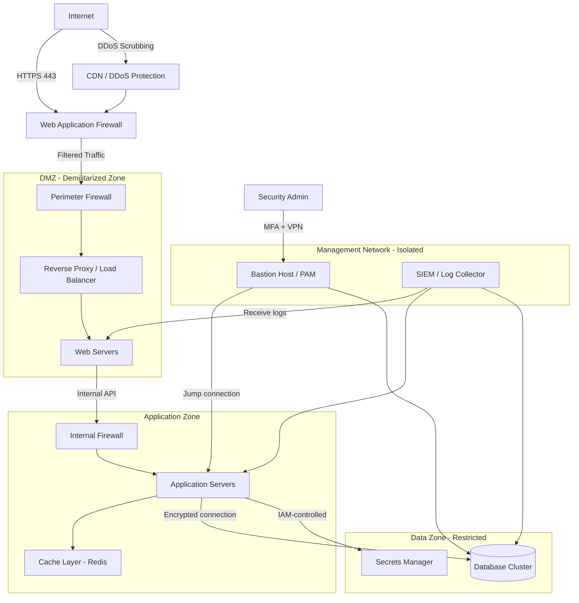
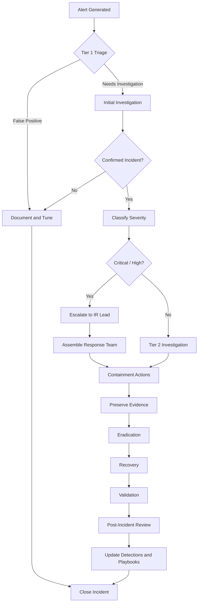
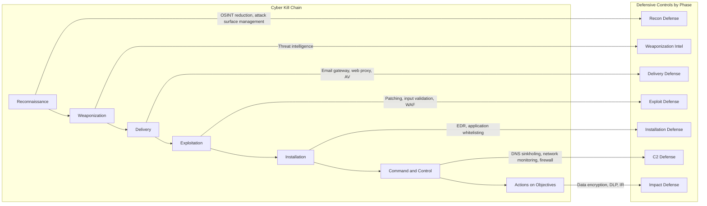
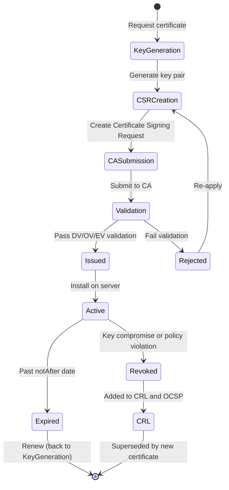
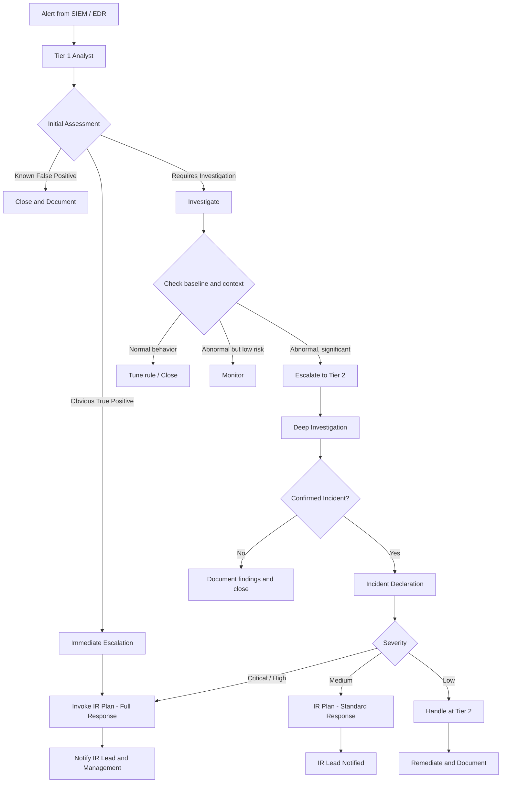
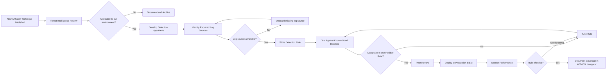

# Diagrams

This directory contains Mermaid diagrams covering key cybersecurity architectures and processes. All diagrams are in Mermaid format and can be rendered in any Mermaid-compatible viewer or directly in GitHub Markdown.

---

## Network Security Architecture

---

## Incident Response Workflow

---

## Kill Chain Mapping

---

## PKI Certificate Lifecycle

---

## Zero Trust Network Model

```mermaid
graph TD
    subgraph Anywhere [User - Any Location]
        Device[Managed Device]
        ID[User Identity]
    end
    
    subgraph Evaluation [Policy Evaluation]
        PDP[Policy Decision Point]
        TI[Threat Intelligence]
        DC[Device Compliance Check]
        IC[Identity Verification - MFA]
        RC[Risk Context - Location, Behavior]
    end
    
    subgraph Enforcement [Access Enforcement]
        PEP[Policy Enforcement Point - ZTNA]
    end
    
    subgraph Resources [Protected Resources]
        App1[Internal Application]
        App2[SaaS Application]
        API[API Gateway]
    end
    
    Device --> DC
    ID --> IC
    DC --> PDP
    IC --> PDP
    TI --> PDP
    RC --> PDP
    
    PDP --> |Allow / Deny / Step-up| PEP
    PEP --> |Per-session access| App1
    PEP --> |Per-session access| App2
    PEP --> |Per-session access| API
```

---

## SOC Alert Triage Flow

---

## MITRE ATT&CK Technique Lifecycle in Detection

