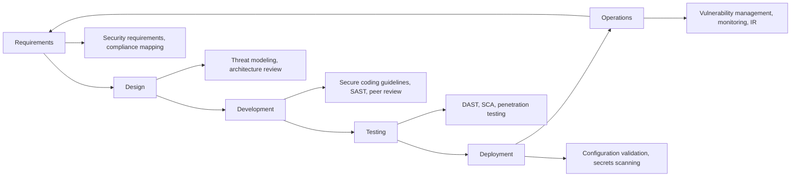
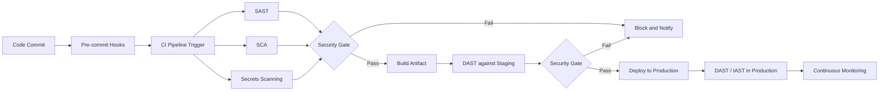

# Application Security

## Overview

Application security (AppSec) is the practice of building security into software from the design phase through development, testing, deployment, and maintenance. Unlike perimeter security, which attempts to keep attackers out of an environment, AppSec addresses vulnerabilities that persist regardless of network security controls.

The cost of fixing a vulnerability increases significantly with the phase at which it is discovered. A design flaw identified during threat modeling costs a fraction of the same flaw found in production after exploitation.

---

## Secure Software Development Lifecycle (SSDLC)

Security activities should be integrated into every phase of the software development lifecycle, not added as a final checkpoint before release.



### Requirements Phase

- Define security requirements alongside functional requirements
- Identify applicable compliance obligations (PCI DSS, HIPAA, GDPR)
- Classify the sensitivity of data the application will process
- Define authentication, authorization, and logging requirements
- Establish security acceptance criteria for release

### Design Phase

- Conduct threat modeling for all new features and significant changes
- Review architecture against security principles: least privilege, defense in depth, fail secure
- Identify third-party dependencies and their security implications
- Define trust boundaries and data flow security requirements
- Document cryptographic requirements: algorithms, key management, certificate requirements

### Development Phase

- Apply secure coding standards specific to the language and framework
- Use security-focused code review checklists
- Avoid common vulnerability patterns: injection, insecure deserialization, broken authentication
- Use parameterized queries, input validation, and output encoding as default practices
- Never commit secrets to version control

### Testing Phase

- Static Application Security Testing (SAST)
- Dynamic Application Security Testing (DAST)
- Software Composition Analysis (SCA) for third-party dependencies
- Manual security code review for high-risk components
- Penetration testing before major releases

---

## Static Application Security Testing (SAST)

SAST analyzes source code, bytecode, or binaries for vulnerabilities without executing the application. It is most effective when integrated into the developer's IDE and CI/CD pipeline, providing feedback at the earliest possible stage.

### SAST Tools

| Tool | Languages | Type | Notes |
|------|-----------|------|-------|
| Semgrep | 30+ languages | Open source/Commercial | Flexible pattern matching, custom rule support |
| SonarQube | 30+ languages | Open source/Commercial | Broad coverage, CI/CD integration |
| CodeQL | 10+ languages | Free (GitHub) | Used in GitHub Advanced Security |
| Checkmarx | Most languages | Commercial | Enterprise-grade, low false positive rate |
| Veracode | Most languages | Commercial | Binary/bytecode analysis |
| Bandit | Python | Open source | Python-specific, lightweight |
| FindBugs / SpotBugs | Java | Open source | Java-focused |
| Brakeman | Ruby on Rails | Open source | Rails-specific, high accuracy |
| ESLint (security plugins) | JavaScript | Open source | Extensible; add eslint-plugin-security |

### SAST in CI/CD

```yaml
# Example: Semgrep in GitHub Actions
name: Security Scan
on: [push, pull_request]

jobs:
  semgrep:
    name: SAST with Semgrep
    runs-on: ubuntu-latest
    steps:
      - uses: actions/checkout@v3
      - uses: returntocorp/semgrep-action@v1
        with:
          config: >-
            p/security-audit
            p/owasp-top-ten
            p/sql-injection
```

**SAST limitations:**
- High false positive rates in some tools require tuning
- Cannot detect runtime behavior or configuration issues
- Struggles with complex data flows across multiple files
- Language-specific tools miss cross-language vulnerabilities

---

## Dynamic Application Security Testing (DAST)

DAST tests a running application by sending crafted inputs and analyzing responses. It simulates external attacker behavior and can detect issues that SAST cannot, including server-side configuration problems and runtime vulnerabilities.

### DAST Tools

| Tool | Type | Use Case |
|------|------|---------|
| OWASP ZAP | Open source | Web app scanning, CI/CD integration, API testing |
| Burp Suite Pro | Commercial | Manual + automated web testing |
| Nikto | Open source | Web server misconfiguration, known vulnerable files |
| nuclei | Open source | Template-based scanning, CVE detection |
| Arachni | Open source | Full-featured web app scanner |

### DAST in CI/CD

```yaml
# Example: OWASP ZAP Baseline Scan in GitHub Actions
name: ZAP Baseline Scan
on: [push]

jobs:
  zap_scan:
    runs-on: ubuntu-latest
    steps:
      - uses: actions/checkout@v3
      - name: ZAP Scan
        uses: zaproxy/action-baseline@v0.7.0
        with:
          target: 'https://staging.myapp.com'
          rules_file_name: '.zap/rules.tsv'
          cmd_options: '-a'
```

---

## Software Composition Analysis (SCA)

Modern applications depend heavily on open source libraries. SCA tools identify known vulnerabilities in these dependencies by comparing them against vulnerability databases (NVD, OSV, GitHub Advisory Database).

### SCA Tools

| Tool | Type | Notes |
|------|------|-------|
| OWASP Dependency-Check | Open source | Maven, Gradle, npm, PyPI, NuGet |
| Snyk | Commercial/Free tier | Developer-focused, IDE integration |
| Dependabot | Free (GitHub) | Automated dependency update PRs |
| Trivy | Open source | Containers, filesystems, git repos |
| Grype | Open source | Container and filesystem scanning |
| npm audit | Built-in | Node.js package vulnerability scanning |
| pip-audit | Open source | Python package scanning |

### Dependency Risk Factors

Beyond CVSS score, evaluate dependencies for:
- **Maintenance status**: Is the project still actively maintained?
- **Transitive dependencies**: How many indirect dependencies are introduced?
- **License**: Does the license conflict with your use case?
- **Download volume**: High-volume packages are more attractive attack targets
- **Typosquatting risk**: Is the package name similar to legitimate packages?

### Supply Chain Attacks

Supply chain attacks against package registries have increased significantly. Notable examples:
- **event-stream** (2018): Malicious code injected into popular npm package targeting cryptocurrency wallets
- **ua-parser-js** (2021): npm package hijacked; malicious version published with cryptominer and password stealer
- **PyPI typosquatting**: Numerous malicious packages with names similar to popular libraries

**Mitigations:**
- Pin dependency versions (lockfiles: `package-lock.json`, `Pipfile.lock`, `go.sum`)
- Verify package integrity using checksums
- Use private registry mirrors with approval process for new packages
- Implement SCA scanning in CI/CD blocking pipeline on high-severity findings
- Monitor for new vulnerabilities in existing dependencies continuously

---

## Secure Coding Principles

### Input Validation

Never trust data from any external source. Validate all input on the server side.

```python
# Validation approaches

# Allowlist (preferred): Define what IS permitted
import re

def validate_username(username: str) -> bool:
    # Only allow alphanumeric and underscore, 3-30 characters
    pattern = r'^[a-zA-Z0-9_]{3,30}$'
    return bool(re.match(pattern, username))

# Blocklist (weaker): Define what is NOT permitted
def sanitize_html_dangerous(input_str: str) -> str:
    # Insufficient: attackers can bypass blocklists
    return input_str.replace('<script>', '').replace('</script>', '')

# Use a dedicated library for HTML sanitization
import bleach
def sanitize_html_safe(input_str: str) -> str:
    allowed_tags = ['b', 'i', 'em', 'strong', 'p']
    return bleach.clean(input_str, tags=allowed_tags, strip=True)
```

### Output Encoding

Encode data before inserting it into output contexts. The encoding method depends on the context:

| Context | Encoding Required | Example |
|---------|-----------------|---------|
| HTML body | HTML entity encoding | `<` → `&lt;` |
| HTML attribute | HTML attribute encoding | `"` → `&quot;` |
| JavaScript | JavaScript string encoding | `'` → `\'` |
| URL parameter | URL encoding (percent encoding) | space → `%20` |
| CSS | CSS string encoding | |
| SQL (wrong approach) | Do not encode — use parameterized queries | |

### Authentication

```python
# Secure password storage with Argon2
from argon2 import PasswordHasher
from argon2.exceptions import VerifyMismatchError

ph = PasswordHasher(
    time_cost=3,      # Number of iterations
    memory_cost=65536, # 64 MB
    parallelism=4,    # 4 parallel threads
    hash_len=32,
    salt_len=16
)

def hash_password(password: str) -> str:
    return ph.hash(password)

def verify_password(stored_hash: str, password: str) -> bool:
    try:
        return ph.verify(stored_hash, password)
    except VerifyMismatchError:
        return False
```

### Session Management

```python
# Secure session configuration (Flask example)
app.config.update(
    SESSION_COOKIE_SECURE=True,      # Only send over HTTPS
    SESSION_COOKIE_HTTPONLY=True,    # Prevent JavaScript access
    SESSION_COOKIE_SAMESITE='Lax',  # CSRF mitigation
    PERMANENT_SESSION_LIFETIME=1800, # 30-minute timeout
    SESSION_COOKIE_NAME='__Host-session'  # __Host- prefix: domain-locked
)

# Session invalidation on logout (required)
@app.route('/logout')
def logout():
    session.clear()  # Remove all session data
    response = redirect(url_for('login'))
    response.delete_cookie('__Host-session')
    return response

# Session regeneration after privilege change (prevents session fixation)
@app.route('/login', methods=['POST'])
def login():
    # ... authenticate user ...
    session.regenerate()  # Generate new session ID
    session['user_id'] = user.id
    return redirect(url_for('dashboard'))
```

---

## DevSecOps

DevSecOps integrates security into the DevOps pipeline, making security an automated, continuous part of development rather than a gate at the end.

### CI/CD Security Pipeline



### Pre-commit Hooks

```bash
# Install pre-commit framework
pip install pre-commit

# .pre-commit-config.yaml
cat > .pre-commit-config.yaml << 'EOF'
repos:
  - repo: https://github.com/pre-commit/pre-commit-hooks
    rev: v4.4.0
    hooks:
      - id: check-added-large-files
      - id: check-merge-conflict
      
  - repo: https://github.com/Yelp/detect-secrets
    rev: v1.4.0
    hooks:
      - id: detect-secrets
        args: ['--baseline', '.secrets.baseline']
        
  - repo: https://github.com/PyCQA/bandit
    rev: 1.7.5
    hooks:
      - id: bandit
        args: ['-ll']
        
  - repo: https://github.com/returntocorp/semgrep
    rev: v1.0.0
    hooks:
      - id: semgrep
        args: ['--config', 'p/security-audit', '--error']
EOF

pre-commit install
```

### Secrets Detection

```bash
# Detect secrets in current codebase
detect-secrets scan > .secrets.baseline

# Check for new secrets in staged changes
detect-secrets-hook --baseline .secrets.baseline

# TruffleHog — scan git history for leaked secrets
trufflehog git file://. --only-verified

# Gitleaks — scan repository and history
gitleaks detect --source . --log-opts="--all"
```
