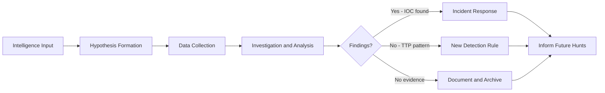
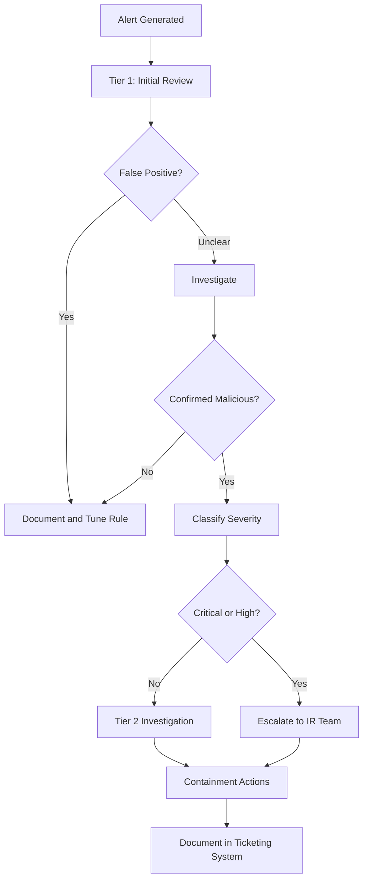

# Blue Team Operations

## Overview

Blue team operations encompass the detection, analysis, and response functions that protect organizational assets from adversarial activity. An effective blue team combines technical tooling, operational processes, and threat intelligence to reduce detection latency and minimize attacker dwell time.

---

## Security Information and Event Management (SIEM)

A SIEM aggregates log data from across the environment, applies correlation rules, and provides a centralized platform for investigation and alerting.

### Core SIEM Functions

| Function | Description |
|----------|-------------|
| Log collection | Receive and parse logs from diverse sources via agents, syslog, or API |
| Normalization | Parse disparate log formats into a unified schema for querying |
| Correlation | Identify related events across sources and time |
| Alerting | Generate notifications when correlation rules trigger |
| Search and investigation | Ad-hoc querying across historical data |
| Dashboards and reporting | Operational metrics, compliance reporting |
| Threat intelligence integration | Enrich events with IOC lookups |

### Log Sources

**Priority log sources for a functional detection capability:**

| Source | Critical Events |
|--------|----------------|
| Active Directory / Identity provider | Authentication failures, privilege assignments, account modifications, group changes |
| DNS | Queries to suspicious domains, DGA-like query patterns, unusual query volumes |
| Firewall / Network | Allowed/denied connections, traffic to rare destinations, unusual volumes |
| Endpoint (EDR/Windows Event Logs) | Process creation (Event 4688), PowerShell execution, lateral movement tools |
| Web proxy | HTTP requests to suspicious URLs, data exfiltration volumes |
| Email gateway | Phishing indicators, attachment types, link click data |
| VPN/Remote access | Authentication, unusual geographic access, after-hours activity |
| Cloud (CloudTrail, Azure Monitor) | API calls, privilege escalation, configuration changes |
| Web server | Access logs, error spikes, vulnerability scanning patterns |

### Detection Rule Development

Detection rules define the conditions that trigger alerts. Effective rules balance detection coverage against false positive rate.

**Rule quality criteria:**
- **Specificity**: Target a specific technique or behavior, not generic activity
- **Context**: Include enough context to enable triage without a full investigation
- **Tunable**: Parameters adjustable without modifying core logic
- **Documented**: Include reference to ATT&CK technique, description, and expected false positive rate
- **Tested**: Validated against real data before deployment

**Sigma rules (vendor-neutral detection rule format):**

```yaml
title: Suspicious PowerShell Encoded Command
id: b8f79cc0-6b1c-4c53-85c1-c12b4a84e7a2
status: stable
description: Detects execution of PowerShell with encoded command, common in malware and post-exploitation
references:
    - https://attack.mitre.org/techniques/T1059/001/
author: Detection Engineering Team
date: 2024/01/15
tags:
    - attack.execution
    - attack.t1059.001
logsource:
    category: process_creation
    product: windows
detection:
    selection:
        Image|endswith: '\powershell.exe'
        CommandLine|contains:
            - '-EncodedCommand'
            - '-enc '
            - '-e '
    filter_admin_tools:
        CommandLine|contains:
            - 'SCCM'
            - 'MDM'
    condition: selection and not filter_admin_tools
falsepositives:
    - Legitimate administrative scripts using encoded commands
    - SCCM and MDM agent activities
level: medium
```

---

## Endpoint Detection and Response (EDR)

EDR provides continuous monitoring of endpoint activity, behavioral detection, and the ability to respond to threats directly from the security console.

### EDR Telemetry

Modern EDR collects telemetry across multiple event categories:

| Category | Events |
|----------|--------|
| Process | Creation, termination, injection, hollowing |
| File | Create, modify, delete, rename |
| Network | Connection, DNS, HTTP |
| Registry | Key creation, value modification |
| User | Login, logout, privilege use |
| Image load | DLL loads, driver loads |
| Memory | Suspicious memory regions, shellcode |

### Behavioral Detection vs. Signature Detection

| Aspect | Signature | Behavioral |
|--------|-----------|------------|
| Basis | Known-bad hash or pattern | Patterns of activity indicating malicious intent |
| Coverage | Known malware only | Novel techniques if they match known TTP patterns |
| Evasion | Trivial (modify file by one byte) | Requires changing the actual technique |
| False positive rate | Low | Higher; requires tuning |

**Example behavioral detections:**
- Process creates network connection within 30 seconds of being spawned by Office application (malicious macro)
- cmd.exe or powershell.exe spawned as child of a document reader or browser
- PowerShell executing from an unusual path or with encoded commands
- Credential access tools (mimikatz signatures, LSASS memory access)
- Living-off-the-land patterns: certutil.exe downloading a file, regsvr32.exe loading from URL

---

## Threat Hunting

Threat hunting is the proactive, analyst-driven search for indicators of compromise or attacker activity that has evaded automated detection.

### Hunting Methodology



### Hypothesis-Driven Hunting

A hunt hypothesis frames the investigation as a testable statement:

"If threat actor group X is present in our environment, we expect to observe Kerberoasting activity targeting service accounts with SPNs, evidenced by 4769 events with ticket encryption type 0x17 (RC4) from non-service accounts."

**Sources of hypotheses:**
- Threat intelligence reports describing adversary TTPs
- Recent CVE disclosures affecting technologies in your environment
- ATT&CK matrix techniques relevant to your threat model
- Anomalies observed in routine monitoring
- Industry peer sharing (ISACs, trusted communities)

### Hunt Techniques

**Stack counting / frequency analysis:**
Identify rare values in normally consistent fields. Rare process names, rare parent-child relationships, and rare command-line arguments are worth investigating.

```sql
-- Rare process parents for cmd.exe (Splunk SPL)
index=endpoint EventCode=4688 NewProcessName="*\\cmd.exe"
| stats count by ParentProcessName
| sort count asc
| head 20
```

**Clustering:**
Group similar events to identify outliers. Connections to countries or ASNs not typically used by the organization, or file sizes dramatically outside the norm for a protocol.

**Timeline analysis:**
Reconstruct the sequence of events around a suspicious artifact to understand scope and trajectory.

**Known-bad matching:**
Query historical data for newly discovered IOCs. Threat intelligence often reveals C2 infrastructure that was active weeks or months before discovery.

---

## Detection Engineering

Detection engineering is the discipline of systematically building, testing, and maintaining detection capabilities.

### Detection-as-Code

Treat detection rules like software: version-controlled, peer-reviewed, tested, and deployed through a pipeline.

```
detection-rules/
├── windows/
│   ├── execution/
│   │   ├── powershell_encoded_command.yml
│   │   └── wmi_process_creation.yml
│   ├── persistence/
│   │   ├── registry_run_key.yml
│   │   └── scheduled_task_creation.yml
│   └── lateral_movement/
│       ├── pass_the_hash.yml
│       └── remote_services.yml
├── linux/
│   ├── execution/
│   └── persistence/
└── cloud/
    ├── aws/
    └── azure/
```

### Detection Coverage Mapping

Map detection rules to MITRE ATT&CK to identify coverage gaps and prioritize new rule development:

| Tactic | Covered Techniques | Coverage % |
|--------|-------------------|------------|
| Initial Access | T1566.001, T1190, T1133 | 60% |
| Execution | T1059.001, T1059.003, T1047 | 70% |
| Persistence | T1053.005, T1547.001, T1543.003 | 55% |
| Privilege Escalation | T1078, T1134 | 40% |
| Defense Evasion | T1140, T1027 | 35% |
| Credential Access | T1003.001, T1558.003 | 50% |
| Discovery | T1082, T1083, T1087 | 30% |
| Lateral Movement | T1021.001, T1021.002 | 45% |
| Collection | T1005, T1039 | 25% |
| Exfiltration | T1048, T1041 | 35% |
| Command and Control | T1071.001, T1105 | 50% |

### Logging Strategy

**Logging must be:**
- **Centralized**: All logs forwarded to a SIEM or log aggregation platform
- **Tamper-resistant**: Write-protected destination; logs cannot be modified or deleted by compromised endpoints
- **Retained**: Minimum 12 months online, 24+ months archived for regulatory and forensic requirements
- **Timestamped accurately**: NTP synchronization across all log sources (critical for timeline analysis)
- **Normalized**: Common schema to enable cross-source queries

**Windows logging configuration (critical events):**

```
Security Event Log:
  - 4624: Successful logon
  - 4625: Failed logon
  - 4648: Logon using explicit credentials
  - 4672: Special privileges assigned to new logon
  - 4688: Process creation (enable with command line auditing)
  - 4698: Scheduled task created
  - 4720: User account created
  - 4732: Member added to security-enabled local group
  - 4769: Kerberos service ticket requested
  - 5140: Network share accessed

PowerShell logging:
  Enable-PSScriptBlockLogging
  Enable-PSTranscription
  Enable-PSModuleLogging
  # Events logged to: Microsoft-Windows-PowerShell/Operational
  # Event IDs: 4103, 4104 (script block logging)
```

---

## SOC Operations

### Alert Triage Workflow



### Triage Questions

For any potential security event, answer these questions in sequence:

1. **What happened?** What activity does the alert describe?
2. **Where?** Which systems, accounts, or data are involved?
3. **When?** What is the timeline of activity?
4. **Who?** Which account or system initiated the activity?
5. **Is it expected?** Is this behavior consistent with the account/system's normal function?
6. **What is the business context?** Is there a change ticket, approved activity, or business event explaining this?
7. **What is the potential impact?** If this is malicious, what could the attacker access or do next?
8. **What is the confidence level?** How certain are you in the assessment?

### Metrics and KPIs

| Metric | Description | Target |
|--------|-------------|--------|
| Mean Time to Detect (MTTD) | Time from incident start to detection | < 24 hours |
| Mean Time to Respond (MTTR) | Time from detection to containment | < 4 hours for critical |
| Alert volume | Total alerts per day/week | Trending analysis |
| True positive rate | Proportion of alerts that are genuine threats | > 80% |
| False positive rate | Proportion of alerts that are not threats | < 20% |
| Coverage score | Percentage of ATT&CK techniques with detection | Increasing over time |
| Dwell time | Duration of attacker presence before detection | Decreasing |
