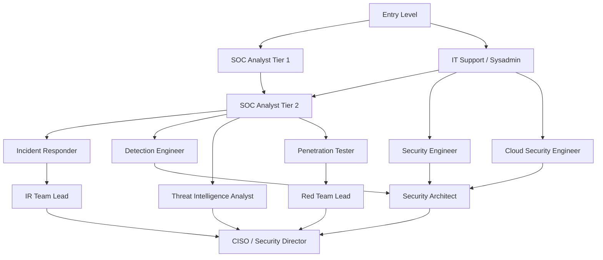

# Cybersecurity Career Roadmap

## Overview

Cybersecurity offers diverse career paths ranging from highly technical roles to management and governance functions. This guide provides structured learning paths by role, with honest assessment of required skills, realistic timelines, and the certifications and experiences that carry the most weight with hiring organizations.

---

## Career Paths

---

## SOC Analyst (Tier 1 → Tier 2 → Tier 3)

### Role Description

SOC analysts monitor security alerts, investigate events, triage incidents, and escalate confirmed threats to incident response teams. It is the most common entry point into security operations.

### Required Skills

**Technical:**
- Network fundamentals: TCP/IP, DNS, HTTP, common ports and protocols
- Windows and Linux operating system basics
- Understanding of common attack types: phishing, malware, intrusion attempts
- Log analysis: reading and interpreting firewall logs, authentication logs, endpoint logs
- SIEM usage: querying, building dashboards, understanding correlation rules
- Basic scripting (Python or PowerShell) for automation

**Analytical:**
- Ability to assess alert context and determine true/false positive
- Systematic investigation methodology
- Documentation of findings clearly and concisely
- Understanding when to escalate vs. resolve independently

### Learning Path

**Foundation (3–6 months):**
- CompTIA Security+: broad baseline, widely recognized, appropriate for early career
- TryHackMe SOC Level 1 path: practical hands-on training
- Blue Team Labs Online: alert triage, log analysis, practical scenarios
- Study: networking fundamentals (Professor Messer, CompTIA Network+ material)

**Intermediate (6–18 months in role):**
- CompTIA CySA+ (Cybersecurity Analyst): focused on detection and analysis
- SANS SEC511 (Continuous Monitoring and Security Operations)
- Build SIEM skills: Splunk Core Certified User, Splunk BOTS (Boss of the SOC)
- Practice with MITRE ATT&CK Navigator for detection coverage understanding

**Advanced:**
- GIAC GCIA (Intrusion Analyst) or GMON (Security Operations Certified)
- Threat hunting training
- Pursue specialization: detection engineering, threat intelligence, or IR

---

## Penetration Tester

### Role Description

Penetration testers conduct authorized simulated attacks against organizations' systems to identify vulnerabilities before real attackers do. The role requires broad technical knowledge across networking, web applications, operating systems, and common attack techniques.

### Required Skills

- Network and application architecture
- Web application vulnerabilities (OWASP Top 10 in depth)
- Operating system internals (Windows, Linux)
- Active Directory and common enterprise environments
- Scripting: Python, Bash, PowerShell
- Common offensive tools: Nmap, Burp Suite, Metasploit, Impacket, BloodHound
- Report writing: communicating findings clearly to technical and non-technical audiences
- Legal and ethical constraints of authorized testing

### Learning Path

**Foundation:**
- CompTIA Security+ (baseline)
- Study: networking, web protocols, OS fundamentals
- Hands-on platforms: HackTheBox, TryHackMe (Offensive Pentesting path), VulnHub
- OWASP WebGoat, DVWA for web application practice

**Intermediate:**
- eLearnSecurity eJPT (Junior Penetration Tester): practical, entry-level
- CompTIA PenTest+: broad coverage, less technically demanding than OSCP
- PortSwigger Web Academy: comprehensive free web application security training

**Advanced (Industry Standard):**
- **Offensive Security OSCP** (PEN-200): The most widely recognized technical penetration testing certification. 24-hour practical exam. Required or strongly preferred by most employers. Minimum 3–6 months dedicated study recommended.
- GIAC GPEN or GWAPT for web application focus
- Offensive Security OSEP (advanced Active Directory, evasion)
- Offensive Security OSED (exploit development)

---

## Incident Responder / Digital Forensics

### Role Description

Incident responders lead the investigation and containment of security incidents. Digital forensics practitioners collect, preserve, and analyze digital evidence. The roles often overlap.

### Required Skills

- Incident response lifecycle (NIST SP 800-61)
- Digital forensics fundamentals: evidence handling, chain of custody, forensic acquisition
- Memory forensics: Volatility Framework
- Disk forensics: The Sleuth Kit, Autopsy, FTK
- Log analysis across endpoint, network, and cloud sources
- Malware behavior recognition (without requiring full reverse engineering)
- Windows and Linux internals: file systems, registry, event logs, persistence mechanisms
- Network traffic analysis: Wireshark, Zeek

### Learning Path

**Foundation:**
- CompTIA Security+ or CySA+
- Study: Windows forensics artifacts, Linux forensics, network protocols
- Practice: Digital Forensics CTFs (Magnet Weekly CTF archives, BlueTeamLabs)
- Incident Handling with Linux (free resources from DFIR.training)

**Intermediate:**
- SANS FOR508 (Advanced Incident Response, Threat Hunting, and Digital Forensics) — one of the most respected IR/DFIR courses
- GIAC GCFE (Computer Forensics Examiner) or GCFA (Forensic Analyst)
- Practice with Volatility, Autopsy, and Eric Zimmerman's tools

**Advanced:**
- GIAC GCFE or GCFA with GSE (Security Expert) as long-term goal
- SANS FOR610 (Malware Analysis) for malware reverse engineering
- GIAC GREM (Reverse Engineering Malware)

---

## Cloud Security Engineer

### Role Description

Cloud security engineers design, implement, and monitor security controls for cloud environments. Requires strong understanding of one or more cloud platforms plus traditional security fundamentals.

### Required Skills

- AWS, Azure, or GCP security services (prefer deep knowledge of one, working knowledge of another)
- IAM design: least privilege, role architecture, service accounts
- Infrastructure as Code: Terraform, CloudFormation, Bicep — and associated security review
- Container and Kubernetes security
- Network security in cloud: VPCs, security groups, NACLs, WAF, DDoS protection
- Cloud-native logging and monitoring
- DevSecOps practices: security in CI/CD pipelines, SAST, DAST, SCA

### Learning Path

**Foundation:**
- AWS Cloud Practitioner or Azure Fundamentals (optional but useful for context)
- AWS Solutions Architect Associate or Azure Administrator: understand the platform before securing it
- Study: cloud IAM models, shared responsibility, common misconfigurations

**Intermediate:**
- AWS Security Specialty or Azure Security Engineer Associate
- CCSK (Certificate of Cloud Security Knowledge): vendor-neutral, CSA-issued
- Hands-on: CloudGoat (Rhino Security Labs), Flaws.cloud, Thunder CTF

**Advanced:**
- CCSP (Certified Cloud Security Professional, ISC2): most recognized vendor-neutral cloud security certification
- AWS Security Specialty + deep Kubernetes security (CKS — Certified Kubernetes Security Specialist)

---

## Security Architect

### Role Description

Security architects design security controls and architecture across systems, networks, and applications. It is typically a senior role requiring 8–12+ years of experience.

### Required Skills

- Deep understanding of multiple security domains (not specialist-level in all, but sufficient depth)
- Enterprise architecture frameworks: TOGAF, SABSA
- Threat modeling: STRIDE, PASTA, LINDDUN
- Security frameworks: NIST CSF, ISO 27001, Zero Trust
- Communicating security trade-offs to technical and non-technical stakeholders
- Cloud architecture across multiple providers
- Strong understanding of cryptography, IAM, network security

### Certifications

- CISSP (Certified Information Systems Security Professional, ISC2): The most recognized general security management and architecture credential; requires 5 years of experience
- SABSA Chartership: Enterprise security architecture framework
- TOGAF with Security Extension
- Cloud-specific: AWS Security Specialty, Azure Security Engineer, CCSP

---

## Certifications Reference

| Certification | Issuer | Level | Domain |
|-------------|--------|-------|--------|
| CompTIA Security+ | CompTIA | Entry | General security |
| CompTIA CySA+ | CompTIA | Intermediate | Security analysis/defense |
| CompTIA PenTest+ | CompTIA | Intermediate | Penetration testing |
| eJPT | eLearnSecurity | Entry | Penetration testing |
| OSCP | Offensive Security | Intermediate-Advanced | Penetration testing |
| GPEN | GIAC/SANS | Intermediate | Penetration testing |
| GWAPT | GIAC/SANS | Intermediate | Web application pentesting |
| GCIA | GIAC/SANS | Intermediate | Intrusion analysis |
| GCFE | GIAC/SANS | Intermediate | Digital forensics |
| GCFA | GIAC/SANS | Advanced | Forensic analysis |
| GREM | GIAC/SANS | Advanced | Malware reverse engineering |
| CISSP | ISC2 | Advanced | General security management |
| CCSP | ISC2 | Advanced | Cloud security |
| CISM | ISACA | Advanced | Security management |
| AWS Security Specialty | AWS | Advanced | AWS security |
| CCSK | CSA | Intermediate | Cloud security (vendor-neutral) |
| CEH | EC-Council | Intermediate | Ethical hacking (less respected than OSCP by practitioners) |
