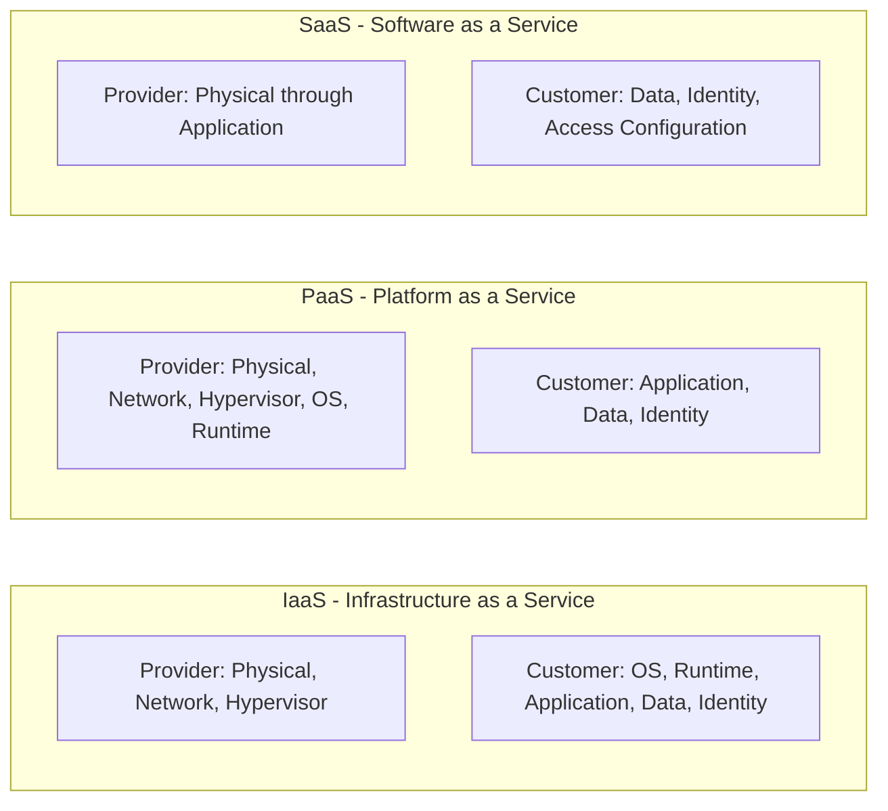
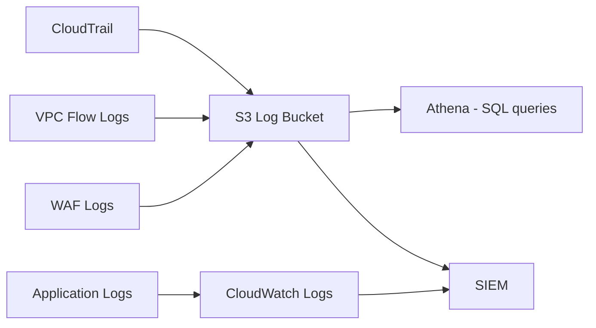

# Cloud Security

## Shared Responsibility Model

Cloud security operates under a shared responsibility model: the cloud provider secures the infrastructure, while the customer is responsible for securing what they run on that infrastructure. The boundary varies by service model.



**Key implication:** The cloud provider's compliance certifications (SOC 2, ISO 27001, FedRAMP) cover their infrastructure, not the customer's workloads. Customers must independently demonstrate compliance for their tier of responsibility.

---

## Identity and Access Management in Cloud

IAM is the most critical security domain in cloud environments. The majority of cloud breaches involve IAM misconfigurations rather than infrastructure vulnerabilities.

### AWS IAM

**Principals:** Users, Groups, Roles, and Services (AWS services that assume roles)

**Policies:** JSON documents defining allowed or denied actions on resources

```json
{
    "Version": "2012-10-17",
    "Statement": [
        {
            "Effect": "Allow",
            "Action": [
                "s3:GetObject",
                "s3:ListBucket"
            ],
            "Resource": [
                "arn:aws:s3:::my-specific-bucket",
                "arn:aws:s3:::my-specific-bucket/*"
            ]
        }
    ]
}
```

**Policy evaluation order:**
1. Explicit Deny overrides everything
2. Service Control Policies (SCPs) in AWS Organizations
3. Permission Boundaries
4. Identity-based policies
5. Resource-based policies
6. Implicit deny (default)

**IAM Best Practices:**

| Practice | Rationale |
|----------|-----------|
| Enable MFA for all human accounts | Credential compromise alone is insufficient for access |
| No root account usage for day-to-day operations | Root account has unrestricted access; compromise is catastrophic |
| Use IAM Roles instead of long-lived access keys | Roles use temporary credentials; keys are permanent until rotated |
| Rotate access keys regularly | Limits the window of exposure for compromised keys |
| Use AWS Organizations SCPs | Preventive guardrails across all accounts |
| Enable CloudTrail in all regions | Ensures API activity is auditable |
| Apply least privilege | Minimize the impact of compromised identities |

**Detecting over-permissive roles:**
```bash
# AWS IAM Access Analyzer - identifies external access to resources
aws accessanalyzer create-analyzer --analyzer-name account-analyzer --type ACCOUNT

# List IAM users with no recent activity
aws iam generate-credential-report
aws iam get-credential-report
```

### Azure RBAC

Azure uses Role-Based Access Control with built-in and custom roles assigned at management group, subscription, resource group, or resource scope.

**Built-in roles of note:**
- **Owner**: Full access including ability to assign roles to others
- **Contributor**: Full access except role assignment
- **Reader**: Read-only access
- **User Access Administrator**: Manage user access

**Security principles:**
- Assign roles at the lowest scope required
- Prefer built-in roles over custom roles for simplicity
- Use Azure AD Privileged Identity Management (PIM) for just-in-time privileged access
- Review access regularly with Access Reviews

### GCP IAM

GCP IAM follows similar principles with some terminology differences:

- **Members**: Google accounts, service accounts, groups, domains
- **Roles**: Collection of permissions. Predefined, basic, or custom.
- **Bindings**: Member + Role assignment on a resource

GCP-specific security features:
- **Workload Identity Federation**: Allows external identities (e.g., GitHub Actions, AWS) to access GCP resources without service account keys
- **Organization Policy Service**: Preventive constraints on resource configurations (e.g., prevent public GCS buckets)
- **VPC Service Controls**: Define a security perimeter around GCP services to prevent data exfiltration

---

## Common Cloud Misconfigurations

### Publicly Accessible Storage

Publicly accessible cloud storage buckets remain one of the most common causes of data breaches. A misconfigured S3 bucket, Azure Blob container, or GCS bucket can expose terabytes of sensitive data.

**AWS S3 Public Access:**
```bash
# Check bucket ACL
aws s3api get-bucket-acl --bucket bucket-name

# Check bucket policy
aws s3api get-bucket-policy --bucket bucket-name

# Block all public access (apply at account level)
aws s3control put-public-access-block \
    --account-id 123456789012 \
    --public-access-block-configuration \
    "BlockPublicAcls=true,IgnorePublicAcls=true,BlockPublicPolicy=true,RestrictPublicBuckets=true"
```

**Detection tools:**
- AWS Trusted Advisor
- AWS Config rule: `s3-bucket-public-read-prohibited`
- Scout Suite, Prowler for multi-account auditing

### Overly Permissive Security Groups / Network ACLs

Security groups acting as firewalls for cloud resources are frequently misconfigured to allow unrestricted inbound access.

**Common findings:**
- `0.0.0.0/0` on port 22 (SSH) or 3389 (RDP)
- `0.0.0.0/0` on database ports (3306, 5432, 1433, 27017)
- `0.0.0.0/0` on administrative ports (8080, 9200, 6379)

```bash
# Find security groups allowing all inbound traffic
aws ec2 describe-security-groups \
    --filters "Name=ip-permission.cidr,Values=0.0.0.0/0" \
    --query "SecurityGroups[*].{ID:GroupId,Name:GroupName}"
```

### Instance Metadata Service (IMDS) Abuse

The EC2 Instance Metadata Service provides configuration and credentials to running instances via `http://169.254.169.254/`. This is accessible to any process running on the instance, including server-side request forgery vulnerabilities.

**IMDSv1 (vulnerable):**
```bash
# Accessible via simple GET from any process on the instance, including via SSRF
curl http://169.254.169.254/latest/meta-data/iam/security-credentials/role-name
```

**IMDSv2 (requires PUT first):**
```bash
# Requires a token - blocks simple SSRF attacks
TOKEN=$(curl -X PUT "http://169.254.169.254/latest/api/token" \
    -H "X-aws-ec2-metadata-token-ttl-seconds: 21600")
curl -H "X-aws-ec2-metadata-token: $TOKEN" \
    http://169.254.169.254/latest/meta-data/iam/security-credentials/
```

**Enforcement:**
```bash
# Require IMDSv2 on existing instances
aws ec2 modify-instance-metadata-options \
    --instance-id i-1234567890abcdef0 \
    --http-tokens required \
    --http-endpoint enabled
```

### Secrets in Code and Environment Variables

Secrets (API keys, database passwords, private keys) frequently end up in:
- Source code committed to version control
- Container images
- Environment variable listings visible in logs
- CloudFormation/Terraform state files

**Detection:**
```bash
# Scan for secrets in git history
git log --all --oneline | head -50
truffleHog git file://. --regex --entropy=False

# AWS: scan for exposed credentials
aws secretsmanager list-secrets
aws ssm describe-parameters
```

**Remediation:**
- Use cloud-native secrets management: AWS Secrets Manager, Azure Key Vault, GCP Secret Manager
- Rotate all exposed credentials immediately
- Use git-secrets or pre-commit hooks to prevent future commits

---

## Cloud-Native Detection

### AWS CloudTrail

CloudTrail records all API calls made in an AWS account, including the principal, source IP, timestamp, and request/response details.

**High-value events to monitor:**

| Event | Significance |
|-------|-------------|
| `ConsoleLogin` with `additionalEventData.MFAUsed = No` | Console login without MFA |
| `CreateUser`, `AttachUserPolicy` | New IAM user or privilege escalation |
| `AssumeRole` with unknown external principal | Cross-account access attempt |
| `DeleteTrail`, `StopLogging` | Attacker attempting to disable audit trail |
| `GetSecretValue` | Secret access, particularly for unusual principals |
| `S3:GetObject` on sensitive buckets from unexpected principals | Data exfiltration |
| `RunInstances` with large instance types | Cryptomining or compute abuse |

**CloudTrail Insights:** Detects unusual API activity patterns automatically. Useful for detecting credential abuse and unusual automation.

### AWS GuardDuty

GuardDuty is a managed threat detection service analyzing CloudTrail logs, VPC Flow Logs, and DNS logs using machine learning and threat intelligence.

**Key finding categories:**
- **Backdoor**: EC2 instance communicating with known C2 IPs
- **Behavior**: Unusual API calls from a principal
- **CryptoCurrency**: Mining activity detected
- **Recon**: Port scanning, unauthorized port probing
- **Trojan**: EC2 instance communicating with known malware IPs
- **UnauthorizedAccess**: Credentials used from unusual geographic location

### Logging Architecture



---

## Container Security

### Docker Image Security

Container images accumulate vulnerabilities from base images, installed packages, and application dependencies.

**Secure Dockerfile practices:**
```dockerfile
# Use minimal base image
FROM python:3.11-slim

# Run as non-root user
RUN useradd --create-home --shell /bin/bash appuser
USER appuser

# Copy only required files
COPY --chown=appuser:appuser requirements.txt .
RUN pip install --no-cache-dir -r requirements.txt

COPY --chown=appuser:appuser app/ ./app/

# Read-only filesystem where possible
EXPOSE 8080
CMD ["python", "-m", "app"]
```

**Image scanning:**
```bash
# Trivy: vulnerability scanner
trivy image python:3.11-slim
trivy image --severity HIGH,CRITICAL myapp:latest

# Grype
grype myapp:latest
```

### Kubernetes Security

Kubernetes clusters introduce a significant attack surface through the API server, kubelet, etcd, and default configurations.

**Key hardening areas:**

| Area | Control |
|------|---------|
| RBAC | Define ClusterRoles and Roles with minimal permissions; avoid cluster-admin where possible |
| Pod Security | Use Pod Security Admission or OPA Gatekeeper to enforce security contexts |
| Network Policies | Default deny all ingress/egress; explicitly allow required communication |
| Secrets | Do not store secrets as base64-encoded Kubernetes Secrets in etcd without encryption at rest |
| Image Policy | Enforce image signing (Cosign) and restrict to approved registries |
| API Server | Disable anonymous authentication; enable audit logging |

**Network Policy (default deny):**
```yaml
apiVersion: networking.k8s.io/v1
kind: NetworkPolicy
metadata:
  name: default-deny-all
  namespace: production
spec:
  podSelector: {}
  policyTypes:
  - Ingress
  - Egress
```
