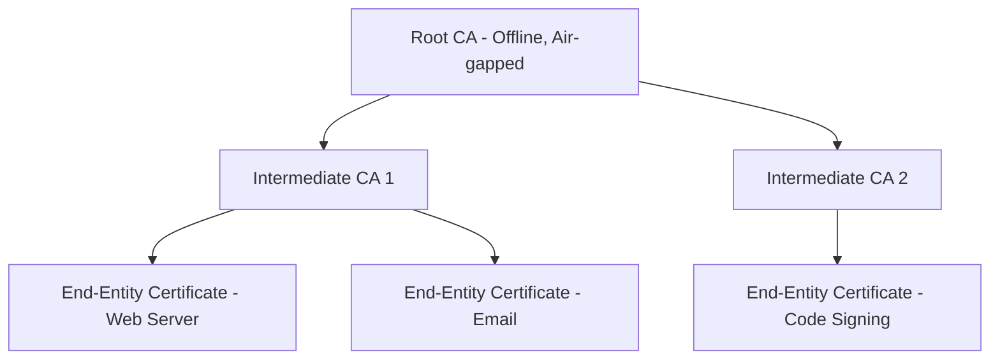

# Cryptography

## Foundational Concepts

### Symmetric vs. Asymmetric Encryption

| Property | Symmetric | Asymmetric |
|----------|-----------|------------|
| Keys used | Same key for encryption and decryption | Public key encrypts, private key decrypts |
| Speed | Fast (suitable for bulk data) | Slow (suitable for small data or key exchange) |
| Key distribution | Difficult (secure channel required) | Easier (public key can be shared openly) |
| Examples | AES, ChaCha20, 3DES | RSA, ECC, ElGamal |
| Typical use | Data encryption at rest and in transit | Key exchange, digital signatures, certificate signing |

In practice, hybrid encryption is used: asymmetric cryptography establishes a shared secret, which is then used as a symmetric key for bulk data encryption. This is how TLS operates.

---

## Hashing Algorithms

A cryptographic hash function maps an input of arbitrary length to a fixed-length output (digest). Properties:

- **Deterministic**: The same input always produces the same output
- **Pre-image resistance**: Given a hash output H, it is computationally infeasible to find input M such that H(M) = H
- **Second pre-image resistance**: Given input M1, it is computationally infeasible to find M2 ≠ M1 such that H(M1) = H(M2)
- **Collision resistance**: It is computationally infeasible to find any two inputs M1 ≠ M2 such that H(M1) = H(M2)

### Algorithm Reference

| Algorithm | Output Size | Status | Notes |
|-----------|------------|--------|-------|
| MD5 | 128 bits | Broken (2005) | Collisions trivially constructible; do not use for security |
| SHA-1 | 160 bits | Deprecated | SHAttered collision demonstrated (2017); avoid in new systems |
| SHA-256 | 256 bits | Current | Part of SHA-2 family; widely used |
| SHA-384 | 384 bits | Current | Part of SHA-2 family |
| SHA-512 | 512 bits | Current | Part of SHA-2 family; slower on 32-bit |
| SHA3-256 | 256 bits | Current | Keccak-based; different construction from SHA-2 |
| BLAKE2b | 256-512 bits | Current | Faster than SHA-3 in software, resistant to length extension |
| BLAKE3 | 256 bits | Current | Highly parallelizable, fastest of modern hash functions |

### Hash Applications

**Password storage:**
Passwords should never be stored as plaintext or as simple hashes. Simple hashes enable dictionary and rainbow table attacks because identical passwords produce identical hashes.

Correct approaches:
- **bcrypt**: Adaptive cost factor, slow by design, includes salt
- **Argon2id**: Winner of Password Hashing Competition (2015). Memory-hard, time-hard. Preferred for new implementations.
- **scrypt**: Memory-hard function, strong against GPU/ASIC attacks

```python
import hashlib
import bcrypt

# Incorrect: Plain SHA-256 for passwords
sha_hash = hashlib.sha256(b"password123").hexdigest()

# Correct: bcrypt with work factor
password = b"password123"
salt = bcrypt.gensalt(rounds=12)
hashed = bcrypt.hashpw(password, salt)
verified = bcrypt.checkpw(password, hashed)
```

**HMAC (Hash-based Message Authentication Code):**
Combines a cryptographic hash with a secret key to provide both integrity verification and authentication of the source.

```
HMAC(K, M) = H((K XOR opad) || H((K XOR ipad) || M))
```

Used in TLS for record authentication, JWT signatures (HS256), API authentication.

---

## Symmetric Encryption: AES

The Advanced Encryption Standard (AES) is the dominant symmetric block cipher, standardized by NIST in 2001 (FIPS 197). AES operates on 128-bit blocks with key sizes of 128, 192, or 256 bits.

### AES Modes of Operation

Block ciphers operate on fixed-size blocks. A mode of operation specifies how to apply the block cipher to data of arbitrary length.

| Mode | Properties | Use Cases | Notes |
|------|-----------|-----------|-------|
| ECB | Deterministic, no IV | None recommended | Identical plaintext blocks produce identical ciphertext; reveals patterns |
| CBC | Requires IV, sequential | Legacy systems | Vulnerable to BEAST and padding oracle attacks |
| CTR | Stream cipher mode, parallel | Data encryption | No padding needed; IV reuse is catastrophic |
| GCM | Authenticated encryption (AEAD) | TLS 1.2+, file encryption | Preferred; provides confidentiality and integrity |
| CCM | AEAD, limited nonce size | IoT protocols | Less common than GCM |

**AES-GCM is the recommended mode for new implementations.**

```python
from cryptography.hazmat.primitives.ciphers.aead import AESGCM
import os

# AES-256-GCM encryption
key = AESGCM.generate_key(bit_length=256)
aesgcm = AESGCM(key)

nonce = os.urandom(12)  # 96-bit nonce for GCM
plaintext = b"Sensitive data to encrypt"
aad = b"authenticated additional data"

ciphertext = aesgcm.encrypt(nonce, plaintext, aad)
recovered = aesgcm.decrypt(nonce, ciphertext, aad)
```

**Critical AES-GCM constraint:** The nonce must never be reused with the same key. Nonce reuse in GCM allows an attacker to recover the authentication key and decrypt messages. Use a random 96-bit nonce or a counter, ensuring uniqueness.

---

## Asymmetric Encryption: RSA

RSA (Rivest-Shamir-Adleman) is based on the computational hardness of factoring the product of two large prime numbers.

### RSA Key Generation

1. Choose two large primes p and q (typically 2048+ bits)
2. Compute n = p × q (the modulus)
3. Compute φ(n) = (p-1)(q-1)
4. Choose e: 1 < e < φ(n), gcd(e, φ(n)) = 1 (commonly 65537)
5. Compute d: d × e ≡ 1 (mod φ(n)) (d is the private exponent)
6. Public key: (n, e); Private key: (n, d)

### RSA Key Sizes

| Key Size | Status | Notes |
|----------|--------|-------|
| 512 bits | Broken | Factorable in hours on modern hardware |
| 1024 bits | Deprecated | NIST prohibits after 2013 |
| 2048 bits | Acceptable | Minimum for current use; roughly 112-bit security |
| 3072 bits | Recommended | 128-bit security level |
| 4096 bits | Strong | 140-bit security level; slower operations |

### RSA Vulnerabilities

- **Textbook RSA**: Raw RSA without padding is deterministic and malleable. Never use without proper padding.
- **PKCS#1 v1.5 padding (RSA-PKCS1)**: Vulnerable to Bleichenbacher's chosen-ciphertext attack (padding oracle). Avoid for new applications.
- **OAEP (Optimal Asymmetric Encryption Padding)**: Use for encryption. Provides semantic security.
- **PSS (Probabilistic Signature Scheme)**: Use for signatures. Preferred over PKCS#1 v1.5 signature padding.
- **Small exponent attacks**: Using a small public exponent with RSA-PKCS1 without proper padding enables attack.
- **Coppersmith attacks**: If a portion of the private key or message is known, the full key/message may be recoverable.

---

## Elliptic Curve Cryptography (ECC)

ECC provides equivalent security to RSA at significantly smaller key sizes, based on the hardness of the elliptic curve discrete logarithm problem (ECDLP).

### Key Size Comparison

| Security Level | RSA Key Size | ECC Key Size |
|---------------|-------------|-------------|
| 80 bits | 1024 bits | 160 bits |
| 112 bits | 2048 bits | 224 bits |
| 128 bits | 3072 bits | 256 bits |
| 192 bits | 7680 bits | 384 bits |
| 256 bits | 15360 bits | 512 bits |

### Recommended Curves

| Curve | Use | Notes |
|-------|-----|-------|
| P-256 (secp256r1) | TLS, signatures | NIST curve, widely supported |
| P-384 (secp384p1) | High-security TLS | 192-bit security |
| X25519 | ECDH key exchange | Designed by Bernstein; faster, safer implementation properties |
| Ed25519 | Digital signatures | Fast, secure, no dependency on random number quality |

### ECDSA vs. EdDSA

ECDSA (Elliptic Curve Digital Signature Algorithm) requires a cryptographically secure random nonce (k) for each signature. If k is reused or predictable, the private key can be recovered. The Sony PlayStation 3 private key was extracted using this vulnerability.

EdDSA (Edwards-curve Digital Signature Algorithm, e.g., Ed25519) derives k deterministically from the message and private key, eliminating the nonce reuse vulnerability.

**Prefer Ed25519 for new signature implementations.**

---

## Public Key Infrastructure (PKI)

PKI is the set of roles, policies, hardware, software, and procedures needed to create, manage, distribute, use, store, and revoke digital certificates.

### Certificate Authorities (CAs)

A Certificate Authority signs digital certificates, asserting that a public key belongs to a specific entity. Trust in the CA is the foundation of PKI.

**CA hierarchy:**



Root CAs should be kept offline and air-gapped. Intermediate CAs perform day-to-day certificate issuance.

### X.509 Certificate Structure

Critical fields:
- **Subject**: The entity the certificate represents (distinguished name)
- **Issuer**: The CA that signed the certificate
- **Serial Number**: Unique identifier within the issuing CA
- **Validity Period**: notBefore and notAfter timestamps
- **Public Key**: The subject's public key and algorithm
- **Key Usage**: Permitted uses (digital signature, key encipherment, etc.)
- **Extended Key Usage**: More specific uses (TLS Web Server Authentication, Code Signing, etc.)
- **Subject Alternative Names (SANs)**: Additional hostnames or IP addresses (modern certificates use SANs rather than Common Name for hostname binding)
- **Signature**: The CA's digital signature over the certificate content

### Certificate Revocation

When a certificate is compromised or the associated key is exposed, the certificate must be revoked.

| Mechanism | Description | Limitations |
|-----------|-------------|-------------|
| CRL (Certificate Revocation List) | Signed list of revoked serial numbers published by the CA | Large files, delayed updates, often not checked by browsers |
| OCSP (Online Certificate Status Protocol) | Real-time query for revocation status | Privacy (reveals which certificates you're checking), availability dependency |
| OCSP Stapling | Server pre-fetches OCSP response and includes it in TLS handshake | Eliminates client-side OCSP queries; must configure short response lifetime |

**Browser behavior:** Most modern browsers implement "soft fail" for revocation checks — if the OCSP responder is unreachable, the browser proceeds. This means revocation provides weaker guarantees than often assumed.

### Certificate Transparency (CT)

Certificate Transparency is an RFC 6962 standard that requires all publicly-trusted TLS certificates to be logged to public CT logs. Browsers verify that certificates are logged before trusting them.

Benefits:
- Allows organizations to detect unauthorized certificates issued for their domains
- Creates an auditable record of certificate issuance

Monitoring: Organizations should monitor CT logs for certificates issued for their domains using services such as crt.sh or commercial certificate monitoring tools.

---

## Transport Layer Security (TLS)

### Cipher Suite Components

A cipher suite specifies the algorithms used for each function in a TLS connection. Example: `TLS_ECDHE_RSA_WITH_AES_256_GCM_SHA384`

| Component | Example | Function |
|-----------|---------|---------|
| Key exchange | ECDHE | Establishes shared secret |
| Authentication | RSA | Verifies server certificate |
| Encryption | AES_256_GCM | Encrypts application data |
| MAC/PRF | SHA384 | Integrity and key derivation |

TLS 1.3 simplified cipher suites (authentication/key exchange separated from symmetric cipher):
- TLS_AES_256_GCM_SHA384
- TLS_CHACHA20_POLY1305_SHA256
- TLS_AES_128_GCM_SHA256

### Forward Secrecy

Forward secrecy (also called perfect forward secrecy, PFS) ensures that compromise of the server's long-term private key does not enable decryption of past recorded traffic.

Achieved through ephemeral key exchange algorithms: ECDHE (Elliptic Curve Diffie-Hellman Ephemeral) and DHE (Diffie-Hellman Ephemeral) generate a new session key for each connection, discarded after the session ends.

**Cipher suites without forward secrecy (RSA key exchange) must be disabled.**

### Common TLS Vulnerabilities

| Vulnerability | Description | Mitigation |
|--------------|-------------|------------|
| POODLE | Padding oracle on degraded legacy encryption (SSL 3.0) | Disable SSL 3.0 |
| BEAST | CBC mode IV prediction (TLS 1.0) | Disable TLS 1.0; use AES-GCM |
| CRIME/BREACH | Compression oracle against compressed encrypted data | Disable TLS compression; mitigate BREACH at application layer |
| Heartbleed | OpenSSL buffer over-read exposing server memory | OpenSSL patch; rotate certificates and keys |
| FREAK | Forced negotiation of export-grade RSA | Disable export cipher suites |
| Logjam | DHE downgrade to 512-bit DH | Use 2048-bit DH parameters or ECDHE |
| DROWN | Cross-protocol attack using SSLv2 | Disable SSLv2 on all servers sharing a key |
