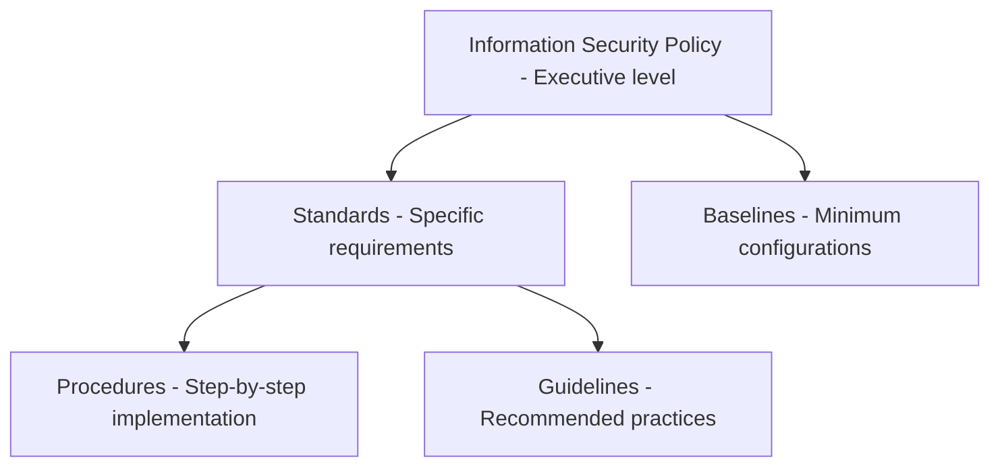

# Governance, Risk, and Compliance

## Overview

Governance, Risk, and Compliance (GRC) provides the organizational framework that translates business objectives into security requirements, manages risk within defined tolerance levels, and ensures adherence to applicable legal and regulatory obligations.

GRC is not a technical discipline — it requires understanding of business operations, legal obligations, organizational dynamics, and how security controls reduce risk to acceptable levels.

---

## Security Governance

### Security Policy Framework

A well-constructed policy framework provides clear, enforceable guidance across all security domains.

**Policy hierarchy:**



| Level | Purpose | Owner | Example |
|-------|---------|-------|---------|
| Policy | High-level management intent and direction | CISO / Board | "All sensitive data must be encrypted in transit and at rest" |
| Standard | Specific mandatory requirements | Security team | "TLS 1.2 minimum, AES-256, SHA-256+" |
| Procedure | Step-by-step implementation instructions | IT/Security operations | "How to configure TLS on Apache web servers" |
| Guideline | Recommended but not mandatory practices | Security team | "Recommended cipher suite ordering" |
| Baseline | Minimum security configuration for a system type | Security engineering | "Windows Server hardening baseline" |

### CISO Role and Responsibilities

The Chief Information Security Officer (CISO) is accountable for:
- Defining and maintaining the information security program
- Risk communication to executive leadership and board
- Security budget management and resource allocation
- Regulatory compliance oversight
- Incident response oversight at executive level
- Security strategy aligned with business objectives

---

## Risk Management

### Risk Assessment Methodology

Risk is defined as:
```
Risk = Threat × Vulnerability × Impact
```

Or more formally:
```
Risk = Likelihood of Occurrence × Potential Impact
```

**Qualitative risk assessment:**

| Likelihood | Impact: Low | Impact: Medium | Impact: High | Impact: Critical |
|-----------|------------|---------------|-------------|-----------------|
| Very High | Medium | High | Critical | Critical |
| High | Low | High | High | Critical |
| Medium | Low | Medium | High | High |
| Low | Low | Low | Medium | High |
| Very Low | Low | Low | Low | Medium |

**Quantitative risk assessment:**
Assigns monetary values to risk, enabling cost-benefit analysis of controls:

- **Asset Value (AV)**: Dollar value of the asset
- **Exposure Factor (EF)**: Percentage of asset value lost if threat materializes (0.0–1.0)
- **Single Loss Expectancy (SLE)**: SLE = AV × EF
- **Annual Rate of Occurrence (ARO)**: Expected frequency per year
- **Annual Loss Expectancy (ALE)**: ALE = SLE × ARO

Example:
```
Web application asset value:         $2,000,000
Exposure factor (SQL injection):      0.30 (30% of data exposed)
SLE:                                  $600,000
ARO:                                  0.50 (expected once every 2 years)
ALE:                                  $300,000/year

If WAF costs $30,000/year and reduces ARO from 0.50 to 0.05:
New ALE:                              $30,000/year
Annual savings:                       $270,000
ROI:                                  $240,000/year
```

### Risk Treatment Options

| Treatment | Description | Example |
|-----------|-------------|---------|
| Accept | Acknowledge and document; no additional control | Low-likelihood, low-impact risks within tolerance |
| Mitigate | Implement controls to reduce likelihood or impact | Deploy WAF to reduce SQL injection risk |
| Transfer | Shift financial risk to third party | Cyber insurance, outsourced processing with liability |
| Avoid | Eliminate the activity creating the risk | Stop collecting unnecessary personal data |

**Risk register format:**

| Risk ID | Description | Threat | Vulnerability | Likelihood | Impact | Inherent Risk | Controls | Residual Risk | Owner |
|---------|------------|--------|--------------|------------|--------|--------------|---------|--------------|-------|
| R-001 | Ransomware via phishing | Cybercriminal | User clicks malicious attachment | High | Critical | Critical | Email filtering, EDR, backups, MFA | High | CISO |
| R-002 | SQL injection on customer portal | External attacker | Unparameterized queries | Medium | High | High | WAF, code review, parameterized queries | Low | AppSec Lead |

---

## Compliance Frameworks

### General Data Protection Regulation (GDPR)

GDPR applies to organizations that process personal data of EU residents, regardless of where the organization is located.

**Key GDPR requirements:**

| Requirement | Description |
|-------------|-------------|
| Lawful basis | Personal data must be processed under a lawful basis (consent, contract, legal obligation, legitimate interest, etc.) |
| Data minimization | Collect only what is necessary for the stated purpose |
| Purpose limitation | Data collected for one purpose cannot be used for incompatible purposes |
| Storage limitation | Data should not be retained longer than necessary |
| Data subject rights | Rights to access, rectification, erasure, portability, objection |
| Breach notification | Notify supervisory authority within 72 hours; notify affected individuals without undue delay if high risk |
| Privacy by design | Build privacy controls into systems and processes from the start |
| Data Protection Impact Assessment (DPIA) | Required for high-risk processing activities |
| Data Protection Officer (DPO) | Required for public authorities and certain organizations |

**GDPR penalties:** Up to €20 million or 4% of annual global turnover, whichever is higher.

### HIPAA (Health Insurance Portability and Accountability Act)

HIPAA applies to covered entities (healthcare providers, health plans, clearinghouses) and their business associates.

**Key rules:**

| Rule | Scope |
|------|-------|
| Privacy Rule | Governs permitted uses and disclosures of PHI (Protected Health Information) |
| Security Rule | Administrative, physical, and technical safeguards for electronic PHI (ePHI) |
| Breach Notification Rule | Requirements for reporting breaches of unsecured PHI |
| Enforcement Rule | Civil and criminal penalties for violations |

**HIPAA Security Rule safeguard categories:**
- **Administrative**: Security management process, workforce training, access management, contingency planning
- **Physical**: Facility access controls, workstation security, device controls
- **Technical**: Access control, audit controls, integrity controls, transmission security

### PCI DSS (Payment Card Industry Data Security Standard)

PCI DSS applies to any organization that stores, processes, or transmits cardholder data.

**12 PCI DSS Requirements (v4.0):**

| Requirement | Description |
|-------------|-------------|
| 1 | Install and maintain network security controls |
| 2 | Apply secure configurations to all system components |
| 3 | Protect stored account data |
| 4 | Protect cardholder data with strong cryptography during transmission |
| 5 | Protect all systems against malware |
| 6 | Develop and maintain secure systems and software |
| 7 | Restrict access to cardholder data by business need to know |
| 8 | Identify users and authenticate access to system components |
| 9 | Restrict physical access to cardholder data |
| 10 | Log and monitor all access to system components and cardholder data |
| 11 | Test security of systems and networks regularly |
| 12 | Support information security with organizational policies and programs |

**Merchant levels:**
| Level | Transactions per year | Assessment requirement |
|-------|----------------------|----------------------|
| 1 | 6+ million | Annual on-site audit by QSA |
| 2 | 1–6 million | Annual SAQ + quarterly scan |
| 3 | 20,000–1 million e-commerce | Annual SAQ + quarterly scan |
| 4 | Less than 20,000 e-commerce | Annual SAQ |

---

## Vendor Risk Management

Third-party vendors and suppliers are a significant and often underestimated attack surface. Supply chain attacks have demonstrated that even indirect relationships create material risk.

### Vendor Risk Assessment Process

1. **Inventory**: Maintain a complete inventory of vendors and the data/systems they access
2. **Classification**: Categorize vendors by risk level (access to critical systems, sensitive data, operational dependency)
3. **Due diligence**: Pre-engagement security assessment (questionnaire, certifications review, penetration test results)
4. **Contractual requirements**: Security requirements in contracts (minimum controls, right to audit, breach notification SLAs)
5. **Ongoing monitoring**: Annual reassessment, continuous monitoring of vendor security posture
6. **Offboarding**: Revoke access, ensure data return or destruction, final review

### Vendor Assessment Criteria

| Category | Key Questions |
|----------|-------------|
| Data handling | What data do they receive? How is it encrypted, stored, retained, deleted? |
| Access | Do they access your environment? What systems? What credentials? |
| Certifications | SOC 2 Type II, ISO 27001, PCI DSS (if relevant)? |
| Incident response | What is their breach notification procedure and SLA? |
| Subprocessors | Do they use fourth parties who access your data? |
| Business continuity | What is their availability SLA and recovery capability? |
| Personnel security | Background checks, security awareness training, access reviews? |

---

## Security Metrics and Reporting

### Board-Level Reporting

Board members and executives need security reporting that translates technical risk into business impact.

**Effective board metrics:**
- Percentage of critical vulnerabilities remediated within SLA
- Phishing simulation click rates (trending over time)
- Mean time to detect and respond to incidents
- Security incidents by category and business impact
- Compliance status against key frameworks
- Security investment vs. industry benchmarks

**What to avoid in board reporting:**
- Raw vulnerability counts without context
- Technical jargon without business translation
- Incomplete good-news-only reporting
- Metrics without trend lines

### Operational Security Metrics

| Metric | Measurement | Target |
|--------|------------|--------|
| Patch compliance | % of systems patched within SLA by severity | Critical: 95% in 72h; High: 90% in 7d |
| Vulnerability age | Mean age of open vulnerabilities by severity | Critical: < 5 days; High: < 14 days |
| MFA adoption | % of accounts with MFA enabled | 100% for privileged; 95%+ for all |
| Security awareness training | % completed annual training | 98%+ |
| Backup success rate | % of backup jobs completing successfully | 99%+ |
| Security incident rate | Confirmed security incidents per month | Trending down |
