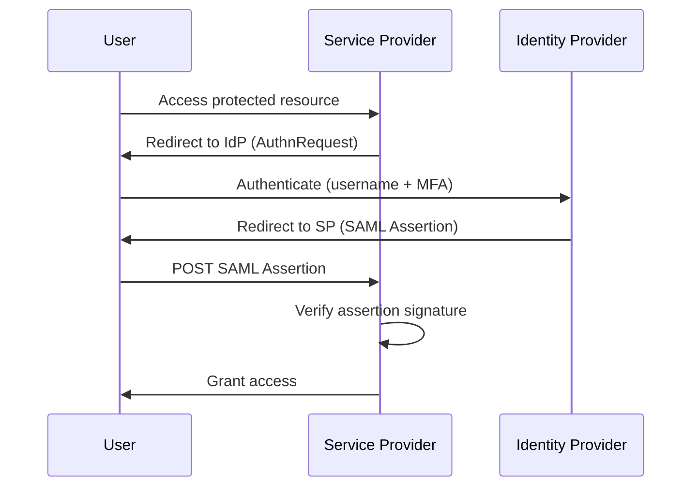
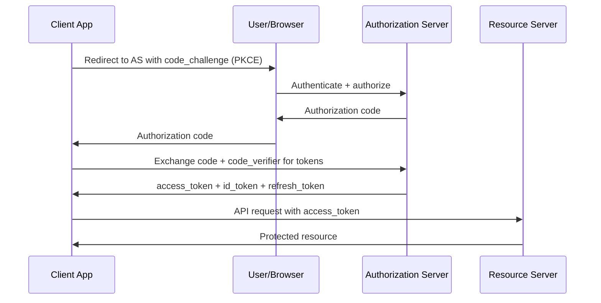

# Identity and Access Management

## Overview

Identity and Access Management (IAM) is the discipline governing who can access what resources under what conditions. It is foundational to every other security control — when access controls fail, technical controls protecting data and systems are bypassed.

Modern IAM has shifted from perimeter-centric models (trust anything inside the network) to identity-centric models, driven by cloud adoption, remote work, and insider threats.

---

## Authentication

### Multi-Factor Authentication (MFA)

MFA requires users to prove identity using two or more independent factors. It is the single most impactful control for preventing account compromise via stolen credentials.

**MFA factor types:**

| Type | Examples | Phishing Resistant? |
|------|---------|-------------------|
| Password (knowledge) | Password, PIN | No |
| OTP via SMS | Text message code | No (SIM swap) |
| TOTP authenticator app | Google Authenticator, Authy | No (real-time phishing) |
| Push notification | Duo, Okta Verify | No (MFA fatigue) |
| Hardware FIDO2 key | YubiKey, Titan Key | Yes |
| Platform authenticator | Windows Hello, Touch ID | Yes |

**MFA fatigue attack**: Attacker sends repeated MFA push requests until the user approves (often late at night). Mitigation: require number matching or FIDO2 hardware keys.

**FIDO2 / WebAuthn**: Cryptographic protocol using public key cryptography, bound to the origin domain. Proof of presence (physical touch of hardware key). Not interceptable by phishing because the key is domain-bound.

### Password Policies

**Modern password guidance (NIST SP 800-63B):**

| Practice | Traditional (outdated) | NIST Current |
|----------|----------------------|--------------|
| Length | 8+ characters, mixed case | 8+ minimum; support up to 64+ characters |
| Complexity | Require uppercase, lowercase, numbers, symbols | Discourage complexity rules; encourage length |
| Rotation | Regular forced rotation (30/60/90 days) | Rotate only when compromised |
| Secret questions | Common practice | Discourage; answers are often guessable |
| Password hints | Allowed | Prohibit |

**Breach corpus checking**: Check new passwords against known-compromised password lists (Have I Been Pwned API). Reject passwords found in breach databases regardless of complexity.

---

## Authorization Models

### Role-Based Access Control (RBAC)

Permissions are assigned to roles, and users are assigned to roles. Users inherit permissions from their roles.

```
Users → Roles → Permissions → Resources

Example:
Jane Smith → [Finance_Analyst, Project_Viewer] → {read_financial_reports, view_projects} → FinanceDB, ProjectMgr
```

**RBAC best practices:**
- Define roles based on job function, not individuals
- Audit role assignments regularly (access reviews)
- Apply least privilege: no role should grant more permission than required for the function
- Use role hierarchies carefully — inherited permissions can create over-privilege

### Attribute-Based Access Control (ABAC)

Access decisions are based on attributes of the user, resource, and environment. More flexible and fine-grained than RBAC.

```
Policy: Allow access IF
    user.department = "Finance" AND
    user.clearance_level >= 3 AND
    resource.classification = "Confidential" AND
    environment.location = "Corporate Network" AND
    environment.time BETWEEN "08:00" AND "18:00"
```

Used in: XACML (standard), AWS IAM policies (attribute conditions), Azure AD Conditional Access.

### Just-In-Time (JIT) Access

Rather than granting persistent privileged access, JIT access provides temporary elevation for a specific task with automatic expiration.

Benefits:
- Privileged accounts exist only when needed, minimizing attack surface
- Every elevation is logged with purpose and approver
- Reduces impact of credential compromise (temporary credentials expire automatically)

Implementations: CyberArk, BeyondTrust, Microsoft PIM, HashiCorp Vault.

---

## Privileged Access Management (PAM)

PAM is a subset of IAM specifically focused on managing, securing, and auditing access by privileged accounts — administrators, service accounts, and others with elevated rights.

### Why PAM is Critical

Privileged accounts are the highest-value targets for attackers:
- Domain Administrator: full control of Active Directory
- Local Administrator: full control of an endpoint
- Root/sudo: full control of Linux/Unix systems
- Service accounts: often over-privileged, rarely monitored
- Cloud root accounts: unrestricted cloud access

### PAM Controls

| Control | Purpose |
|---------|---------|
| Privileged Account Discovery | Identify all privileged accounts across the environment |
| Vault/Password Management | Store privileged credentials in encrypted vault; rotate automatically |
| Session Recording | Record all privileged sessions for audit and forensics |
| Least Privilege Enforcement | Replace shared admin accounts with individual, attributed accounts |
| Just-In-Time Access | Provide temporary elevation rather than persistent privilege |
| Break-Glass Procedures | Emergency access for outages, with enhanced logging |

**Credential vaulting workflow:**
```
Privileged User → Request Access → PAM System → Approve/Deny
                                              ↓
                                   Retrieve credential from vault
                                              ↓
                              Establish proxied session (no direct credential handoff)
                                              ↓
                                   Record session + audit log
                                              ↓
                              Rotate credential after session ends
```

---

## Single Sign-On (SSO) and Federation

SSO allows users to authenticate once and access multiple applications without re-authenticating. Federation extends SSO across organizational boundaries.

### SAML 2.0

Security Assertion Markup Language is an XML-based standard for exchanging authentication and authorization data between an Identity Provider (IdP) and Service Providers (SPs).

**SAML flow:**



**SAML vulnerabilities:**
- XML signature wrapping: manipulate assertion structure to bypass signature validation
- Overly permissive assertion validation: SP accepts assertions with expired or wrong audience
- Missing signature verification: SP does not verify IdP signature on assertions

### OAuth 2.0 and OpenID Connect

OAuth 2.0 is an authorization framework for delegating access. OpenID Connect (OIDC) is an identity layer on top of OAuth 2.0 that adds authentication.

**Authorization Code Flow (recommended for web apps):**



**PKCE (Proof Key for Code Exchange)**: Prevents authorization code interception attacks in public clients. Required for mobile apps and SPAs.

---

## Active Directory Security

Active Directory (AD) is the identity backbone of most enterprise Windows environments and a primary target for attackers.

### Critical Attack Paths

**Kerberoasting:**
Request Kerberos service tickets for accounts with Service Principal Names (SPNs). Tickets are encrypted with the service account's password hash and can be brute-forced offline.

```bash
# Discovery - find accounts with SPNs
Get-ADUser -Filter {ServicePrincipalName -ne "$null"} -Properties ServicePrincipalName

# Request and extract tickets
impacket-GetUserSPNs -request targetcorp.com/user:password
hashcat -m 13100 tickets.txt /usr/share/wordlists/rockyou.txt
```

Mitigation: Enforce strong passwords (25+ characters) on service accounts; use Group Managed Service Accounts (gMSA) which auto-rotate credentials.

**AS-REP Roasting:**
Accounts that do not require Kerberos pre-authentication allow an attacker to request AS-REP responses containing the account's password hash without authenticating.

```bash
impacket-GetNPUsers targetcorp.com/ -usersfile usernames.txt -format hashcat
```

Mitigation: Enable pre-authentication on all user accounts; this is the default and should never be disabled.

**DCSync:**
Simulate a Domain Controller replication request to extract password hashes from AD. Requires GetReplicationChangesAll permission (granted to Domain Admins and Domain Controllers by default).

```bash
impacket-secretsdump -just-dc-user administrator targetcorp.com/admin:password@dc01
```

Mitigation: Restrict DCSync permissions; monitor for unexpected replication requests (Event ID 4662).

**Pass-the-Hash / Pass-the-Ticket:**
Use captured NTLM hashes or Kerberos tickets to authenticate without knowing the cleartext password.

Mitigation: Enable LAPS (Local Administrator Password Solution) to ensure unique local admin passwords per host; restrict NTLM where possible; monitor for anomalous authentication patterns.

### Active Directory Hardening

| Control | Implementation |
|---------|---------------|
| Tiered administration model | Tier 0: DC/AD; Tier 1: Servers; Tier 2: Workstations — no lateral credential use |
| Protected Users security group | Prevents use of NTLM, DES/RC4 Kerberos encryption, credential caching |
| PAM for DA access | No persistent Domain Admin logins; JIT elevation only |
| LAPS deployment | Unique, rotating local admin passwords per host |
| Credential Guard | Isolates LSASS using virtualization-based security (Windows 10+) |
| Audit AD changes | Enable auditing on all AD object modifications |
| Monitoring | Alert on suspicious LDAP queries, DCSync, golden/silver ticket indicators |
