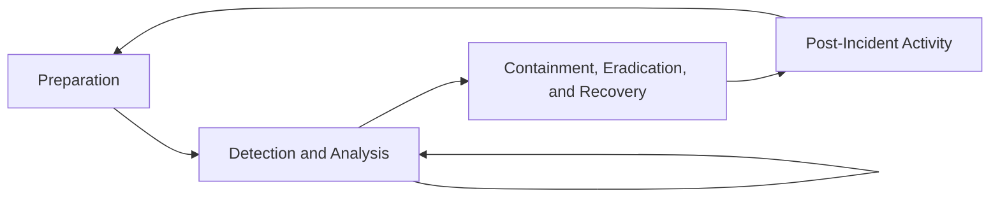

# Incident Response: NIST SP 800-61 Lifecycle

## Overview

Incident response is the organized approach to addressing and managing the aftermath of a security breach or cyberattack. An effective incident response capability minimizes damage, reduces recovery time and cost, and improves organizational security posture over time.

The NIST Computer Security Incident Handling Guide (SP 800-61 Rev. 2) defines a four-phase lifecycle.



---

## Phase 1: Preparation

Preparation is the foundation of effective incident response. Organizations that invest in preparation consistently achieve better outcomes when incidents occur.

### Incident Response Policy and Plan

The IR policy and plan should define:
- Scope: what constitutes a security incident
- Roles and responsibilities of the CSIRT (Computer Security Incident Response Team)
- Communication procedures (internal escalation, external notifications, legal/regulatory reporting requirements)
- Authority levels for containment and remediation decisions
- Evidence handling requirements

### CSIRT Structure

| Role | Responsibilities |
|------|----------------|
| IR Lead / Incident Commander | Overall coordination, decision authority, stakeholder communication |
| Tier 1 Analyst | Initial triage, alert investigation, escalation |
| Tier 2 Analyst | Deep investigation, malware analysis, log forensics |
| Tier 3 / Specialist | Advanced forensics, reverse engineering, threat intelligence |
| Legal | Regulatory compliance, law enforcement liaison |
| Communications | Internal executive briefings, external/media communications |
| IT Operations | System isolation, account management, backup restoration |

### Preparation Activities

**Technical preparation:**
- Deploy and tune SIEM with coverage of critical log sources
- Deploy EDR on all endpoints with appropriate retention
- Establish network packet capture capability at critical points
- Configure centralized authentication (AD, Azure AD, Okta) with MFA
- Document asset inventory with criticality ratings
- Verify backup integrity and practice restoration procedures

**Process preparation:**
- Develop and test incident response playbooks for likely scenarios
- Establish out-of-band communication channels (if primary email/messaging is compromised)
- Pre-negotiate retainer contracts with external IR firms
- Establish chain of custody procedures for evidence handling
- Conduct tabletop exercises and simulations annually

**Playbook categories to develop:**
- Ransomware/destructive malware
- Business email compromise (BEC)
- Insider threat
- Data exfiltration
- Credential compromise / account takeover
- DDoS
- Third-party/supply chain compromise
- Cloud account compromise

---

## Phase 2: Detection and Analysis

### Incident Sources

Incidents are detected through multiple channels:

| Source | Examples |
|--------|---------|
| SIEM alerts | Correlation rules triggering on log data |
| EDR alerts | Behavioral detections on endpoints |
| User reports | Phishing emails, unusual behavior observed |
| External notification | Law enforcement, threat intelligence feeds, disclosure by third parties |
| Threat hunting | Proactive investigation discovering malicious artifacts |
| Bug bounty / responsible disclosure | Vulnerability researchers |

### Incident Severity Classification

Establish a consistent severity classification to drive appropriate response urgency and resource allocation:

| Severity | Criteria | Response SLA |
|----------|----------|-------------|
| Critical (P1) | Active attacker in environment; ransomware; critical system compromise; large-scale data exfiltration | Immediate; 24/7 response |
| High (P2) | Confirmed compromise of significant system; active lateral movement; credentials of privileged account compromised | Same day |
| Medium (P3) | Potential compromise under investigation; malware on isolated endpoint; phishing with credential submission | Within 24 hours |
| Low (P4) | Attempted attack without confirmed success; policy violations; informational alerts | Within 72 hours |

### Initial Triage

When an alert or report is received:

1. **Validate the alert**: Determine whether the alert represents a true positive or false positive
2. **Scope the initial impact**: How many systems, users, and data assets appear involved?
3. **Preserve initial state**: Before any remediation, capture relevant logs and artifacts
4. **Classify severity**: Apply the severity classification to determine response level
5. **Notify**: Escalate according to defined thresholds; notify the IR Lead

### Evidence Collection

**Volatility order** — collect volatile evidence first:

```
1. CPU registers and cache
2. Routing table, ARP cache, process table, kernel statistics
3. Memory (RAM)
4. Temporary file systems
5. Disk
6. Remote logging and monitoring data
7. Physical configuration, network topology
8. Archival media, backups
```

**Live system collection:**
```bash
# Process list with full path and parent relationships
ps auxf > /tmp/ir/processes.txt

# Network connections
ss -anp > /tmp/ir/network_connections.txt
netstat -anp >> /tmp/ir/network_connections.txt

# Established connections with process info
ss -anp | grep ESTABLISHED > /tmp/ir/established.txt

# ARP table
arp -n > /tmp/ir/arp.txt

# Loaded kernel modules (Linux)
lsmod > /tmp/ir/modules.txt

# Logged-in users
who > /tmp/ir/users.txt
last -n 100 > /tmp/ir/last_logins.txt

# Recent commands (if history not cleared)
cat ~/.bash_history > /tmp/ir/bash_history.txt

# Cron jobs
crontab -l > /tmp/ir/crontab.txt
cat /etc/cron* /var/spool/cron/* > /tmp/ir/cron_all.txt

# Memory acquisition (requires LiME or similar)
insmod /path/to/lime.ko "path=/tmp/ir/memory.lime format=lime"
```

### Indicators of Compromise (IOCs)

During investigation, document all IOCs for detection, hunting, and sharing:

| IOC Type | Examples |
|----------|---------|
| File hash (MD5/SHA-256) | Malware sample hashes |
| File path | Malware dropped in `C:\Users\Public\`, persistence in startup folders |
| Registry key | Run keys, service installation |
| IP address | C2 infrastructure |
| Domain | C2 domains, phishing domains |
| URL | Specific C2 beacon paths |
| Email address | Phishing sender addresses |
| Mutex | Malware mutexes for anti-duplication |
| Network signature | JA3 TLS fingerprints, user-agent strings |

---

## Phase 3: Containment, Eradication, and Recovery

### Containment

Containment stops the spread of the incident. The appropriate containment strategy depends on the type of incident, the systems involved, and the business impact of taking systems offline.

**Containment strategies by scenario:**

| Scenario | Containment Actions |
|----------|-------------------|
| Compromised endpoint | Network isolation, force password reset, revoke tokens, preserve for forensics |
| Compromised privileged account | Disable account, reset credentials, revoke all active sessions and tokens |
| Ransomware outbreak | Network isolation of affected segments, disable domain accounts temporarily, engage backup restoration plan |
| Data exfiltration in progress | Block identified egress destinations, isolate source system, capture traffic |
| Business email compromise | Disable compromised account, block malicious inbox rules, notify finance/affected parties |

**Network isolation options:**

1. **VLAN isolation**: Move compromised host to an isolated VLAN with no internet access and minimal internal connectivity
2. **EDR network containment**: Modern EDR platforms (CrowdStrike, Microsoft Defender) allow host isolation from the console without physical access
3. **Firewall ACL**: Add specific deny rules for the compromised host IP
4. **DNS sinkholing**: Redirect known malicious domains to a sinkhole to observe and block callback traffic

**Preserve before modifying:**
Before any remediation action, ensure forensic artifacts are preserved:
- Memory image (if the system must be rebooted or shut down)
- Disk image (for deleted file recovery and timeline analysis)
- Log files (copy to secure, write-once storage)

### Eradication

Eradication removes the threat from the environment. This phase must be comprehensive — incomplete eradication leads to re-compromise.

**Eradication activities:**

1. **Identify all affected systems**: Use IOCs from the investigation to scan for additional compromised hosts
2. **Remove malware**: Automated removal using EDR, or manual removal guided by forensic findings
3. **Remediate vulnerabilities**: Patch the initial access vector to prevent re-entry
4. **Remove persistence mechanisms**: Review and clean all persistence points (scheduled tasks, services, registry run keys, startup items, web shells)
5. **Revoke compromised credentials**: Reset all passwords, revoke all tokens and certificates associated with compromised identities
6. **Verify completeness**: After cleanup, re-scan for IOCs to confirm removal

**Common persistence locations to review:**

Windows:
```
HKLM\SOFTWARE\Microsoft\Windows\CurrentVersion\Run
HKCU\SOFTWARE\Microsoft\Windows\CurrentVersion\Run
HKLM\SYSTEM\CurrentControlSet\Services
C:\Windows\System32\Tasks
C:\Users\*\AppData\Roaming\Microsoft\Windows\Start Menu\Programs\Startup
WMI Subscriptions (Get-WMIObject -Namespace root/subscription -Class __EventFilter)
```

Linux:
```
/etc/cron*
/var/spool/cron/crontabs/
~/.bashrc, ~/.bash_profile, ~/.profile
/etc/init.d/, /etc/systemd/system/
/etc/rc.local
~/.ssh/authorized_keys (check for unauthorized keys)
SUID/SGID binaries (find / -perm -4000 2>/dev/null)
```

### Recovery

Recovery restores systems to normal operation with confidence that the threat has been removed.

**Recovery process:**
1. Restore from clean backups (prefer backups predating the compromise if feasible)
2. Rebuild from known-good images where restoration is uncertain
3. Apply all patches and hardening configurations before returning to production
4. Monitor restored systems closely for 30+ days for signs of re-compromise
5. Validate backup integrity and completeness before relying on them for restoration

**Phased return to operations:**
- Return critical systems first with enhanced monitoring
- Validate system integrity before connecting to wider network
- Consider temporary enhanced logging and monitoring during recovery period

---

## Phase 4: Post-Incident Activity

### Post-Incident Report

A thorough post-incident report documents the incident timeline, root cause, impact, and response effectiveness. It serves as the primary artifact for organizational learning.

**Report sections:**

1. **Executive Summary**: Non-technical overview of the incident, business impact, and key actions taken
2. **Timeline**: Chronological reconstruction from initial compromise through full recovery
3. **Root Cause Analysis**: Technical analysis of the initial access vector and how the attacker progressed
4. **Impact Assessment**: Data accessed or exfiltrated, systems affected, business disruption, regulatory implications
5. **Response Actions**: What was done, by whom, and when
6. **Lessons Learned**: What worked, what did not, and what should be improved
7. **Recommendations**: Prioritized control improvements derived from the incident

### Lessons Learned Meeting

Conduct a lessons learned meeting within two weeks of incident closure while details are fresh.

**Questions to address:**
- When did the incident begin and when was it detected? What was the detection gap?
- What was the initial access vector? Was it preventable?
- What delayed detection, containment, or eradication?
- Were playbooks and runbooks accurate and useful?
- Were communication channels effective?
- Was the escalation process followed?
- What evidence was missing or insufficient?

### Metrics to Track

| Metric | Definition | Goal |
|--------|-----------|------|
| Mean Time to Detect (MTTD) | Time from incident start to initial detection | Minimize |
| Mean Time to Respond (MTTR) | Time from detection to containment | Minimize |
| Mean Time to Recover (MTTRS) | Time from detection to full recovery | Minimize |
| Dwell time | Duration attacker was in environment before detection | Minimize |
| False positive rate | Proportion of alerts that are not true incidents | Reduce while maintaining detection coverage |
