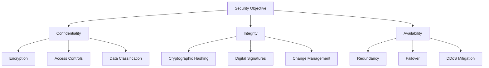
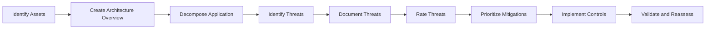
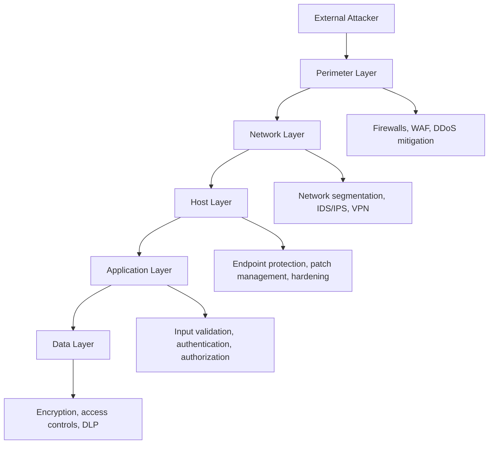

# Introduction to Cybersecurity

## What Is Cybersecurity

Cybersecurity is the discipline concerned with protecting information systems, networks, and data from unauthorized access, damage, disruption, modification, or destruction. It encompasses technical controls, organizational processes, and human behavior as interdependent layers of a defense posture.

The scope of cybersecurity has expanded significantly. Where it once focused primarily on perimeter defense — keeping adversaries outside the network — modern practice addresses insider threats, supply chain risk, cloud environments, mobile endpoints, industrial control systems, and the human element through social engineering.

## The CIA Triad

The CIA triad is the foundational conceptual model in information security. Every security control, policy, and risk assessment maps to one or more of these three properties.

### Confidentiality

Confidentiality ensures that information is accessible only to those with explicit authorization. Violations of confidentiality include unauthorized data exfiltration, eavesdropping on unencrypted communications, and insider theft of sensitive records.

**Controls supporting confidentiality:**
- Encryption at rest (AES-256) and in transit (TLS 1.2+)
- Access control lists and role-based access control
- Data classification schemes (e.g., Public, Internal, Confidential, Restricted)
- Network segmentation to limit lateral access
- Data loss prevention (DLP) systems

### Integrity

Integrity ensures that information is accurate, complete, and has not been modified except through authorized processes. Violations of integrity include database record tampering, man-in-the-middle attacks that alter data in transit, and insider manipulation of audit logs.

**Controls supporting integrity:**
- Cryptographic hashing (SHA-256, SHA-3) for file and message verification
- Digital signatures for non-repudiation
- Write-once storage for audit logs
- Database transaction controls and referential integrity constraints
- File integrity monitoring (FIM)

### Availability

Availability ensures that systems and information are accessible to authorized users when needed. Violations include denial-of-service attacks, ransomware that encrypts operational data, and hardware failures without adequate redundancy.

**Controls supporting availability:**
- Geographic redundancy and failover architecture
- DDoS mitigation: rate limiting, scrubbing, CDN-based distribution
- Backup and recovery with tested restoration procedures
- Capacity planning and performance monitoring
- Uninterruptible power supplies and power redundancy

---

## AAA Framework

Authentication, Authorization, and Accounting form the access control triad.

### Authentication

Authentication answers the question: who are you? It verifies the identity claimed by a user, device, or process.

**Authentication factors:**
- Something you know: passwords, PINs, security questions
- Something you have: hardware tokens, smart cards, mobile authenticator apps
- Something you are: fingerprints, retinal scans, facial recognition
- Somewhere you are: IP geolocation, GPS coordinates (contextual)

**Multi-factor authentication (MFA)** requires two or more independent factors. The most common deployment is password combined with a time-based one-time password (TOTP) or push notification.

**Authentication protocols:**
| Protocol | Use Case | Notes |
|----------|---------|-------|
| Kerberos | Active Directory environments | Ticket-based, susceptible to Pass-the-Ticket and Golden Ticket attacks |
| LDAP | Directory lookups | Often deployed over TLS (LDAPS) |
| SAML 2.0 | Enterprise SSO | XML-based assertions |
| OAuth 2.0 | API authorization | Delegation framework, not authentication |
| OpenID Connect | Authentication over OAuth | Token-based identity layer |
| FIDO2/WebAuthn | Passwordless authentication | Phishing-resistant hardware keys |

### Authorization

Authorization answers the question: what are you permitted to do? It determines the access rights granted to an authenticated entity.

**Access control models:**
- **Discretionary Access Control (DAC)**: Resource owners define access. Example: traditional Unix file permissions.
- **Mandatory Access Control (MAC)**: The system enforces policy based on classification labels. Example: SELinux, used in high-security government environments.
- **Role-Based Access Control (RBAC)**: Access is granted based on a user's assigned role within the organization.
- **Attribute-Based Access Control (ABAC)**: Access decisions are made based on attributes of the user, resource, and environment.
- **Least Privilege**: Users and processes should operate with the minimum access rights required to perform their function.

### Accounting

Accounting answers the question: what did you do? It records actions taken by authenticated, authorized entities.

Accounting systems must:
- Record sufficient detail for post-incident investigation
- Protect log integrity against tampering
- Retain logs for a period consistent with compliance requirements
- Forward logs to a centralized system (SIEM) in near-real-time

---

## Threat Modeling

Threat modeling is a structured process for identifying potential threats to a system, evaluating their likelihood and impact, and prioritizing mitigations. It is most effective when applied during the design phase of a system or application.

### STRIDE Model

Developed by Microsoft, STRIDE categorizes threats by their effect:

| Threat | Violation | Example |
|--------|-----------|---------|
| Spoofing | Authentication | Impersonating a legitimate user with stolen credentials |
| Tampering | Integrity | Modifying data in transit or at rest without detection |
| Repudiation | Non-repudiation | Denying having performed an action due to insufficient logging |
| Information Disclosure | Confidentiality | Exposing sensitive data through misconfigured storage |
| Denial of Service | Availability | Exhausting server resources to prevent legitimate access |
| Elevation of Privilege | Authorization | Executing code with more privileges than intended |

### PASTA (Process for Attack Simulation and Threat Analysis)

PASTA is a seven-stage risk-centric methodology:

1. Define the business objectives and security requirements
2. Define the technical scope of the application
3. Decompose the application into components and data flows
4. Analyze threats using threat intelligence and attack patterns
5. Analyze vulnerabilities and weaknesses
6. Enumerate and model attacks based on identified threats and vulnerabilities
7. Analyze residual risk and define countermeasures

### Threat Modeling Process

---

## Defense in Depth

Defense in depth is a security strategy that employs multiple, independent layers of controls. The assumption is that any single control may fail or be bypassed; redundant layers reduce the probability that a complete compromise occurs.

### Security Layers

**Layer descriptions:**

| Layer | Controls |
|-------|---------|
| Perimeter | Firewalls, web application firewalls, DDoS scrubbing, DMZ architecture |
| Network | Segmentation, VLANs, IDS/IPS, network access control, traffic inspection |
| Host | Endpoint detection and response, patch management, local firewalls, hardening baselines |
| Application | Secure development practices, input validation, authentication, session management |
| Data | Encryption at rest, database access controls, data masking, DLP |
| Administrative | Security policies, security awareness training, background checks, separation of duties |

---

## Attack Surface

The attack surface of a system or organization is the total set of points where an attacker could attempt to gain unauthorized access, extract data, or disrupt operations.

### Attack Surface Components

**Network attack surface:**
- Open ports and exposed services
- Internet-facing applications
- Remote access infrastructure (VPN, RDP, SSH)
- Wireless networks

**Software attack surface:**
- User input fields and APIs
- Parsing libraries (document parsers, image processors)
- Third-party dependencies and libraries
- Authentication endpoints

**Human attack surface:**
- Employees susceptible to phishing and social engineering
- Privileged users with extensive access
- Third-party contractors and vendors
- Help desk and IT support staff

**Physical attack surface:**
- Physical access to server rooms and network equipment
- Unlocked workstations
- Physical media (USB drives, printed documents)

### Attack Surface Reduction

Attack surface reduction is one of the highest-leverage risk mitigation strategies:

- Disable or remove services, protocols, and ports that are not operationally required
- Remove unused software, accounts, and credentials
- Apply least privilege to all accounts and service identities
- Segment networks to limit what an attacker can reach from a compromised position
- Replace public-facing services with private alternatives where feasible (e.g., VPN-gated access instead of exposed RDP)

---

## Security Control Categories

Security controls are classified by their function:

| Category | Purpose | Examples |
|----------|---------|---------|
| Preventive | Stop attacks from succeeding | Firewalls, encryption, access control |
| Detective | Identify attacks in progress or after the fact | SIEM, IDS, audit logs, file integrity monitoring |
| Corrective | Restore normal operations after an incident | Backup restoration, patch deployment |
| Deterrent | Discourage attacks through consequence or visibility | Legal notices, security cameras, warning banners |
| Compensating | Alternative controls when primary controls cannot be implemented | Additional monitoring in lieu of network segmentation |

Controls are also classified by type:

- **Administrative**: Policies, procedures, training, background checks
- **Technical**: Hardware and software controls (encryption, authentication systems, firewalls)
- **Physical**: Physical security measures (locks, access cards, cameras, environmental controls)
