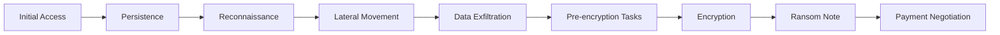

# Malware Analysis

## Malware Taxonomy

Malware (malicious software) is software designed to disrupt, damage, or gain unauthorized access to computer systems. Understanding the taxonomy helps analysts apply appropriate analysis techniques and detection strategies.

| Type | Self-Replicating | Requires Host | Primary Goal |
|------|-----------------|---------------|-------------|
| Virus | Yes (modifies files) | Yes | Propagation, payload delivery |
| Worm | Yes (network) | No | Propagation, payload delivery |
| Trojan | No | No | Initial access, backdoor |
| Ransomware | Sometimes | No | Financial extortion |
| Rootkit | No | No | Persistence, stealth |
| Spyware | No | No | Surveillance, data theft |
| Adware | No | No | Revenue fraud |
| Botnet agent | No | No | Remote control, DDoS, spam |
| Cryptominer | No | No | Unauthorized compute resources |

---

## Virus

A virus is a self-replicating program that inserts copies of itself into other executable files or documents. Execution of the infected host triggers execution of the virus code.

**Infection methods:**
- **File infectors**: Attach to or replace executable files (.exe, .com, .dll)
- **Boot sector viruses**: Infect the master boot record (MBR) or volume boot record (VBR)
- **Macro viruses**: Embed in document macros (Office documents); executed when macros run
- **Multipartite viruses**: Combine file and boot sector infection

**Detection evasion:**
- **Polymorphic viruses**: Mutate their code on each infection while maintaining functionality
- **Metamorphic viruses**: Completely rewrite their code on each generation
- **Encrypted viruses**: Encrypt the virus body; only the decryption stub remains static

---

## Worms

Worms propagate across networks without requiring a host file. They exploit network vulnerabilities or protocols to spread and execute on new hosts.

**Notable worms and their propagation methods:**

| Worm | Year | Propagation Method |
|------|------|-------------------|
| Morris Worm | 1988 | Unix sendmail, fingerd, rsh vulnerabilities |
| Code Red | 2001 | IIS buffer overflow (MS01-033) |
| SQL Slammer | 2003 | SQL Server buffer overflow (UDP 1434) |
| Conficker | 2008 | Windows Server Service vulnerability (MS08-067) |
| WannaCry | 2017 | EternalBlue SMB exploit (MS17-010) |
| NotPetya | 2017 | EternalBlue + credential harvesting + WMIC/PsExec |

---

## Ransomware

Ransomware encrypts victim files and demands payment for the decryption key. Modern ransomware operations are sophisticated criminal enterprises.

### Ransomware Lifecycle



### Initial Access Vectors

- Phishing emails with malicious attachments or links
- Exploitation of public-facing applications (VPN, RDP, Exchange)
- Credential stuffing against RDP endpoints
- Malicious advertisements (malvertising)
- Supply chain compromise
- Insider threat

### Encryption Mechanisms

Modern ransomware uses hybrid encryption:
1. Generate a unique symmetric key (AES-256) per victim or per file
2. Encrypt file content with the symmetric key
3. Encrypt the symmetric key with the attacker's RSA or ECC public key
4. Only the attacker's private key can decrypt the symmetric key

This design ensures that:
- Encryption is fast (symmetric for bulk data)
- Key management is secure (attacker holds private key)
- Payment is required for each victim independently

### Double Extortion

Modern ransomware groups routinely exfiltrate data before encrypting, threatening to publish it if the ransom is not paid. This creates pressure even when backups are available.

**Triple extortion** adds DDoS attacks against the victim and contacts the victim's customers or partners.

### Indicators of Ransomware Activity

**Pre-encryption indicators:**
- Enumeration tools executed: `net group`, `nltest /domain_trusts`, `ADFind.exe`
- Lateral movement: PsExec, WMI, RDP activity across multiple hosts
- Data staging and compression: `7zip`, `WinRAR` with unusual command-line arguments
- Backup deletion: `vssadmin delete shadows`, `wmic shadowcopy delete`
- AV/EDR tampering: attempts to stop security services
- Exfiltration tools: Rclone, MEGAsync, custom HTTPS uploads

**Encryption indicators:**
- High disk write activity across many files
- File extension changes
- Creation of ransom note files (`README.txt`, `HOW_TO_DECRYPT.txt`) in many directories
- Volume Shadow Copy deletion (`vssadmin.exe delete shadows /all /quiet`)

### Ransomware Prevention

| Control | Effectiveness |
|---------|--------------|
| Immutable backups (3-2-1 rule) | Essential for recovery without payment |
| MFA on all remote access | Prevents credential-based initial access |
| Patch management | Eliminates exploitation of known vulnerabilities |
| Network segmentation | Limits blast radius of successful compromise |
| EDR with behavioral detection | Detects pre-encryption activity |
| Disable unnecessary services | Reduces attack surface (disable RDP where not needed) |
| Least privilege | Limits what an attacker can do with a compromised account |

---

## Rootkits

A rootkit is malware designed to maintain persistent, privileged, and stealthy access to a system. Rootkits operate by modifying the operating system or firmware to hide their presence.

### Rootkit Types

**User-mode rootkits:**
Operate in user space. Intercept system calls or library functions to hide files, processes, and network connections. Easier to implement but also easier to detect.

**Kernel-mode rootkits:**
Load as kernel modules or drivers. Hook kernel functions directly. Harder to detect because security tools rely on the same kernel.

**Bootkit / MBR rootkits:**
Infect the Master Boot Record or bootloader, loading before the operating system. Can survive OS reinstallation.

**Firmware rootkits:**
Flash malware into device firmware (BIOS/UEFI, HDD firmware, network card). Extremely persistent — survives disk replacement. Rare but observed in nation-state operations.

**Hypervisor rootkits:**
Install a rogue hypervisor beneath the original OS, making the OS a guest while the rootkit has full access.

### Detection Techniques

- **Differential analysis**: Compare system state from two different perspectives (e.g., API-based listing vs. direct disk parsing) — discrepancies indicate hiding
- **Memory forensics**: Analyze raw memory image using volatility to identify hidden processes and kernel hooks
- **Boot media analysis**: Boot from trusted external media and analyze the disk from a clean OS
- **Integrity checking**: Compare critical system binaries against known-good hashes
- **Hardware-based detection**: Intel TXT, TPM-backed boot verification (Secure Boot)

---

## Botnets

A botnet is a network of compromised computers (bots or zombies) under the control of a botmaster through a Command and Control (C2) infrastructure.

### C2 Architectures

**Centralized C2:**
All bots communicate with a central C2 server. Simple to operate but single point of failure. Takedown of C2 infrastructure neutralizes the botnet.

**Peer-to-peer (P2P) C2:**
Bots communicate through a distributed network. More resilient — no central point to take down. Seen in: Gozi, ZeroAccess, GameOver Zeus.

**Domain Generation Algorithm (DGA) C2:**
Bots and the botmaster generate the same list of domain names from a shared algorithm (seeded by date). The botmaster registers a subset; bots attempt to contact the generated list. Makes sinkholing harder.

```python
# Simplified DGA concept (not functional malware)
import hashlib
import datetime

def generate_dga_domains(seed, date, count=10):
    domains = []
    for i in range(count):
        h = hashlib.md5(f"{seed}{date}{i}".encode()).hexdigest()
        domains.append(f"{h[:12]}.com")
    return domains

# Defenders analyze malware to extract the DGA algorithm and pre-register sinkhole domains
```

**Fast flux:**
Rapidly rotate DNS A records for C2 domains across many compromised hosts acting as proxies. Makes IP-based blocking ineffective.

### Botnet Uses

| Use | Description |
|-----|-------------|
| DDoS | Volumetric attack using bot bandwidth |
| Spam | Send bulk phishing or spam email |
| Credential stuffing | Distribute credential testing across bot IPs |
| Click fraud | Generate fraudulent ad clicks |
| Cryptocurrency mining | Pool bot compute resources |
| Proxy / anonymization | Route traffic through bots to evade attribution |
| Data exfiltration relay | Stage exfiltrated data through bots |

---

## Malware Analysis Methodology

### Static Analysis

Analysis of malware without executing it.

**File identification:**
```bash
file malware.bin
sha256sum malware.bin
md5sum malware.bin

# Check against known-malicious databases
curl https://www.virustotal.com/api/v3/files/$(sha256sum malware.bin | awk '{print $1}') \
    -H "x-apikey: $VT_API_KEY"
```

**PE file analysis (Windows executables):**
```bash
# Extract strings
strings -n 8 malware.exe
strings -e l malware.exe  # Unicode strings

# PE header analysis
pestudio malware.exe  # GUI tool
pefile malware.exe    # Python library

# Examine imports and exports
objdump -d malware.exe
dumpbin /imports malware.exe

# Check for packing
exeinfo pe malware.exe
```

**Disassembly:**
- Ghidra (NSA, free, open source)
- IDA Pro (commercial)
- Binary Ninja (commercial)
- Radare2 (free, open source)

### Dynamic Analysis

Executing malware in a controlled environment and observing behavior.

**Sandbox environments:**
- Cuckoo Sandbox (open source)
- Any.run (cloud, interactive)
- VirusTotal sandbox
- Cape Sandbox

**Manual dynamic analysis setup:**
1. Isolated virtual machine, snapshoted to clean state
2. Network traffic capture (Wireshark, tcpdump)
3. Process monitoring (Process Monitor, Process Hacker)
4. File system monitoring (Process Monitor)
5. Registry monitoring (Process Monitor)
6. API call monitoring (API Monitor, Frida)
7. Network simulation (INetSim) to capture C2 callback attempts

**Key behaviors to document:**
- Files created, modified, or deleted
- Registry keys modified (especially persistence locations)
- Network connections and DNS queries
- Processes created or injected
- Privileges requested or obtained
- Anti-analysis behaviors triggered

### Anti-Analysis Techniques

| Technique | Description | Countermeasure |
|-----------|-------------|---------------|
| Packing | Compress/encrypt the payload, decompress at runtime | Dump unpacked code from memory after unpacking |
| Obfuscation | Rename variables, insert junk code | Patient disassembly; pattern recognition |
| VM detection | Detect virtualization artifacts and alter behavior | Use bare-metal analysis; patch detection routines |
| Sandbox detection | Detect automated sandbox environment and remain dormant | Human-interaction simulation; extended execution time |
| Timing attacks | Execute payload only after delay to outlast sandbox timeouts | Extend sandbox analysis duration; patch sleep calls |
| Anti-debugging | Detect debugger presence; crash or change behavior | Patch IsDebuggerPresent calls; use kernel-level debugging |
| String encryption | Encrypt strings, decrypt at runtime | Dump strings from memory after decryption |
