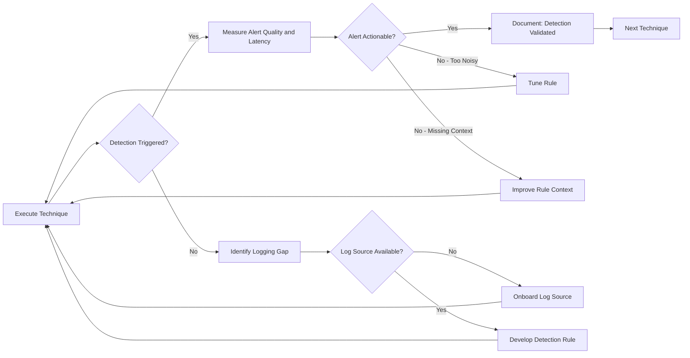

# Purple Team Operations

## Overview

Purple teaming is a collaborative security testing methodology in which red team (offensive) and blue team (defensive) practitioners work together to improve detection and response capabilities. Unlike traditional red team engagements where the blue team operates blind, purple team exercises involve real-time knowledge sharing and feedback loops.

The term "purple" reflects the combination of red (offensive) and blue (defensive) — not a separate team, but a collaboration mode.

---

## Purple Team vs. Traditional Red Team

| Dimension | Traditional Red Team | Purple Team |
|-----------|---------------------|-------------|
| Blue team awareness | Blind (not informed) | Collaborative (fully informed) |
| Primary objective | Test detection and response | Improve detection and response |
| Knowledge sharing | Post-engagement debrief only | Real-time throughout exercise |
| Efficiency | Lower (time spent on evasion) | Higher (focused on gaps, not stealth) |
| Output | Attack report with detection gaps | Improved detection rules + process changes |
| Cost | Higher per detection gap identified | Lower per improvement realized |
| Mindset | Adversarial | Collaborative |

**When to use red team (traditional):** When you need an unbiased test of detection and response capability against realistic adversary behavior. The blue team should not know the scope or timing.

**When to use purple team:** When you want to systematically improve detection coverage, verify that specific controls work, or train detection engineers against real attack techniques.

---

## Purple Team Exercise Methodology

### 1. Pre-Exercise Planning

**Define objectives:**
- Which ATT&CK techniques are you validating?
- What detection gaps have been identified from prior red team engagements or threat intelligence?
- What is the expected detection outcome for each technique (detect, alert, block, no detection)?

**Select adversary profile:**
- Base the exercise on a threat actor relevant to your sector
- Use ATT&CK Group profiles to identify the technique set to emulate
- Prioritize techniques your threat intelligence indicates are actively used against your sector

**Define success criteria:**
- Technique X should generate alert Y within Z minutes
- Detection rule for technique X should trigger with < N false positives per week
- Analyst should correctly triage technique X within M minutes

### 2. Technique Execution and Testing Cycle

For each technique:



### 3. Post-Exercise Outputs

**Detection improvements:**
- New SIEM rules or tuning of existing rules for each tested technique
- Updated ATT&CK Navigator coverage map showing before/after state
- Log source gaps identified and remediation plan

**Process improvements:**
- Playbook updates based on observed analyst behavior during testing
- Response time benchmarks for each technique category
- Training gaps identified for analyst development

---

## ATT&CK-Aligned Exercise Structure

### Technique Testing Card

For each technique in the exercise, document:

```
Technique ID:     T1059.001 — PowerShell
Tactic:           Execution (TA0002)
Adversary group:  APT29 (documented usage)

Execution method:
  powershell.exe -EncodedCommand [base64 encoded payload]
  Executed from: cmd.exe spawned by Word process

Expected log source:  Windows Security Event 4688 with command line
Expected alert:       "PowerShell Encoded Command" — Splunk rule SEC-0042

Test result:
  Alert triggered?          Yes
  Alert latency:            2 minutes 18 seconds
  Alert quality (1-5):      3 — Missing parent process context
  Analyst triage time:      4 minutes
  Analyst conclusion:       Correct (True Positive)

Actions:
  - Improve rule to include ParentProcessName in alert body
  - Create correlation: Office child process + PowerShell encoded = High severity
```

---

## Adversary Emulation Plans

### What Is an Adversary Emulation Plan?

An adversary emulation plan is a documented set of instructions for simulating a specific threat actor's behavior using their known TTPs. It provides enough detail for a red team to execute the simulation without requiring deep threat intelligence expertise.

MITRE CTID (Center for Threat-Informed Defense) maintains public adversary emulation plans for groups including APT29, FIN6, and Carbanak.

### Emulation Plan Structure

```
1. Executive Summary
   - Threat actor overview and motivation
   - Industries and geographies targeted
   - Why this actor is relevant to the exercise target

2. Intelligence Summary
   - Documented techniques (ATT&CK IDs)
   - Preferred initial access vectors
   - Known tooling and infrastructure patterns

3. Emulation Phases
   Phase 1: Initial Access
     - Technique: T1566.001 Spear Phishing Attachment
     - Payload type: Macro-enabled Office document
     - Infrastructure: Phishing domain, HTTPS delivery
   
   Phase 2: Execution and Staging
     - Technique: T1059.001 PowerShell
     - Download and execute stage 2 payload
   
   [Continue through all phases]

4. Indicators Generated
   - File hashes produced during emulation
   - C2 domains used
   - Commands executed
   - Registry keys modified

5. Detection Opportunity Mapping
   - For each technique: what telemetry it generates and where
   - Expected detection: what rule should fire
```

---

## Detection Validation Framework

### Coverage Matrix

After completing an exercise, document the coverage state:

| ATT&CK Technique | Description | Detectable? | Rule Exists? | Rule Fires? | Analyst Responds Correctly? |
|----------------|-------------|-------------|-------------|------------|---------------------------|
| T1566.001 | Spear Phishing Attachment | Yes | Yes | Yes | Yes |
| T1059.001 | PowerShell | Yes | Yes | Yes | Partial |
| T1053.005 | Scheduled Task | Yes | Yes | No | N/A |
| T1003.001 | LSASS Memory | Yes | No | N/A | N/A |
| T1021.002 | SMB Lateral Movement | Yes | Partial | Sometimes | Yes |

**Coverage scoring:**
- **Detect and Respond**: Log source present, rule fires, analyst responds correctly
- **Detect Only**: Alert fires but analyst response is incorrect or delayed
- **Log Only**: Log source present, no detection rule
- **Blind**: No log source or telemetry

### Gap Prioritization

Prioritize detection gaps by:
1. Likelihood that the technique will be used against the organization (based on threat intelligence)
2. Business impact if the technique is successfully executed without detection
3. Ease of implementing detection (log source available? Rule complexity?)

---

## Atomic Testing

MITRE's Atomic Red Team library provides individual, small-scale tests of specific ATT&CK techniques. Each test (atomic) is a self-contained execution of one technique, designed to generate telemetry for detection validation.

### Atomic Red Team Usage

```powershell
# Install the Invoke-AtomicRedTeam framework
Install-Module -Name invoke-atomicredteam, powershell-yaml -Scope CurrentUser

# Run all atomics for a specific technique
Invoke-AtomicTest T1059.001

# Run a specific atomic test number
Invoke-AtomicTest T1059.001 -TestNumbers 1

# Check prerequisites only (does not execute)
Invoke-AtomicTest T1059.001 -CheckPrereqs

# Clean up after testing
Invoke-AtomicTest T1059.001 -Cleanup
```

**Atomic test workflow for purple team:**
1. Notify blue team that testing is beginning (purple mode)
2. Execute atomic test
3. Verify with blue team whether alert was generated
4. If no alert: examine log sources together; determine root cause of detection gap
5. If alert: review alert quality, latency, and enrichment
6. Develop or tune rule as needed
7. Re-execute to verify fix
8. Document outcome and move to next technique

---

## Purple Team Metrics

| Metric | Measurement | Improvement Tracking |
|--------|------------|---------------------|
| Detection coverage | % of tested techniques with validated detection | Increase over time |
| Mean time to detect (by technique) | Minutes from execution to alert | Decrease over time |
| Alert quality score | Analyst rating of actionability (1–5) | Increase over time |
| False positive rate (post-tuning) | Alerts per week for each rule | Maintain at acceptable level |
| Technique regression rate | % of previously validated detections that stop working after system changes | Should be zero with change tracking |
| Analyst proficiency | Correct triage rate per technique category | Increase over time |
