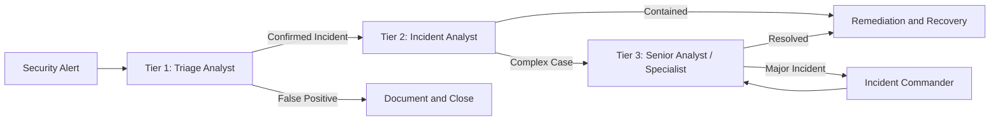
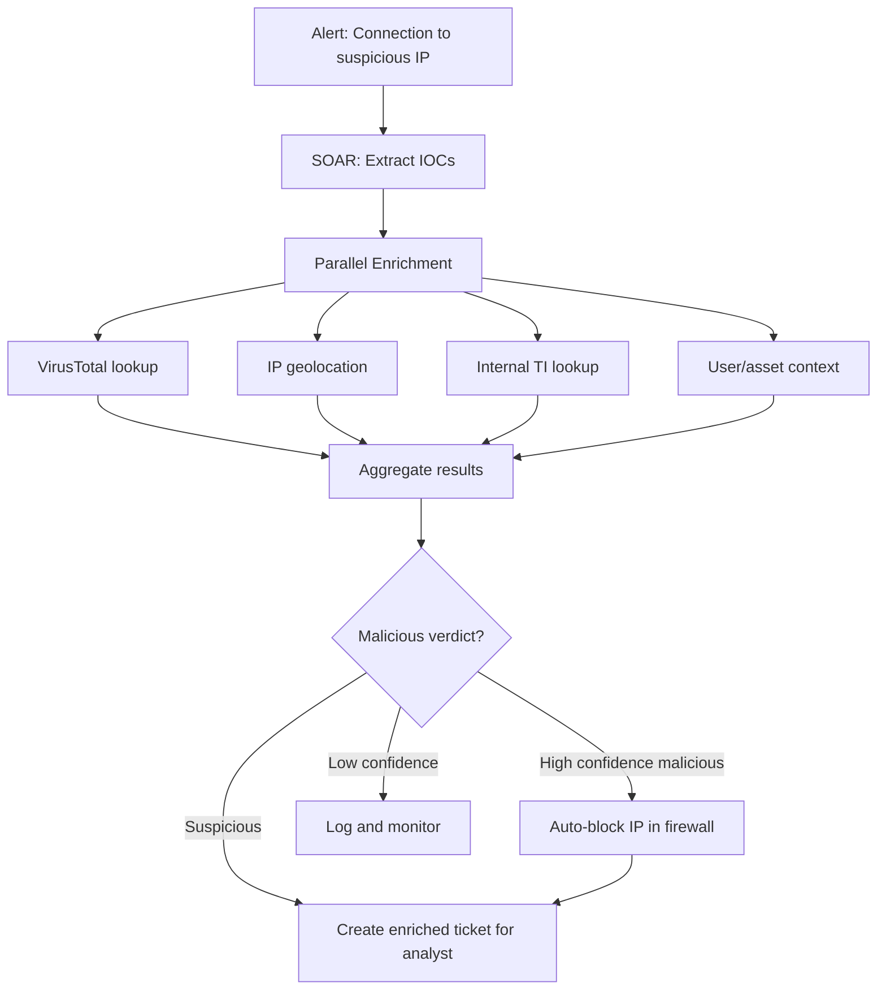

# SOC Operations

## Overview

A Security Operations Center (SOC) is the organizational function responsible for monitoring, detecting, analyzing, and responding to cybersecurity threats on a continuous basis. SOC effectiveness is measured by the speed and accuracy with which threats are identified and contained, and by the organization's ability to improve detection over time.

---

## SOC Models

| Model | Description | Advantages | Disadvantages |
|-------|-------------|-----------|---------------|
| In-house | Dedicated internal security team | Deep organizational knowledge, highest control | Expensive, 24/7 staffing challenging |
| Co-managed | Internal team plus MSSP augmentation | Extends coverage, reduces cost | Requires coordination with external party |
| MSSP | Fully outsourced to Managed Security Service Provider | Lower cost, immediate coverage | Less organizational context, shared resources |
| Hybrid | Combination of above models | Flexible, tailored | Complexity |

---

## SOC Tier Structure

Most enterprise SOCs use a tiered analyst model:



| Tier | Responsibilities | Skills Required |
|------|----------------|----------------|
| Tier 1 | Alert triage, initial classification, playbook execution, escalation | SIEM querying, basic log analysis, playbook adherence |
| Tier 2 | Deep investigation, correlation, threat context, containment recommendations | Network analysis, endpoint forensics, threat intelligence consumption |
| Tier 3 | Advanced threat hunting, malware analysis, IR leadership, detection rule development | Full-stack security expertise, threat intelligence production |

---

## Alert Triage Process

### Triage Decision Framework

Every alert received by Tier 1 must be assessed against these questions in sequence:

1. **What is the alert describing?** Read the full alert body and understand what behavior triggered it.
2. **Is this a known false positive?** Check the alert history and false positive documentation.
3. **What context is available?** Examine: source system, user account, time of day, recent changes.
4. **Is this behavior expected?** Does the account, system, or process normally perform this activity?
5. **What is the blast radius if malicious?** What could an attacker accomplish from this position?
6. **What evidence would confirm or deny malicious intent?** Query for additional context.

### Alert Context Checklist

For any endpoint alert:
- [ ] What process triggered the alert?
- [ ] Who started the process? (user account)
- [ ] What is the parent process?
- [ ] What is the command line?
- [ ] What network connections did the process make?
- [ ] What files did it access or create?
- [ ] Is the hash known-bad (VirusTotal/ThreatIntel lookup)?
- [ ] Has this occurred on other hosts?

For any authentication alert:
- [ ] Which account?
- [ ] From which source IP and location?
- [ ] What is the user's normal location?
- [ ] Is there concurrent activity from another location?
- [ ] What actions followed the authentication?

---

## Playbooks and Runbooks

### What Is a Playbook?

A playbook is a documented, step-by-step procedure for responding to a specific type of security event. Playbooks reduce cognitive load, ensure consistent response, support onboarding, and enable automation.

**Playbook structure:**

```
Playbook: Phishing Email Report

Trigger: User reports suspicious email via phishing button or email to security@

Tier 1 Actions:
  1. Retrieve the reported email from quarantine or user's sent-to-security mailbox
  2. Examine sender domain, return-path, and headers (mail header analysis)
  3. Check sender domain against threat intel (VirusTotal, URLScan)
  4. Examine links: submit to URLScan.io without clicking
  5. Examine attachments: hash and submit to VirusTotal / sandbox
  
  Decision point:
    - No indicators: Mark as false positive; educate user
    - Indicators found: Escalate to Tier 2
    - Evidence of credential submission: Immediate escalation; begin IR

Tier 2 Actions (if indicators found):
  1. Search for the email in all mailboxes (message trace)
  2. Identify all recipients
  3. Identify any recipients who clicked links or opened attachments
  4. For any link clicks: obtain the endpoint forensic data
  5. Block sender domain and associated IPs in email gateway and firewall
  6. Retroactively quarantine the email from all mailboxes
  7. If credential submission suspected: force password reset; revoke sessions
  8. Notify affected users

Containment:
  - Isolate endpoints where payloads were downloaded and executed
  - Revoke and reset credentials for affected accounts

Documentation:
  - IOCs extracted and added to threat intel platform
  - Incident ticket created with timeline and actions
  - Lessons learned if detection gaps identified
```

### Playbook Categories to Maintain

| Category | Trigger |
|----------|---------|
| Phishing email | User report or email gateway alert |
| Ransomware | EDR alert for mass encryption activity |
| Business email compromise | Finance team alert, mail forwarding rule |
| Privileged account compromise | Unusual admin activity, credential spray |
| Data exfiltration | DLP alert, proxy anomaly |
| Insider threat | HR referral, behavioral anomaly |
| Cloud account compromise | CSPM/CloudTrail unusual API activity |
| Malware (non-ransomware) | EDR detection |
| DDoS | Network monitoring threshold |
| Vulnerability exploitation | WAF alert, IDS alert |

---

## SIEM Operations

### Splunk Query Patterns

```splunk
-- Authentication failures with geographic anomaly
index=authentication action=failure
| iplocation src_ip
| eval country=coalesce(Country, "Unknown")
| stats count by user, country
| eventstats dc(country) as distinct_countries by user
| where distinct_countries > 2
| sort -count

-- Detect PowerShell execution from Office applications (T1566.001 + T1059.001)
index=endpoint EventCode=4688
| where match(ParentProcessName, "(?i)winword|excel|outlook|powerpnt")
  AND match(NewProcessName, "(?i)powershell|cmd|wscript|cscript|mshta")
| table _time, host, user, ParentProcessName, NewProcessName, CommandLine

-- Network beaconing detection (regular outbound intervals = C2)
index=network_traffic direction=outbound
| bucket _time span=1h
| stats count dc(dest_port) as ports_used by src_ip, dest_ip, _time
| streamstats window=24 avg(count) as avg_count stdev(count) as stdev by src_ip, dest_ip
| eval coefficient_of_variation = stdev/avg_count
| where coefficient_of_variation < 0.2 AND count > 10
| sort -count

-- Detect LSASS access (credential dumping T1003.001)
index=endpoint EventCode=10 TargetImage="*\\lsass.exe"
NOT SourceImage IN ("*\\MsMpEng.exe", "*\\csrss.exe", "*\\wininit.exe", "*\\services.exe", "*\\svchost.exe")
| table _time, host, SourceImage, GrantedAccess
| sort -_time
```

### Alert Management Principles

**Alert fatigue** is one of the primary challenges in SOC operations. When analysts are overwhelmed by alert volume, true positives are missed. Address alert fatigue through:

1. **Ruthless tuning**: Every alert that fires should be reviewed. Alerts that consistently produce false positives should be tuned or suppressed.
2. **Alert quality over quantity**: 50 high-quality, actionable alerts are more valuable than 500 noisy alerts.
3. **Prioritization**: Critical and high severity alerts get immediate attention; lower severity alerts are batched.
4. **Automation**: Low-complexity, high-confidence alerts should be handled by SOAR, not analysts.
5. **Regular review**: Monthly review of top alert sources by volume and true positive rate.

---

## SOAR (Security Orchestration, Automation, and Response)

SOAR platforms automate repetitive, well-defined response actions, freeing analysts for complex investigations.

### Automation Opportunities

| Task | Manual Time | Automated Time | Suitable for Automation? |
|------|------------|----------------|------------------------|
| IOC enrichment (VirusTotal lookup) | 2–5 minutes | < 30 seconds | Yes |
| IP geolocation | 1–2 minutes | < 10 seconds | Yes |
| User context (AD lookup) | 2–3 minutes | < 30 seconds | Yes |
| Known FP suppression | 1 minute | Automatic | Yes |
| Endpoint isolation (EDR) | 5–10 minutes | 30–60 seconds | Yes (with review gate) |
| Phishing email quarantine | 5–10 minutes | 1–2 minutes | Yes |
| Password reset | 5–10 minutes | 2–3 minutes | Yes (with approval for privileged) |
| Firewall block | 5 minutes | < 1 minute | Yes |
| Root cause analysis | 30–120 minutes | N/A | No — requires analyst judgment |

### SOAR Workflow Example: IOC Enrichment



---

## Threat Hunting from the SOC

SOC analysts are positioned to perform threat hunting using the same data sources used for alerting. The difference is the approach: reactive (waiting for alerts) vs. proactive (actively searching for evidence of threats).

### Hunt Hypothesis Examples for SOC Analysts

**Hypothesis 1**: "Living-off-the-land binaries are being used for lateral movement that our current rules don't catch."

```splunk
-- Search for unusual uses of LOLBins
index=endpoint EventCode=4688
| where NewProcessName IN ("*\\certutil.exe", "*\\bitsadmin.exe", "*\\regsvr32.exe", "*\\mshta.exe")
| stats count by host, user, NewProcessName, CommandLine
| sort count asc
-- Review rare occurrences for context
```

**Hypothesis 2**: "An attacker has established C2 using a technique that our proxy doesn't flag."

```splunk
-- Look for long-duration HTTP connections to rare external destinations
index=proxy
| stats count sum(bytes_out) as total_bytes min(_time) as first_seen max(_time) as last_seen by src_ip, dest_host
| eval duration_hours = (last_seen - first_seen) / 3600
| where duration_hours > 24 AND count > 100
| sort -total_bytes
```

---

## SOC Metrics and Reporting

### Operational Metrics

| Metric | Definition | Formula | Target |
|--------|-----------|---------|--------|
| Mean Time to Detect (MTTD) | Average time from incident start to detection | Sum(detection time - incident start) / N | < 24 hours |
| Mean Time to Respond (MTTR) | Average time from detection to containment | Sum(containment time - detection time) / N | < 4 hours (critical) |
| Alert Volume | Total alerts per day | Count of alerts fired | Track trends |
| True Positive Rate | Proportion of real threats | TP / (TP + FP) | > 80% |
| Escalation Rate | Tier 1 alerts escalated to Tier 2 | Escalations / Total alerts | Track trends |
| Dwell Time | Time attacker present before detection | Detection time - estimated compromise time | Minimize |

### Reporting Cadence

| Report | Audience | Frequency | Contents |
|--------|---------|-----------|---------|
| Shift handover | Incoming analysts | Per shift | Open incidents, active threats, escalations |
| Daily operations report | SOC Manager | Daily | Alert volumes, incidents, coverage status |
| Weekly metrics | Security leadership | Weekly | KPIs, trends, notable incidents |
| Monthly executive summary | CISO / Executives | Monthly | Threat landscape, program metrics, improvements |
| Incident report | CISO, Legal, affected teams | Per incident | Full incident timeline, impact, lessons learned |
