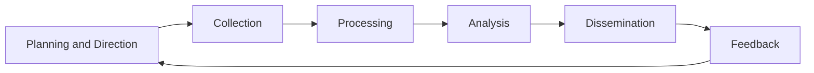

# Threat Intelligence

## Overview

Cyber Threat Intelligence (CTI) is the collection, processing, analysis, and dissemination of information about current and potential threats. Effective CTI enables organizations to make informed decisions about defensive priorities, resource allocation, and proactive threat hunting.

Intelligence is distinguished from raw data by analysis and context — data becomes intelligence when it has been processed to answer specific questions relevant to decision-makers.

---

## Intelligence Types

| Type | Audience | Timeframe | Examples |
|------|---------|-----------|---------|
| Strategic | Executives, board | Long-term (months, years) | Threat actor motivations, geopolitical risks, industry targeting trends |
| Operational | Security managers, IR leads | Medium-term (days, weeks) | Planned campaigns, actor TTPs, targeting of specific sectors |
| Tactical | SOC analysts, incident responders | Short-term (hours, days) | Specific TTPs, attack patterns, malware behaviors |
| Technical | SOC analysts, security engineers | Immediate | IOCs: IP addresses, domains, file hashes, YARA rules |

---

## Intelligence Lifecycle



### 1. Planning and Direction

Define intelligence requirements (IRs) — the specific questions CTI needs to answer:
- What threat actors are likely to target our sector?
- What TTPs are being used against organizations like ours?
- Are there indicators of active targeting of our infrastructure?
- What vulnerabilities are currently being exploited in the wild?

### 2. Collection

Gather raw data from diverse sources:

**Internal sources:**
- SIEM events and alerts
- Firewall and proxy logs
- Email gateway data
- Incident reports
- Honeypots

**External sources:**

| Category | Examples |
|----------|---------|
| Open Source Intelligence (OSINT) | VirusTotal, Shodan, Censys, CIRCL, AbuseIPDB |
| Commercial feeds | Recorded Future, Mandiant Advantage, CrowdStrike Falcon Intelligence |
| Information Sharing | ISACs, MISP communities, government feeds (CISA AIS) |
| Dark web monitoring | Threat actor forums, marketplaces, paste sites |
| Malware sandboxes | Any.run, Cuckoo, Triage |

### 3. Processing

Convert raw collected data into a usable format:
- Normalize data into a common schema
- Deduplicate IOCs across sources
- Assess source reliability and data quality
- Extract structured indicators from unstructured reports

### 4. Analysis

Transform processed data into actionable intelligence:
- Cluster related indicators into campaigns
- Map actor TTPs to MITRE ATT&CK
- Assess relevance to the specific organization
- Prioritize based on applicability and confidence level

### 5. Dissemination

Deliver intelligence to the appropriate consumers in the right format:
- Technical indicators to SIEM/SOAR for automated blocking
- Hunting packages to threat hunting team
- Tactical TTPs to SOC for manual hunting
- Strategic briefings to executives

---

## Indicators of Compromise (IOCs)

IOCs are forensic artifacts that indicate potential system compromise. They are the most perishable form of intelligence — IP addresses and domains rotate quickly.

| IOC Type | Longevity | Detection Utility |
|----------|----------|------------------|
| File hash (MD5/SHA-256) | High | Low (trivial to change) |
| File hash (TLSH/ssdeep fuzzy) | High | Medium (detects modified samples) |
| IP address | Low (hours to days) | Low (rotating C2 infrastructure) |
| Domain | Medium | Medium (domain registration takes effort) |
| URL | Medium | Medium |
| Registry key | High | High (actor behaviors are sticky) |
| Mutex | High | High |
| Network signature | High | High |
| User-agent string | Medium | Medium |
| JA3/JA3S TLS fingerprint | High | High (fingerprints TLS client behavior) |

**Pyramid of Pain** (David Bianco): Disrupting IOCs at higher levels of the pyramid causes more pain for the adversary:

```
              /\
             /  \  TTPs (most painful to adversary)
            /----\
           / Tools \
          /----------\
         /  Network   \
        / Artifacts    \
       /----------------\
      / Host Artifacts   \
     /--------------------\
    /  Domain Names       \
   /------------------------\
  /  IP Addresses           \
 /----------------------------\
/   Hash Values (trivial)     \
/------------------------------\
```

---

## Threat Actor Tracking

### Actor Classification

| Category | Motivation | Typical Targets | Sophistication |
|----------|-----------|----------------|----------------|
| Nation-state APT | Espionage, sabotage, influence | Government, defense, critical infrastructure | Very high |
| Financially motivated | Revenue | Financial services, healthcare, retail | Low to high |
| Hacktivists | Ideology, publicity | Any publicly visible organization | Low to medium |
| Insider threat | Personal grievance, financial | Employer's assets | Varies |
| Cybercriminal groups (ransomware) | Ransom revenue | SMBs, healthcare, education | Medium to high |

### ATT&CK Group Profiles

MITRE maintains ATT&CK Group profiles documenting known adversary behaviors:

- **APT29 (Cozy Bear)**: Russian SVR; targets government, think tanks, healthcare; uses sophisticated tooling including SUNBURST (SolarWinds supply chain)
- **APT41**: Chinese dual espionage and financially motivated; targets healthcare, telecom, tech
- **Lazarus Group**: North Korean; targets financial institutions, cryptocurrency, defense
- **FIN7**: Eastern European; targets hospitality, retail, financial; uses spear phishing and POS malware

---

## Intelligence Sharing

### Structured Formats

**STIX (Structured Threat Information eXpression)**: JSON-based standard for representing threat intelligence. Supports rich relationship modeling between indicators, TTPs, threat actors, and campaigns.

**TAXII (Trusted Automated eXchange of Intelligence Information)**: Transport mechanism for sharing STIX content. Defines API for publishing and consuming intelligence feeds.

**MISP (Malware Information Sharing Platform)**: Open source threat intelligence sharing platform. Widely used by ISACs, government CERTs, and enterprises.

### Sharing Communities

| Community | Membership | Focus |
|-----------|-----------|-------|
| FS-ISAC | Financial sector | Financial industry threats |
| H-ISAC | Healthcare sector | Healthcare industry threats |
| IT-ISAC | IT industry | Technology sector threats |
| CISA AIS | US organizations | US government threat intelligence |
| FIRST | Global (by invitation) | Incident response and security teams |
| Shadowserver | Global | Botnet, malware network monitoring |

### Traffic Light Protocol (TLP)

TLP defines handling restrictions for sensitive information shared within communities:

| Label | Color | Sharing Restriction |
|-------|-------|---------------------|
| TLP:RED | Red | Not for disclosure; restricted to named recipients only |
| TLP:AMBER+STRICT | Amber+Strict | Restricted to named organization only |
| TLP:AMBER | Amber | Restricted to organization and need-to-know partners |
| TLP:GREEN | Green | Community-wide; not publicly available |
| TLP:CLEAR | White | Publicly available; no restriction |

---

## YARA Rules

YARA is a pattern-matching tool used to identify and classify malware families based on textual and binary patterns.

```yara
rule Ransomware_WannaCry {
    meta:
        description = "Detects WannaCry ransomware"
        author = "Security Research Team"
        date = "2017-05-15"
        reference = "https://attack.mitre.org/software/S0366/"
        tlp = "TLP:CLEAR"
    
    strings:
        $mssecsvc = "mssecsvc2.0" ascii wide
        $wannacry_marker = "WANACRY!" ascii
        $tor_onion = ".onion" ascii
        $kill_switch = "http://www.iuqerfsodp9ifjaposdfjhgosurijfaewrwergwea.com" ascii
        
        $mz = { 4D 5A }  // MZ header
        $pe_sig = { 50 45 00 00 }  // PE signature
        
    condition:
        $mz at 0 and $pe_sig and
        (2 of ($mssecsvc, $wannacry_marker, $kill_switch)) and
        filesize < 10MB
}
```

**YARA rule development process:**
1. Collect malware samples from the same family
2. Extract unique strings, byte sequences, and behavioral patterns
3. Write rule targeting unique characteristics
4. Test against clean files to verify no false positives
5. Test against variant samples to verify coverage
6. Deploy to AV scanner, SIEM, or endpoint monitoring

---

## Threat Intelligence Operations

### Intelligence-Driven SOC

Integrating CTI into SOC operations transforms reactive alert triage into proactive threat detection:

1. **Feed integration**: Ingest IOC feeds into SIEM/SOAR; automatically enrich events with intelligence context
2. **Hunt packages**: Weekly delivery of hunting hypotheses based on current threat intelligence to the hunting team
3. **Detection updates**: When a new TTP is documented in a threat report, create or update detection rules within 48 hours
4. **Campaign tracking**: Track active campaigns targeting the sector; update blocking rules and alerts as new IOCs are published
5. **Vulnerability prioritization**: Correlate vulnerability data with active exploitation intelligence to prioritize patching

### Intelligence-Driven Patching

Rather than treating all vulnerabilities equally by CVSS score, use threat intelligence to prioritize:

| Priority | Criteria |
|----------|---------|
| Immediate | CVE with confirmed active exploitation in the wild targeting your sector |
| Urgent | CVE with public exploit code; high CVSS; relevant to your stack |
| Standard | High CVSS; no active exploitation evidence |
| Low | Medium/low CVSS; no active exploitation |
