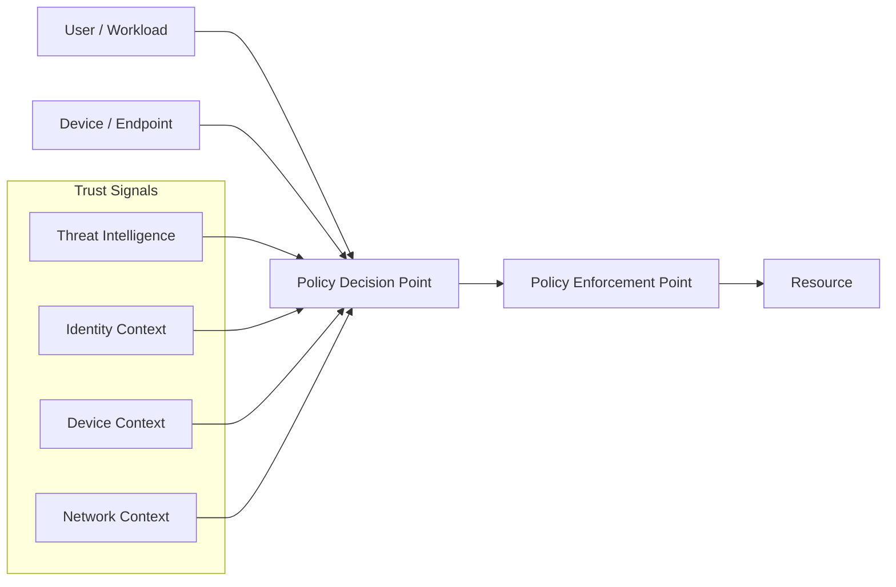

# Zero Trust Architecture

## Principles

Zero Trust is a security model based on the principle of "never trust, always verify." It rejects the traditional perimeter security assumption that entities inside the network are trusted. In a Zero Trust model, every access request is authenticated, authorized, and continuously validated regardless of its origin.

**Core tenets:**

1. **Verify explicitly**: Always authenticate and authorize based on all available data points — identity, location, device health, service or workload, data classification, and anomalies.
2. **Use least privilege access**: Limit access with just-enough-access (JEA) and just-in-time (JIT) access; implement risk-based adaptive policies and data protection controls.
3. **Assume breach**: Minimize blast radius; segment access; verify end-to-end encryption; use analytics to gain visibility, drive threat detection, and improve defenses.

---

## Historical Context

The traditional security model relied on a hard perimeter — "castle and moat" — trusting anything inside the network. This model has failed for several reasons:

- Remote work dissolved the perimeter
- Cloud adoption moved workloads outside the traditional network boundary
- SaaS applications bypass on-premises network inspection
- Insider threats operate from within trusted network segments
- Attackers who breach the perimeter can often move laterally with little resistance

Zero Trust was first articulated by John Kindervag at Forrester Research in 2010. It was further developed through Google's BeyondCorp implementation (circa 2014), which moved access control from network perimeter to device state and user identity.

---

## Zero Trust Architecture

### Key Components

**Policy Decision Point (PDP)**: The brain of the ZTA. Evaluates access requests against policies using all available context signals.

**Policy Enforcement Point (PEP)**: Enforces the PDP's decisions. May be a proxy, API gateway, network access control, or application control.

### Access Decision Signals

| Signal Category | Components |
|----------------|------------|
| Identity | User identity, group membership, role, authentication strength, behavioral baselines |
| Device | Device compliance status, managed vs. unmanaged, OS version, patch level, EDR health |
| Network | Source network, geography, IP reputation, time of access |
| Application | Requested resource, sensitivity classification, data being accessed |
| Behavior | Deviation from user's normal patterns, velocity, concurrent sessions |
| Threat intelligence | Known-bad IPs/domains, compromised credential indicators |

---

## NIST SP 800-207 Zero Trust Architecture

NIST SP 800-207 provides the authoritative federal guidance on ZTA. It defines seven tenets:

1. All data sources and computing services are considered resources
2. All communication is secured regardless of network location
3. Access to individual enterprise resources is granted on a per-session basis
4. Access to resources is determined by dynamic policy — including the observable state of client identity, application, and the requesting asset
5. The enterprise monitors and measures the integrity and security posture of all owned and associated assets
6. All resource authentication and authorization is dynamic and strictly enforced before access is allowed
7. The enterprise collects as much information as possible about the current state of assets, network infrastructure, and communications and uses it to improve its security posture

---

## Implementation Approach

### Phased ZTA Adoption

Organizations rarely implement Zero Trust completely at once. A phased approach identifies quick wins and builds capability progressively.

**Phase 1: Identity and Device Foundation**
- Implement strong identity (MFA for all users; FIDO2 for privileged)
- Inventory all devices; enroll in MDM/EMM
- Deploy endpoint compliance policies (EDR, patch status, disk encryption)
- Implement Conditional Access based on identity + device compliance

**Phase 2: Application Access**
- Deploy identity-aware proxy for all internal applications
- Eliminate legacy VPN for application access; replace with ZTNA (Zero Trust Network Access)
- Implement application-level access controls with per-session authorization
- Classify applications by sensitivity; require elevated assurance for high-value applications

**Phase 3: Network Segmentation**
- Implement microsegmentation based on workload identity, not network location
- Replace implicit VLAN trust with explicit workload-to-workload access policies
- Enforce east-west traffic inspection between internal segments

**Phase 4: Data-Centric Controls**
- Classify data across the environment
- Apply data access controls based on sensitivity
- Implement CASB for SaaS data governance
- DLP enforcement based on classification

---

## Zero Trust Network Access (ZTNA)

ZTNA replaces traditional VPN for application access. Rather than providing network-level access, ZTNA grants access to specific applications based on identity and device posture.

**VPN vs. ZTNA:**

| Aspect | Traditional VPN | ZTNA |
|--------|----------------|------|
| Access granted | Network segment | Specific application |
| Trust model | Network-level trust after authentication | Per-application, per-session verification |
| Lateral movement risk | High (network access enables scanning) | Low (cannot reach non-allowed applications) |
| User experience | Connect, then access | Transparent application access |
| Device requirement | VPN client | ZTNA client or agentless browser access |
| Infrastructure exposed | VPN concentrator publicly accessible | Applications not directly exposed to internet |

**ZTNA models:**
- **Agent-based**: ZTNA client installed on device, sends device posture signals to PDP
- **Agentless/browser-based**: User authenticates through browser; no client required; limited device posture visibility

---

## Conditional Access Policies

Conditional Access is the ZTA policy enforcement mechanism for identity-aware access. Common implementations: Azure AD Conditional Access, Okta Adaptive MFA, Google BeyondCorp.

**Example policy set:**

| Policy | Condition | Requirement |
|--------|-----------|-------------|
| Baseline MFA | Any sign-in | MFA required |
| Privileged access | Admin role access | Compliant device + MFA + Managed device |
| High-risk sign-in | Risk score: High | Block or require password change + MFA |
| Unmanaged device | Personal device detected | Limited access (web-only, no download) |
| Legacy authentication | No MFA support | Block (legacy auth does not support MFA) |
| Geographic anomaly | Sign-in from unexpected country | Block or step-up to hardware MFA |

---

## Measuring Zero Trust Maturity

CISA's Zero Trust Maturity Model provides a framework for assessing and planning ZTA adoption across five pillars:

| Pillar | Traditional | Initial | Advanced | Optimal |
|--------|------------|---------|----------|---------|
| Identity | Static usernames/passwords | MFA deployed | Risk-based, adaptive auth | Continuous validation, fully passwordless |
| Devices | No MDM | MDM enrollment | Compliance-gated access | Fully automated compliance enforcement |
| Networks | VLAN-based trust | Basic segmentation | Microsegmentation | Dynamic policy per workload |
| Applications | VPN + implicit trust | Application-aware gating | Per-session authorization | Real-time risk assessment per request |
| Data | No classification | Classification scheme | DLP enforcement | Data-centric access with automated classification |

Organizations should assess their current maturity per pillar and define target states based on risk tolerance and resources.
