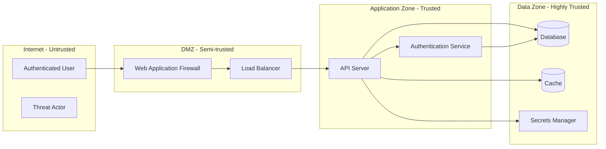

# Threat Model Template

**Application/System**: [Name]
**Version**: [x.y]
**Modeling Date**: [YYYY-MM-DD]
**Lead Architect**: [Name]
**Security Reviewer**: [Name]
**Classification**: [Internal / Confidential]
**Review Cycle**: [Annual / On significant change]

---

## Purpose

This threat model documents the security analysis of [Application/System Name]. It identifies assets, trust boundaries, data flows, potential threats, and mitigations. It is intended to inform secure design decisions and track security requirements through the development lifecycle.

---

## System Overview

### Description

*Briefly describe the system: its purpose, users, key functionality, and deployment context.*

[System description text]

### Technology Stack

| Layer | Technology | Version | Notes |
|-------|-----------|---------|-------|
| Frontend | [React, Angular, etc.] | [x.y] | |
| Backend | [Node.js, Python, Java, etc.] | [x.y] | |
| Database | [PostgreSQL, MySQL, MongoDB] | [x.y] | |
| Cache | [Redis, Memcached] | [x.y] | |
| Infrastructure | [AWS, Azure, on-prem] | | |
| Authentication | [OAuth 2.0 / SAML / custom] | | |
| CDN / WAF | [CloudFront, Cloudflare, etc.] | | |

### Actors

| Actor | Type | Trust Level | Description |
|-------|------|------------|-------------|
| Authenticated User | Human | Low-Medium | Registered user with standard access |
| Administrator | Human | High | Internal admin with elevated privileges |
| API Consumer | System | Medium | External system consuming the API with API key |
| Unauthenticated User | Human | None | Anonymous internet user |
| Internal Service | System | Medium-High | Internal microservice communicating over private network |

---

## Architecture Diagram

*Describe or embed a data flow diagram (DFD). Include trust boundaries.*

---

## Trust Boundaries

| Boundary ID | Boundary Name | Description | Controls at Boundary |
|-------------|--------------|-------------|---------------------|
| TB-01 | Internet / DMZ | Separates untrusted internet from DMZ | WAF, DDoS protection, TLS termination |
| TB-02 | DMZ / Application Zone | Separates DMZ from internal application tier | Firewall, mTLS between services |
| TB-03 | Application / Data Zone | Separates application tier from data stores | Database firewall, IAM, network ACL |
| TB-04 | User Authentication | Separates unauthenticated from authenticated context | Authentication, session management |

---

## Data Flows

| DFD ID | Source | Destination | Data | Protocol | Authenticated? | Encrypted? |
|--------|--------|-------------|------|----------|---------------|-----------|
| DF-01 | User Browser | WAF | HTTP requests, session cookies | HTTPS | Session token | Yes (TLS) |
| DF-02 | WAF | Load Balancer | Forwarded HTTP | HTTP | N/A | Optional (internal) |
| DF-03 | API Server | Database | SQL queries, PII | TCP/5432 | Service account | Yes (TLS) |
| DF-04 | API Server | Secrets Manager | Secret retrieval requests | HTTPS | IAM role | Yes |
| DF-05 | Auth Service | Database | User credential lookup | TCP/5432 | Service account | Yes |

---

## Assets

| Asset ID | Asset | Classification | Confidentiality | Integrity | Availability | Owner |
|---------|-------|---------------|----------------|-----------|-------------|-------|
| AS-01 | Customer PII | Restricted | Critical | Critical | High | Data Officer |
| AS-02 | Authentication credentials | Restricted | Critical | Critical | High | CISO |
| AS-03 | API keys / tokens | Confidential | High | High | High | Engineering |
| AS-04 | Application source code | Confidential | Medium | Critical | Medium | Engineering |
| AS-05 | Database | Confidential | High | Critical | High | DBA |
| AS-06 | Audit logs | Internal | Low | Critical | High | Security |

---

## STRIDE Threat Analysis

### DF-01: User to WAF (Authentication and Session)

**S — Spoofing**

| Threat | Description | Current Mitigations | Risk | Additional Mitigation |
|--------|-------------|---------------------|------|----------------------|
| Session token theft | Attacker steals session cookie via network or XSS | TLS in transit | Medium | Set HttpOnly, Secure, SameSite flags; CSP to prevent XSS |
| Credential stuffing | Attacker uses breach credentials to authenticate | Password authentication | High | MFA, account lockout, impossible travel detection |

**T — Tampering**

| Threat | Description | Current Mitigations | Risk | Additional Mitigation |
|--------|-------------|---------------------|------|----------------------|
| Request tampering | Attacker modifies API request parameters | None | High | Input validation, server-side authorization checks |
| Session replay | Attacker replays captured request | TLS | Low | Short session expiry, CSRF tokens |

**R — Repudiation**

| Threat | Description | Current Mitigations | Risk | Additional Mitigation |
|--------|-------------|---------------------|------|----------------------|
| Action denial | User denies performing action | None | Medium | Audit logging with user ID, IP, timestamp; log integrity protection |

**I — Information Disclosure**

| Threat | Description | Current Mitigations | Risk | Additional Mitigation |
|--------|-------------|---------------------|------|----------------------|
| Verbose error messages | Stack traces or debug info returned to user | None confirmed | Medium | Disable detailed errors in production; log server-side only |
| Sensitive data in URL | PII or tokens in URL query string | None | Medium | Pass sensitive data in request body or headers, not URL |

**D — Denial of Service**

| Threat | Description | Current Mitigations | Risk | Additional Mitigation |
|--------|-------------|---------------------|------|----------------------|
| Volumetric DDoS | Flood of requests exhausting resources | Basic WAF | High | DDoS scrubbing service; rate limiting |
| Application-layer DoS | Expensive queries or operations | None | Medium | Rate limiting, request size limits, query timeout |

**E — Elevation of Privilege**

| Threat | Description | Current Mitigations | Risk | Additional Mitigation |
|--------|-------------|---------------------|------|----------------------|
| IDOR | Access another user's resources by modifying ID | None confirmed | High | Server-side ownership verification on every request |
| JWT manipulation | Modify JWT algorithm to none or use weak key | JWT validation present | Medium | Reject alg:none; use strong signing key (256-bit+) |

---

### AS-03: API Keys / Tokens

| Threat | Description | Current Mitigations | Risk | Additional Mitigation |
|--------|-------------|---------------------|------|----------------------|
| Key exposure in logs | API keys logged in plaintext | Unknown | High | Redact sensitive values in logging middleware |
| Key exposure in code | Keys hardcoded in source code | Pre-commit hooks | Medium | Mandatory secrets scanning in CI/CD pipeline |
| Key theft via SSRF | SSRF exploits metadata service | IMDSv2 required | Low | Verify IMDSv2 enforcement; restrict SSRF attack surface |

---

## Threat Summary and Prioritization

| Threat ID | Description | STRIDE Category | Affected Asset(s) | Risk | Status |
|-----------|-------------|----------------|------------------|------|--------|
| TH-001 | Credential stuffing on login | Spoofing | AS-02 | High | Open |
| TH-002 | IDOR on user resource endpoints | Elevation of Privilege | AS-01 | High | Open |
| TH-003 | Verbose error message disclosure | Information Disclosure | AS-04 | Medium | Open |
| TH-004 | Rate limiting absent on API | Denial of Service | All | Medium | Open |
| TH-005 | API key in application logs | Information Disclosure | AS-03 | High | Open |
| TH-006 | Missing output encoding (XSS) | Tampering | AS-01 | Medium | Open |
| TH-007 | JWT algorithm confusion | Elevation of Privilege | AS-02 | Medium | Open |
| TH-008 | DDoS on public endpoints | Denial of Service | All | High | Open |

---

## Security Requirements

*Derived from the threat analysis. Each requirement corresponds to a mitigation.*

| Req ID | Requirement | Threat(s) Mitigated | Priority | Verification Method |
|--------|-------------|---------------------|----------|---------------------|
| SR-001 | Enforce MFA on all user accounts | TH-001 | High | Authentication flow test |
| SR-002 | Implement IDOR authorization checks on all resource endpoints | TH-002 | Critical | Security code review + pentest |
| SR-003 | Disable verbose error responses in production | TH-003 | Medium | Integration test |
| SR-004 | Apply rate limiting: 100 req/min per authenticated user | TH-004 | Medium | Load test |
| SR-005 | Redact API keys and tokens in all log output | TH-005 | High | Log review |
| SR-006 | Implement output encoding on all user-controlled data | TH-006 | High | Security code review |
| SR-007 | Reject JWT alg:none; pin expected algorithm | TH-007 | Medium | Security unit test |
| SR-008 | Deploy DDoS scrubbing upstream of application | TH-008 | High | Architecture review |

---

## Assumptions and Exclusions

**Assumptions made in this model:**
- The underlying cloud infrastructure is operated and secured by the provider (shared responsibility)
- Physical security of data center is within provider's responsibility
- Third-party libraries are reviewed for known vulnerabilities via SCA tooling
- The CI/CD pipeline is not within scope of this model (separate threat model)

**Explicitly excluded from scope:**
- [Item 1 with rationale]

---

## Review History

| Version | Date | Author | Changes |
|---------|------|--------|---------|
| 1.0 | [YYYY-MM-DD] | [Name] | Initial threat model |
| 1.1 | [YYYY-MM-DD] | [Name] | [Change description] |
